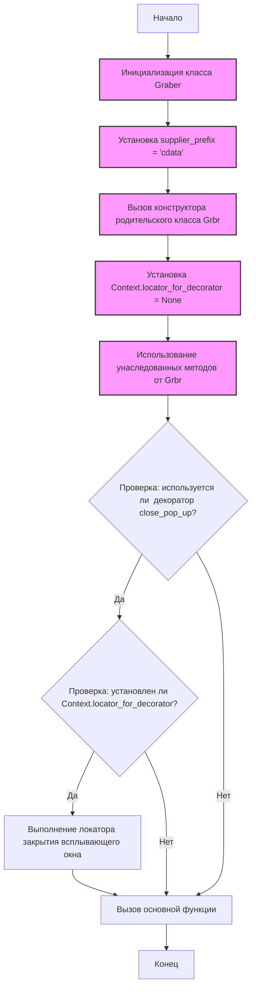
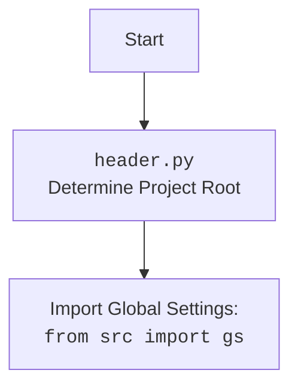

## <алгоритм>

1.  **Инициализация:**
    *   Создается экземпляр класса `Graber`, при этом передается объект `Driver` для управления браузером.
    *   Устанавливается префикс поставщика `supplier_prefix` как "cdata".
    *   Вызывается конструктор родительского класса `Graber` (`Grbr`), передавая префикс поставщика и драйвер.
    *   Инициализируется атрибут `Context.locator_for_decorator` значением `None`.
2.  **Наследование от `Graber` (родительского класса):**
    *   Класс `Graber` наследует функциональность от базового класса `Grbr`. Это означает, что он будет использовать методы родительского класса для обработки различных полей на странице товара.
3.  **Использование декоратора `close_pop_up` (закомментировано):**
    *   Декоратор `close_pop_up` предназначен для выполнения предварительных действий перед основной логикой функции.
    *   В примере кода он закомментирован.
    *   Если раскомментировать, то декоратор будет пытаться закрыть всплывающее окно, используя локатор, указанный в `Context.locator.close_pop_up`, до вызова функции.
    *   В случае ошибки выполнения локатора, ошибка будет записана в лог через `logger.debug`.
    *   Если `Context.locator_for_decorator` установлен, то декоратор `@close_pop_up` будет выполнен.

**Примеры для каждого логического блока:**

1.  **Инициализация:**
    *   `driver_instance = Driver()` - Создается экземпляр драйвера (предполагается, что класс Driver инициализируется).
    *   `graber_instance = Graber(driver_instance)` - Создается экземпляр `Graber`.
    *   `graber_instance.supplier_prefix` будет равен "cdata".
    *   `Context.locator_for_decorator` устанавливается в `None`.
2.  **Наследование от `Graber`:**
    *   Вызывая, например, `graber_instance.get_field('price')`, будет вызван метод `get_field` родительского класса `Grbr` и вернет  значение поля `price` на странице товара.
3.  **Использование декоратора `close_pop_up`:**
    *   Если декоратор раскомментирован и `Context.locator_for_decorator` установлен на нужный локатор,
        то перед вызовом `graber_instance.get_field('price')`  будет выполнен код закрытия всплывающего окна.

## <mermaid>

**Импорт зависимостей:**

*   `from typing import Any`: Импортирует `Any` для определения типов.
*   `import header`: Импортирует модуль `header` из проекта `src`.
*   `from src.suppliers.graber import Graber as Grbr, Context, close_pop_up`: Импортирует класс `Graber` (переименованный в `Grbr`), `Context` и функцию `close_pop_up` из модуля `src.suppliers.graber`.
*   `from src.webdriver.driver import Driver`: Импортирует класс `Driver` из модуля `src.webdriver.driver`.
*   `from src.logger.logger import logger`: Импортирует объект `logger` из модуля `src.logger.logger`.

## <объяснение>

**Импорты:**

*   `from typing import Any`: `Any` используется для обозначения переменных, которые могут иметь любой тип.
*   `import header`: Импортирует модуль `header.py`, который, вероятно, отвечает за настройку путей и общих параметров проекта. В этом файле обычно определяется корень проекта и пути к другим модулям.
*   `from src.suppliers.graber import Graber as Grbr, Context, close_pop_up`:
    *   `Graber as Grbr`: Импортирует базовый класс `Graber` (переименован в `Grbr`) из `src.suppliers.graber`. Этот класс, вероятно, содержит общую логику для сбора данных с веб-страниц.
    *   `Context`: Импортирует класс `Context`, который, вероятно, используется для хранения глобальных параметров и состояния, доступного в разных частях приложения.
    *   `close_pop_up`: Импортирует функцию `close_pop_up` для создания декоратора для закрытия всплывающих окон (в данном коде закомментирована).
*   `from src.webdriver.driver import Driver`: Импортирует класс `Driver` из `src.webdriver.driver`. Этот класс, вероятно, управляет веб-драйвером для взаимодействия с браузером.
*   `from src.logger.logger import logger`: Импортирует объект `logger` из `src.logger.logger`. Этот объект используется для ведения журнала событий и ошибок.

**Классы:**

*   `Graber(Grbr)`:
    *   **Роль:** Наследуется от `Grbr` (базового класса-граббера), расширяя его функциональность для конкретного поставщика (cdata.co.il).
    *   **Атрибуты:**
        *   `supplier_prefix` (str): Хранит префикс поставщика, который используется для определения специфических настроек.
    *   **Методы:**
        *   `__init__(self, driver: Driver)`: Конструктор класса. Принимает объект `Driver` и устанавливает `supplier_prefix` как "cdata", вызывает конструктор родительского класса с этими параметрами, а так же устанавливает `Context.locator_for_decorator` в значение `None`.
    *   **Взаимодействие:**
        *   Использует класс `Driver` для взаимодействия с браузером.
        *   Использует методы родительского класса `Grbr` для сбора и обработки данных.
        *   Взаимодействует с `Context`, используя его для хранения параметров.

**Функции:**

*   `close_pop_up(value: Any = None) -> Callable` (закомментировано):
    *   **Аргументы:** `value` - дополнительное значение, которое можно передать декоратору.
    *   **Возвращает:** Декоратор (`Callable`), который оборачивает другую функцию.
    *   **Назначение:** Создает декоратор для закрытия всплывающих окон перед выполнением основной логики функции.
    *   **Пример:** (если бы был раскомментирован) `
    @close_pop_up()
    async def get_price():
    ...`
    Перед вызовом `get_price` будет предпринята попытка закрыть всплывающее окно.
    *   **Примечание:** В данном коде закомментирована.
    **Переменные:**

*   `supplier_prefix` (str): Строковая переменная, хранит префикс поставщика ("cdata").
*   `Context.locator_for_decorator` (Any): Переменная, доступная через класс `Context`, используется для хранения локатора, который будет использован в декораторе `@close_pop_up`, если такой  используется. По умолчанию равен `None`.

**Потенциальные ошибки и области для улучшения:**

*   Декоратор `close_pop_up` закомментирован, что делает его неактивным. Возможно, это сделано намеренно, но стоит убедиться, что это правильное поведение. Если декоратор нужен, нужно раскомментировать код и добавить логику.
*   Класс `Graber` не содержит никаких новых методов кроме конструктора, что предполагает использование методов родительского класса `Grbr`. Возможно в дальнейшем понадобится перегрузить некоторые из них.
*   Необходимо убедиться, что `Context` правильно инициализирован и что все нужные данные доступны через него.

**Взаимосвязи с другими частями проекта:**

*   `header.py` является отправной точкой проекта для определения глобальных параметров и путей.
*   `src.suppliers.graber` предоставляет базовый класс для всех грабберов.
*   `src.webdriver.driver` управляет взаимодействием с браузером.
*   `src.logger.logger` обеспечивает ведение журнала событий.

Таким образом, код представляет собой класс `Graber`, который наследуется от `Grbr` для сбора данных с веб-страниц конкретного поставщика (cdata). Класс использует `Driver` для управления браузером и `Context` для хранения глобальных параметров. Декоратор `close_pop_up` закомментирован, но может быть использован для выполнения дополнительных действий перед основной логикой сбора данных.