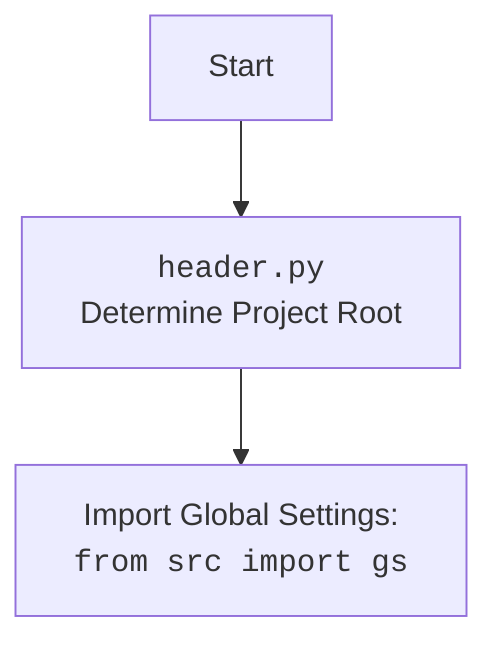

## АНАЛИЗ КОДА `hypotez/src/suppliers/cdata/graber.py`

### 1. <алгоритм>

**Блок-схема:**

```mermaid
flowchart TD
    A[Начало] --> B(Импорт модулей);
    B --> C{Определение класса `Graber`};
    C --> D{Инициализация `__init__`};
    D -- Установка `supplier_prefix` и вызов `super().__init__` --> E{Установка `Context.locator_for_decorator`};
    E --> F[Определение методов класса (наследование от `Graber`)]
    F --> G[Конец];
```

**Примеры:**

1.  **Импорт модулей (B):** Импортируются модули `header`, `Graber` и `Context` из `src.suppliers.graber`, `Driver` из `src.webdriver.driver`, `logger` из `src.logger.logger` и `Any` из typing
2.  **Определение класса `Graber` (C):** Класс `Graber` наследуется от класса `Graber` (переименованного в `Grbr` при импорте) из модуля `src.suppliers.graber`.
3.  **Инициализация `__init__` (D):**
    *   Устанавливает `supplier_prefix` в значение `'cdata'`.
    *   Вызывает конструктор родительского класса `Grbr` (`super().__init__(supplier_prefix=self.supplier_prefix, driver=driver)`), передавая `supplier_prefix` и объект `driver`.
4.  **Установка `Context.locator_for_decorator` (E):** Устанавливается значение `Context.locator_for_decorator` в `None`.
5.  **Определение методов класса (F):** Определяются специфические методы класса `Graber` для `cdata`, наследуя общую логику от родительского класса `Graber` (`Grbr`).
    * Пример: предполагается переопределение методов сбора данных, например, `get_price()`, `get_title()` и т.д.

**Поток данных:**

1.  Объект `Driver` создается и передается в конструктор `Graber`.
2.  Значение `supplier_prefix` устанавливается как `'cdata'`.
3.  Устанавливается значение `Context.locator_for_decorator` в `None`.
4.  Методы класса `Graber` используют `driver` для взаимодействия со страницей, а также `supplier_prefix`.

### 2. <mermaid>

```mermaid
flowchart TD
    Start[Start] --> ImportModules[Import Modules];
    ImportModules --> DefineGraberClass[Define Class Graber];
    DefineGraberClass --> GraberInit[Graber.__init__];
     GraberInit --> SetSupplierPrefix[Set  supplier_prefix = 'cdata'];
    SetSupplierPrefix --> CallSuperInit[Call super().__init__(supplier_prefix, driver)];
    CallSuperInit --> SetContextLocator[Set Context.locator_for_decorator = None];
    SetContextLocator --> End[End];
    
    style Start fill:#f9f,stroke:#333,stroke-width:2px
    
   
    classDef imports fill:#ccf,stroke:#333,stroke-width:2px
    class ImportModules imports
```

**Объяснение `mermaid`:**

*   `Start`: Начальная точка процесса.
*   `ImportModules`: Импортируются необходимые модули и классы. Это включает в себя `header`, `Graber` и `Context` из `src.suppliers.graber`, `Driver` из `src.webdriver.driver`, `logger` из `src.logger.logger` и `Any` из `typing`.
*   `DefineGraberClass`: Определяется класс `Graber`, который наследуется от `Graber` (переименованного в `Grbr`) из `src.suppliers.graber`.
*   `GraberInit`: Вызывается метод `__init__` класса `Graber`.
*   `SetSupplierPrefix`: В `__init__` устанавливается атрибут `supplier_prefix` в значение `'cdata'`.
*   `CallSuperInit`: В `__init__` вызывается конструктор родительского класса `Grbr` с переданными значениями `supplier_prefix` и `driver`.
*   `SetContextLocator`: В `__init__` устанавливается `Context.locator_for_decorator` в `None`.
*   `End`: Конечная точка процесса.



**Объяснение `header.py` (дополнительно):**

*   `Start`: Начало процесса.
*   `Header`: Модуль `header.py` определяет корень проекта.
*  `Import`: Импортирует глобальные настройки проекта из `src.gs`

### 3. <объяснение>

**Импорты:**

*   `from typing import Any`: Импортирует `Any` для указания, что переменная может быть любого типа.
*   `import header`: Импортирует модуль `header` для определения корня проекта и глобальных настроек. `header.py` необходим для настройки путей и глобальных параметров, используемых в проекте. Это стандартный механизм для доступа к конфигурации проекта.
*   `from src.suppliers.graber import Graber as Grbr, Context, close_pop_up`:
    *   `Graber as Grbr`: Импортирует базовый класс `Graber` из `src.suppliers.graber` и переименовывает его в `Grbr` для краткости.
    *   `Context`: Импортирует класс `Context` из `src.suppliers.graber`, который предположительно используется для хранения контекста выполнения, например, драйвера и локаторов.
    *   `close_pop_up`: Импортирует функцию `close_pop_up` из `src.suppliers.graber`, которая используется для закрытия всплывающих окон перед выполнением основных действий.
*   `from src.webdriver.driver import Driver`: Импортирует класс `Driver` из `src.webdriver.driver`, который используется для управления браузером.
*   `from src.logger.logger import logger`: Импортирует объект `logger` для логирования событий.

**Классы:**

*   `class Graber(Grbr)`:
    *   Наследуется от класса `Graber` (как `Grbr`) из `src.suppliers.graber`.
    *   `supplier_prefix: str`: Атрибут класса, указывающий на префикс поставщика (`cdata` в данном случае).
    *   `__init__(self, driver: Driver)`:
        *   Инициализирует объект `Graber` с указанным `driver`.
        *   Устанавливает `self.supplier_prefix = 'cdata'`.
        *   Вызывает `super().__init__(supplier_prefix=self.supplier_prefix, driver=driver)` для инициализации родительского класса.
        *  `Context.locator_for_decorator = None`: Устанавливает атрибут `locator_for_decorator` в `None`. Этот атрибут используется декоратором для закрытия всплывающих окон. Если он не установлен, то декоратор не выполнится.

**Функции:**

*   `__init__`: Инициализирует объект класса, устанавливая префикс поставщика и вызывая конструктор родительского класса.
   * `driver`:  объект `Driver` для управления браузером
   * Возвращает: `None`.

**Переменные:**

*   `supplier_prefix`: Строка, хранящая префикс поставщика (`'cdata'`).
*   `Context.locator_for_decorator`: Атрибут класса Context, используется для управления декоратором закрытия всплывающих окон.

**Потенциальные ошибки и области для улучшения:**

1.  **Отсутствие реализации декоратора:** Код для декоратора `close_pop_up` закомментирован. Его нужно раскомментировать и реализовать логику, если это необходимо для конкретного поставщика `cdata`.
2.  **Зависимость от `Context`:** Класс `Graber` сильно зависит от класса `Context`, что может усложнить тестирование и переиспользование.
3.  **Отсутствие методов сбора данных:** В классе отсутствуют методы для сбора конкретных данных (цены, названия, описания и т.д.) со страницы товара. Они должны быть реализованы, возможно, с перегрузкой методов из родительского класса.
4.  **Жестко заданный `supplier_prefix`:** Префикс поставщика `'cdata'` задан жестко в коде. В будущем, возможно, потребуется сделать его более гибким (например, передавать через параметр конструктора или использовать настройки).

**Взаимосвязь с другими частями проекта:**

*   **`src.suppliers.graber`**: Наследование от `Graber` (переименованного в `Grbr`) позволяет использовать общую логику сбора данных. Использование `Context` обеспечивает доступ к контексту выполнения.
*   **`src.webdriver.driver`**: Класс `Driver` используется для взаимодействия с веб-браузером.
*   **`src.logger.logger`**: Объект `logger` используется для логирования событий.
*   **`header.py`**: Обеспечивает доступ к корневому каталогу проекта и общим настройкам.

**Цепочка взаимосвязей:**

1.  `header.py` определяет корень проекта.
2.  `graber.py` импортирует `header` для доступа к настройкам.
3.  `graber.py` импортирует `Graber` и `Context` из `src.suppliers.graber`, наследуется от `Graber`.
4.  `graber.py` импортирует `Driver` из `src.webdriver.driver` для управления браузером.
5.  `graber.py` использует `logger` из `src.logger.logger` для логирования.
6.  `graber.py` устанавливает контекст для `Context`, включая `driver` и `supplier_prefix`.
7.  Далее вызываются методы класса для сбора данных.

В целом, код представляет собой базовый класс для сбора данных с сайта `cdata.co.il`, наследующий общую логику сбора от родительского класса. Для полноценной работы необходимо реализовать методы сбора конкретных полей и, возможно, декоратор для закрытия всплывающих окон.