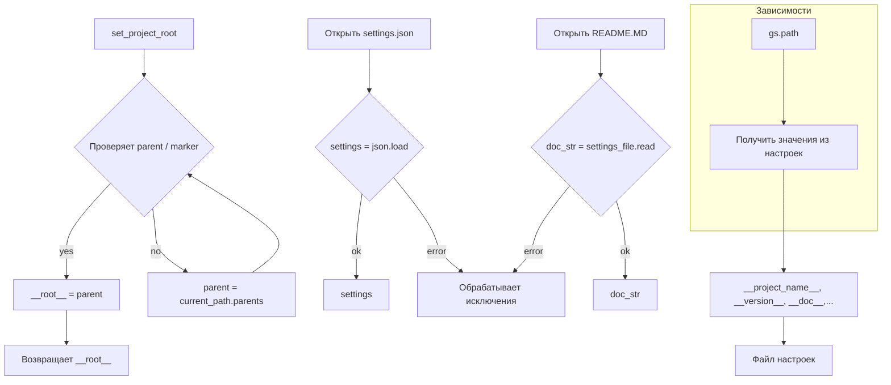

# <input code>

```python
## \file hypotez/src/suppliers/cdata/header.py
# -*- coding: utf-8 -*-
#! venv/Scripts/python.exe
#! venv/bin/python/python3.12

"""
.. module: src.suppliers.cdata 
	:platform: Windows, Unix
	:synopsis:

"""
MODE = 'dev'


import sys
import json
from packaging.version import Version

from pathlib import Path
def set_project_root(marker_files=('pyproject.toml', 'requirements.txt', '.git')) -> Path:
    """
    Finds the root directory of the project starting from the current file's directory,
    searching upwards and stopping at the first directory containing any of the marker files.

    Args:
        marker_files (tuple): Filenames or directory names to identify the project root.
    
    Returns:
        Path: Path to the root directory if found, otherwise the directory where the script is located.
    """
    __root__:Path
    current_path:Path = Path(__file__).resolve().parent
    __root__ = current_path
    for parent in [current_path] + list(current_path.parents):
        if any((parent / marker).exists() for marker in marker_files):
            __root__ = parent
            break
    if __root__ not in sys.path:
        sys.path.insert(0, str(__root__))
    return __root__


# Get the root directory of the project
__root__ = set_project_root()
"""__root__ (Path): Path to the root directory of the project"""

from src import gs

settings:dict = None
try:
    with open(gs.path.root / 'src' /  'settings.json', 'r') as settings_file:
        settings = json.load(settings_file)
except (FileNotFoundError, json.JSONDecodeError):
    ...

doc_str:str = None
try:
    with open(gs.path.root / 'src' /  'README.MD', 'r') as settings_file:
        doc_str = settings_file.read()
except (FileNotFoundError, json.JSONDecodeError):
    ...


__project_name__ = settings.get("project_name", 'hypotez') if settings  else 'hypotez'
__version__: str = settings.get("version", '')  if settings  else ''
__doc__: str = doc_str if doc_str else ''
__details__: str = ''
__author__: str = settings.get("author", '')  if settings else ''
__copyright__: str = settings.get("copyrihgnt", '')  if settings else ''
__cofee__: str = settings.get("cofee", "Treat the developer to a cup of coffee for boosting enthusiasm in development: https://boosty.to/hypo69")  if settings else "Treat the developer to a cup of coffee for boosting enthusiasm in development: https://boosty.to/hypo69"
```

# <algorithm>

**Алгоритм работы кода:**

1. **`set_project_root(marker_files)`:**
    - Задает корневую директорию проекта.
    - Начинает поиск с текущей директории файла `__file__`
    - Итеративно проверяет родительские директории, пока не найдет директорию, содержащую один из файлов в `marker_files`.
    - Если найдена, сохраняет ее в `__root__`
    - Добавляет эту директорию в `sys.path`, если она не присутствует, для импорта модулей.
    - Возвращает путь к корневой директории.


2. **Получение настроек (`settings` и `doc_str`):**
    - Получает путь к файлу настроек `settings.json` из модуля `gs.path.root`.
    - Использует `try-except` блок для обработки ошибок: `FileNotFoundError` и `json.JSONDecodeError` если файл отсутствует или имеет некорректный формат JSON.
    - Аналогично, загружает содержимое `README.MD`.

3. **Получение значений из настроек:**
    - Извлекает значения из `settings` или устанавливает значения по умолчанию, если ключ не найден или `settings` не задано.

**Пример данных:**
- `marker_files`: `('pyproject.toml', 'requirements.txt', '.git')`
-  Если  `pyproject.toml` найден в директории выше текущего файла, то `__root__` = эта директория.


# <mermaid>



# <explanation>

**Импорты:**

- `sys`: предоставляет доступ к переменным и функциям системы, например, `sys.path` для добавления директории в пути поиска модулей.
- `json`: используется для работы с файлами в формате JSON.
- `packaging.version`: используется для работы с версиями пакетов.
- `pathlib`: предоставляет классы для работы с путями к файлам и директориям в независимом от платформы формате.
- `src.gs`:  Импорт из модуля `gs`, предположительно, содержащего вспомогательные функции, связанные с путями к файлам.


**Классы:**

- `Path`: Класс из `pathlib`, представляющий путь к файлу или директории.


**Функции:**

- `set_project_root(marker_files)`: находит корневую директорию проекта, ища директорию с заданными файлами или директориями вверх по дереву от текущей. `marker_files` — кортеж имен файлов, по которым осуществляется поиск.
- `set_project_root` принимает кортеж `marker_files`, содержащий имена файлов, которые используются для определения корневой директории. Если корневая директория найдена, функция добавляет ее в `sys.path`, что позволяет импортировать модули из этой директории.

**Переменные:**

- `MODE`: Строковая переменная, вероятно, для обозначения режима работы (например, `dev`, `prod`).
- `__root__`: Путь к корневой директории проекта, полученный функцией `set_project_root`.
- `settings`: Словарь, содержащий настройки проекта, загруженные из файла `settings.json`.
- `doc_str`: Строка, содержащая содержимое файла `README.MD`.
- `__project_name__`, `__version__`, `__doc__`, `__details__`, `__author__`, `__copyright__`, `__cofee__`: Переменные, хранящие данные из файла настроек, с возможностью задать значения по умолчанию.

**Возможные ошибки или области для улучшений:**

- Обработка ошибок при чтении `settings.json` и `README.MD` более детализирована.
-  Проверка на существование папки `src`.
- Проверка корректности `settings.json`.
- Дополнительная валидация данных в `settings.json`.
- Возможно, стоит использовать `logging` для записи информации об ошибках и процессе работы.
- Использование `try...except` блоков для обработки ошибок чтение файла настроек (`settings.json`) и документации (`README.MD`).


**Взаимосвязи с другими частями проекта:**

- Модуль `gs` является внешним и необходим для работы с путями к файлам проекта.  Очевидно, что модуль `gs` содержит информацию о расположении файлов проекта.  Предполагается, что в `gs.path` есть методы для получения пути к корневой директории.


```