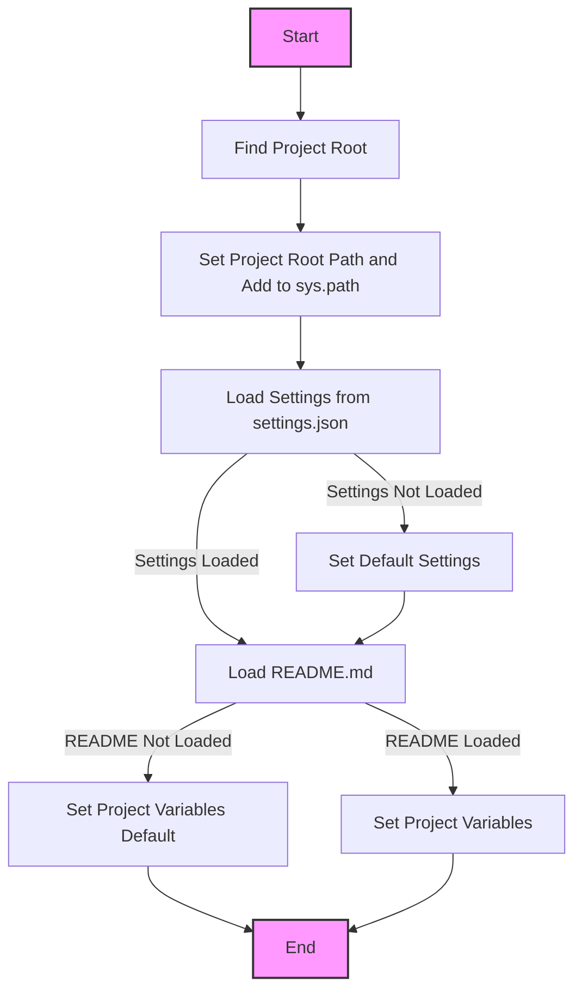

## АНАЛИЗ КОДА: `hypotez/src/suppliers/cdata/header.py`

### 1. <алгоритм>

**Блок-схема:**

```mermaid
flowchart TD
    Start[Начало] --> FindRoot[Найти корневую директорию проекта (set_project_root)]
    FindRoot -- "Найдена корневая директория" --> SetRootPath[Установить __root__ и добавить в sys.path]
    FindRoot -- "Корневая директория не найдена" --> SetCurrentPath[Установить __root__ как текущую директорию]
    SetRootPath --> LoadSettings[Загрузить настройки из settings.json]
    SetCurrentPath --> LoadSettings
    LoadSettings -- "Файл найден и JSON валиден" --> ReadSettings[Прочитать настройки]
    LoadSettings -- "Файл не найден или JSON не валиден" --> DefaultSettings[Установить значения по умолчанию]
    ReadSettings --> LoadReadme[Загрузить README.md]
    DefaultSettings --> LoadReadme
    LoadReadme -- "Файл найден" --> ReadReadme[Прочитать README.md]
    LoadReadme -- "Файл не найден" --> DefaultReadme[Установить пустую строку для __doc__]
    ReadReadme --> SetProjectInfo[Установить __project_name__, __version__, __doc__, __details__, __author__, __copyright__, __cofee__]
    DefaultReadme --> SetProjectInfo
     SetProjectInfo --> End[Конец]
    
    style Start fill:#f9f,stroke:#333,stroke-width:2px
    style End fill:#ccf,stroke:#333,stroke-width:2px
```

**Примеры для логических блоков:**

1.  **`set_project_root`**:
    *   **Вход**: `marker_files = ('__root__', '.git')`.
    *   **Пример 1:** Если в директории `/hypotez/src/suppliers/cdata` есть файл `__root__`, то `__root__` будет равен `/hypotez/src/suppliers/cdata`.
    *   **Пример 2:** Если `__root__` нет, но есть  директория  `.git` в `/hypotez/`,  `__root__` будет равен `/hypotez/`.
    *   **Пример 3:** Если ни `__root__`, ни `.git` нет, `__root__` будет равен `/hypotez/src/suppliers/cdata`.
    *   **Выход:** Возвращает `Path` к найденной корневой директории.

2.  **Загрузка настроек:**
    *   **Вход**: Путь к `settings.json` (например, `/hypotez/src/settings.json`).
    *   **Пример 1:** Файл `settings.json` содержит `{"project_name": "my_project", "version": "1.2.3"}`. `settings` будет равен этому словарю.
    *   **Пример 2:** Файл `settings.json` не существует или не является валидным JSON. `settings` останется `None`.
    *   **Выход**: Словарь `settings` или `None`.

3.  **Загрузка README:**
    *   **Вход**: Путь к `README.MD` (например, `/hypotez/src/README.MD`).
    *   **Пример 1:** `README.MD` содержит текстовое описание. `doc_str` будет содержать эту строку.
    *   **Пример 2:** Файл `README.MD` не существует. `doc_str` останется `None`.
    *   **Выход**: Строка `doc_str` или `None`.

4.  **Установка переменных проекта:**
    *   **Вход**: Словари `settings` и строка `doc_str`.
    *   **Пример 1:**  `settings = {"project_name": "test_project", "version": "0.1.0"}`. `__project_name__` будет "test_project", `__version__` будет "0.1.0".
    *   **Пример 2:** `settings = None`. `__project_name__` будет "hypotez", `__version__` будет "".
    *   **Выход**: Переменные `__project_name__`, `__version__`, `__doc__` и другие устанавливаются.

### 2. <mermaid>



**Объяснение зависимостей:**

*   **`import sys`**: Модуль `sys` используется для работы с параметрами среды выполнения, в данном случае для добавления корневой директории проекта в список путей поиска модулей `sys.path`.
*   **`import json`**: Модуль `json` используется для работы с JSON-форматом данных.  Он нужен для загрузки настроек из файла `settings.json`.
*    **`from packaging.version import Version`**: Используется для сравнения версий
*   **`from pathlib import Path`**: Класс `Path` из модуля `pathlib` используется для представления путей к файлам и директориям в операционной системе, упрощая работу с ними.
*   **`from src import gs`**: Импортируется модуль `gs` из пакета `src`. Предположительно, `gs` содержит глобальные настройки,  включая путь к корневой директории проекта, который используется для поиска файлов `settings.json` и `README.MD`.
*   **`header.py` flowchart:**
```mermaid
    flowchart TD
        Start --> Header[<code>header.py</code><br> Determine Project Root]
    
        Header --> import[Import Global Settings: <br><code>from src import gs</code>] 
    
    ```
### 3. <объяснение>

**Импорты:**

*   **`import sys`**: Предоставляет доступ к некоторым переменным и функциям, взаимодействующим с интерпретатором Python. Здесь используется для модификации `sys.path`, добавляя путь к корневой директории проекта.
*   **`import json`**: Используется для работы с JSON, в частности для десериализации файла `settings.json` в словарь Python.
*   **`from packaging.version import Version`**: Импортируется класс `Version` из библиотеки `packaging`, который предназначен для сравнения версий, но в коде не используется.
*   **`from pathlib import Path`**: Предоставляет класс для представления путей файловой системы, что упрощает навигацию и операции над файлами и директориями.
*   **`from src import gs`**: Импортирует модуль `gs` из пакета `src`, который, предположительно, содержит глобальные настройки проекта, включая объект с путями, необходимыми для поиска `settings.json` и `README.MD`.

**Классы:**

*   В данном коде нет пользовательских классов. Используется только `Path` из библиотеки `pathlib`.

**Функции:**

*   **`set_project_root(marker_files: tuple = ('__root__')) -> Path`**:
    *   **Аргументы:**
        *   `marker_files` (tuple, по умолчанию `('__root__')`): Кортеж с именами файлов или директорий, которые будут использоваться для определения корневой директории проекта.
    *   **Возвращаемое значение:** `Path` - объект, представляющий путь к корневой директории проекта. Если корневая директория не найдена, то возвращается путь к директории, где находится скрипт.
    *   **Назначение:** Функция ищет корневую директорию проекта, двигаясь вверх по структуре каталогов, пока не найдёт маркерный файл (или директорию). Добавляет найденный путь в `sys.path`.
    *   **Пример:**
        ```python
        root_path = set_project_root(marker_files=('__root__', '.git'))
        print(root_path)
        ```

**Переменные:**

*   **`__root__` (Path):**  Путь к корневой директории проекта, вычисляется при запуске модуля. Используется для формирования путей к `settings.json` и `README.MD`.
*   **`settings` (dict):**  Словарь с настройками проекта, загруженный из `settings.json`. Может быть `None`, если файл не найден или не является валидным JSON.
*   **`doc_str` (str):** Строка с содержимым файла `README.MD`. Может быть `None`, если файл не найден.
*   **`__project_name__` (str):** Название проекта, полученное из `settings.json` или значение по умолчанию "hypotez".
*   **`__version__` (str):**  Версия проекта, полученная из `settings.json` или пустая строка.
*   **`__doc__` (str):** Строка с документацией проекта, полученная из `README.MD` или пустая строка.
*   **`__details__` (str):**  Строка для дополнительных деталей проекта, но в коде ей не присваивается никакого значения.
*   **`__author__` (str):**  Автор проекта, полученный из `settings.json` или пустая строка.
*   **`__copyright__` (str):**  Авторские права на проект, полученные из `settings.json` или пустая строка.
*   **`__cofee__` (str):** Сообщение для поддержки разработчиков, полученное из `settings.json` или сообщение по умолчанию.

**Потенциальные ошибки и области для улучшения:**

*   **Обработка исключений:** Обработка исключений `FileNotFoundError` и `json.JSONDecodeError`  происходит с помощью `...`, что является неявным `pass`, это затрудняет отладку.  Рекомендуется логирование ошибок или вывод предупреждений.
*   **`__details__`:** Переменная объявлена, но ей не присваивается значение, что может быть ошибкой или недоработкой.
*   **Зависимость от структуры проекта:** Код предполагает, что `settings.json` и `README.MD` находятся в каталоге `src` от корня проекта. Это может быть неудобно, если структура изменится.
*   **Неиспользуемый импорт**:  `packaging.version` импортирован, но не используется, следует убрать.

**Цепочка взаимосвязей:**

*   `header.py` находит корневую директорию проекта и добавляет её в `sys.path`, что позволяет другим модулям импортировать код из этой директории.
*   `header.py` загружает настройки из `settings.json`, устанавливая переменные проекта. Это позволяет другим модулям использовать эти переменные.
*   `header.py` загружает описание проекта из `README.MD`, которое можно использовать для вывода документации.
*   Модуль `header` используется  для определения основных параметров проекта, таких как название и версия, и эти параметры используются в других частях проекта, например, для вывода информации о проекте в консоли, формирования документации, в процессах сборки и развертывания.
*   Модуль импортирует `gs` , что указывает на зависимость от модуля глобальных настроек.

Этот анализ предоставляет полное понимание того, как работает `header.py` и как он взаимодействует с другими компонентами проекта.