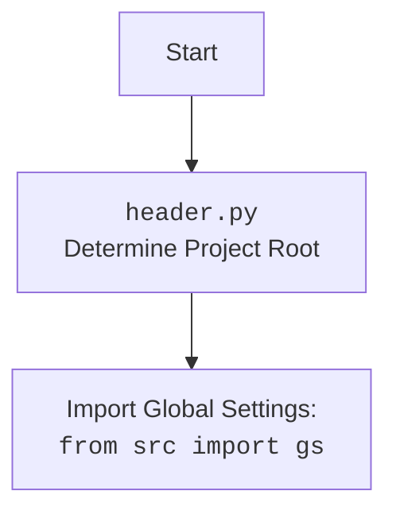

## ИНСТРУКЦИЯ:

Анализируй предоставленный код подробно и объясни его функциональность. Ответ должен включать три раздела:  

1.  **<алгоритм>**: Опиши рабочий процесс в виде пошаговой блок-схемы, включая примеры для каждого логического блока, и проиллюстрируй поток данных между функциями, классами или методами.  
2.  **<mermaid>**: Напиши код для диаграммы в формате `mermaid`, проанализируй и объясни все зависимости, 
    которые импортируются при создании диаграммы. 
    **ВАЖНО!** Убедитесь, что все имена переменных, используемые в диаграмме `mermaid`, 
    имеют осмысленные и описательные имена. Имена переменных вроде `A`, `B`, `C`, и т.д., не допускаются!  
    
    **Дополнительно**: Если в коде есть импорт `import header`, добавьте блок `mermaid` flowchart, объясняющий `header.py`:
    ```mermaid
    flowchart TD
        Start --> Header[<code>header.py</code><br> Determine Project Root]
    
        Header --> import[Import Global Settings: <br><code>from src import gs</code>] 
    ```

3.  **<объяснение>**: Предоставьте подробные объяснения:  
    - **Импорты**: Их назначение и взаимосвязь с другими пакетами `src.`.  
    - **Классы**: Их роль, атрибуты, методы и взаимодействие с другими компонентами проекта.  
    - **Функции**: Их аргументы, возвращаемые значения, назначение и примеры.  
    - **Переменные**: Их типы и использование.  
    - Выделите потенциальные ошибки или области для улучшения.  

Дополнительно, постройте цепочку взаимосвязей с другими частями проекта (если применимо).  

Это обеспечивает всесторонний и структурированный анализ кода.
## Формат ответа: `.md` (markdown)
**КОНЕЦ ИНСТРУКЦИИ**
## <алгоритм>

1. **Определение Корневой Директории Проекта (`set_project_root`)**:
    *   Начало: Функция `set_project_root` вызывается без аргументов.
    *   Инициализация:
        *   `current_path` получает абсолютный путь к директории, в которой находится файл `header.py`. Например, если файл находится в `/home/user/hypotez/src/suppliers/cdata/header.py`, то `current_path` будет `/home/user/hypotez/src/suppliers/cdata`.
        *   `__root__`  инициализируется  `current_path`.
    *   Поиск Маркеров:
        *   Перебираются директории-предки `current_path`: родительская директория, директория родителя и т.д.
        *   Для каждой родительской директории проверяется наличие одного из файлов-маркеров `__root__` или `.git`.
            *   Например, если в `/home/user/hypotez` есть файл `__root__`, цикл прервётся.
        *   Если маркер найден, то `__root__` обновляется до директории с маркером.
    *   Обновление `sys.path`:
        *   Если `__root__` нет в `sys.path`, то  `__root__` добавляется в начало `sys.path`. Это обеспечивает правильное импортирование модулей из корневой директории.
    *   Возврат: Функция возвращает `__root__` (объект `Path`).
2. **Получение Корневой Директории:**
    *   `__root__` присваивается результат вызова `set_project_root()`.
3. **Загрузка Настроек из `settings.json`:**
    *   Попытка:
        *   Открывается файл `settings.json`, который находится в `src/settings.json` от корневой директории проекта (`__root__`).
        *   Загружает содержимое файла в переменную `settings` как словарь JSON.
    *   Обработка ошибок:
        *   Если возникает `FileNotFoundError` (файл не найден) или `json.JSONDecodeError` (некорректный JSON), то переменная `settings` остается `None`.
4.  **Загрузка Документации из `README.MD`:**
    *  Попытка:
        *  Открывается файл `README.MD`, который находится в `src/README.MD` от корневой директории проекта (`__root__`).
        *  Считывает содержимое файла в переменную `doc_str`.
    *  Обработка ошибок:
         * Если возникает `FileNotFoundError` (файл не найден) или `json.JSONDecodeError`, то переменная `doc_str` остается `None`.
5. **Инициализация Глобальных Переменных**:
   *   `__project_name__`: Если `settings` загружен, то получает значение из ключа `project_name`. Если ключа нет или `settings`  `None`, то используется значение по умолчанию `'hypotez'`.
   *   `__version__`: Если `settings` загружен, то получает значение из ключа `version`. Если ключа нет или `settings`  `None`, то используется значение по умолчанию `''`.
   *   `__doc__`: Если `doc_str` загружен, то `__doc__` получает значение `doc_str`, иначе `''`.
   *  `__details__`: Инициализируется пустой строкой.
   *   `__author__`: Если `settings` загружен, то получает значение из ключа `author`. Если ключа нет или `settings`  `None`, то используется значение по умолчанию `''`.
   *   `__copyright__`: Если `settings` загружен, то получает значение из ключа `copyrihgnt`. Если ключа нет или `settings`  `None`, то используется значение по умолчанию `''`.
   *  `__cofee__`: Если `settings` загружен, то получает значение из ключа `cofee`. Если ключа нет или `settings`  `None`, то используется значение по умолчанию  `"Treat the developer to a cup of coffee for boosting enthusiasm in development: https://boosty.to/hypo69"`.

## <mermaid>
```mermaid
flowchart TD
    Start[Start] --> FindRoot[set_project_root(): Find Project Root];
    FindRoot --> CheckMarkers[Check for marker files ('.git', '__root__')];
    CheckMarkers -- Marker Found --> SetRoot[Set project root];
    CheckMarkers -- No Marker Found --> NextParent[Move to parent directory];
     NextParent -- Has Parent --> CheckMarkers
     NextParent -- No Parent --> SetRoot
    SetRoot --> UpdateSysPath[Update sys.path];
    UpdateSysPath -->  ImportGS[Import Global Settings: <br><code>from src import gs</code>];
     ImportGS --> LoadSettings[Load settings.json];
    LoadSettings -- Success --> SetGlobalVars[Set global variables from settings]
    LoadSettings -- Failure --> SetDefaultVars[Set default global variables]
    SetGlobalVars --> LoadDocStr[Load README.MD]
    SetDefaultVars --> LoadDocStr
    LoadDocStr -- Success --> End
    LoadDocStr -- Failure --> End
    End[End]
    

    subgraph Find Project Root
    FindRoot
    CheckMarkers
    SetRoot
    NextParent
    end
    
    subgraph Set Global Variables
    UpdateSysPath
    ImportGS
    LoadSettings
    SetGlobalVars
    SetDefaultVars
    LoadDocStr
    end


```



## <объяснение>

**Импорты:**
*   `import sys`: Модуль `sys` используется для работы с системными переменными и функциями, в частности, для модификации `sys.path`, что позволяет импортировать модули из других директорий, не входящих в стандартный путь поиска.
*   `import json`: Модуль `json` используется для работы с данными в формате JSON, в частности, для чтения файла `settings.json` в словарь Python.
*   `from packaging.version import Version`: Импортируется класс `Version` из пакета `packaging.version`,  который не используется в представленном коде. Это может быть артефакт, оставленный от прежних версий или запланированного функционала.
*   `from pathlib import Path`: Класс `Path` из модуля `pathlib` используется для работы с путями к файлам и директориям как с объектами, что делает код более читаемым и кроссплатформенным.
*   `from src import gs`: Импортирует модуль `gs` из пакета `src`. Этот модуль, скорее всего, содержит глобальные настройки и константы проекта, включая путь к корневой директории.

**Функции:**

*   `set_project_root(marker_files: tuple = ('__root__', '.git')) -> Path`:
    *   **Назначение**: Определяет корневую директорию проекта.
    *   **Аргументы**:
        *   `marker_files`: кортеж (tuple) строк, представляющих файлы или директории, которые являются маркерами корневой директории проекта. По умолчанию это `'__root__'` и `'.git'`.
    *   **Возвращаемое значение**: Объект `Path`, представляющий путь к корневой директории.
    *   **Пример**: Если `header.py` находится в `/home/user/hypotez/src/suppliers/cdata/`, а файл `.git` находится в `/home/user/hypotez`, то функция вернет `Path('/home/user/hypotez')`.

**Переменные:**

*   `__root__`: Объект `Path`, представляющий корневую директорию проекта. Изначально устанавливается в ту же директорию, что и скрипт, но потом может быть переопределен.
*   `settings`: Словарь `dict`, содержащий настройки проекта, загруженные из файла `settings.json`, или `None`, если файл не найден или невалиден.
*   `doc_str`: Строка `str`, содержащая текст документации, загруженный из файла `README.MD`, или `None`, если файл не найден.
*   `__project_name__`: Строка `str`, содержащая имя проекта. Значение по умолчанию "hypotez"
*   `__version__`: Строка `str`, содержащая версию проекта. Значение по умолчанию "".
*   `__doc__`: Строка `str`, содержащая  текст документации проекта. Значение по умолчанию "".
*   `__details__`: Строка `str`, содержащая детали проекта. Изначально пустая строка.
*   `__author__`: Строка `str`, содержащая автора проекта. Значение по умолчанию "".
*   `__copyright__`: Строка `str`, содержащая информацию об авторских правах проекта. Значение по умолчанию "".
*   `__cofee__`: Строка `str`, содержащая призыв угостить разработчика кофе и ссылку. Значение по умолчанию  `"Treat the developer to a cup of coffee for boosting enthusiasm in development: https://boosty.to/hypo69"`.

**Взаимосвязь с другими частями проекта:**

*   **`src.gs`**: Этот модуль, вероятно, содержит глобальные пути и переменные проекта. `header.py` использует его для доступа к корневому пути проекта, что позволяет единообразно работать с файлами и директориями, не завися от текущего расположения скрипта.
*   **`settings.json`**: Файл конфигурации проекта, содержащий настройки проекта, такие как имя проекта, версия, автор и другие.
*   **`README.MD`**: Файл документации проекта, который загружается для заполнения глобальной переменной `__doc__`.

**Потенциальные ошибки и области для улучшения:**

*   **Обработка исключений**: Обработка исключений при чтении файлов `settings.json` и `README.MD` просто пропускает ошибку (`...`). Это не позволяет пользователю получить информацию об ошибках и потенциально может привести к неожиданному поведению. Стоит добавить логирование или более информативное сообщение об ошибке.
*   **Использование `packaging.version`**: Класс `Version` импортируется, но не используется. Это указывает на потенциальный неиспользуемый код, который стоит удалить.
*   **Жестко заданные пути**: Путь к файлам `settings.json` и `README.MD` жестко задан как `'src'` относительно корневой директории. Было бы лучше вынести его в настройки, чтобы была возможность его кастомизировать.
*  **Глобальные переменные**: Использование глобальных переменных для хранения настроек и данных может усложнить тестирование и сопровождение кода. Рассмотрите возможность использования классов для хранения состояния или использования более структурированных механизмов для передачи данных.
* **Копирайт**: В коде имеется опечатка `copyrihgnt`.

**Цепочка взаимосвязей:**

1.  `header.py` определяет корень проекта с помощью `set_project_root`
2.  `header.py` использует корень проекта, чтобы загрузить настройки из `settings.json`.
3.  `header.py` использует корень проекта, чтобы загрузить документацию из `README.MD`.
4.  `header.py` импортирует  `src.gs` для получения доступа к глобальным настройкам.
5.  Глобальные переменные `__project_name__`, `__version__`, `__doc__`, `__author__`, `__copyright__`, `__cofee__` устанавливаются с использованием загруженных настроек и документации.
6.  Остальные модули проекта могут импортировать `header.py` и использовать его глобальные переменные и настройки.