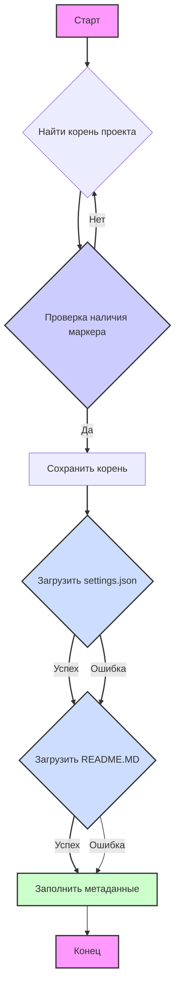

## Анализ кода `hypotez/src/suppliers/cdata/header.py`

### <алгоритм>

1. **Инициализация**:
   - Определяется переменная `MODE` со значением `'dev'`.
   - Импортируются необходимые модули: `sys`, `json`, `packaging.version.Version`, `pathlib.Path`.

2. **Функция `set_project_root`**:
   - **Вход**: `marker_files` (кортеж строк, по умолчанию `('pyproject.toml', 'requirements.txt', '.git')`).
   - **Действие**:
     - Получает абсолютный путь к директории, где расположен файл (`__file__`).
     - Начиная с этой директории, последовательно переходит к родительским директориям.
     - Проверяет наличие любого из файлов `marker_files` в текущей директории.
     - Если файл найден, путь к этой директории сохраняется в `__root__` и цикл завершается.
     - Если `__root__` не содержится в `sys.path`, добавляет его в начало списка путей.
   - **Выход**: `__root__` - путь к корневой директории проекта.
   - **Пример**:
     - Если файл `header.py` расположен в `hypotez/src/suppliers/cdata`, а `pyproject.toml` находится в `hypotez`, функция вернет путь к директории `hypotez`.
     - Если ни один из маркеров не найден, то вернётся путь к директории, где находится сам скрипт.

3. **Определение `__root__`**:
   - Вызывается функция `set_project_root()` и полученное значение присваивается переменной `__root__`.

4. **Импорт модуля `gs`**:
   - Импортируется модуль `gs` из пакета `src`.
   
5. **Загрузка настроек `settings`**:
   - Пытается открыть файл `settings.json` (находящийся в директории `src` в корне проекта).
   - Если файл успешно открыт, загружает его содержимое как словарь в переменную `settings`.
   - Если файл не найден или содержит некорректный JSON, переменная `settings` остаётся `None`.

6. **Загрузка документации `doc_str`**:
    - Пытается открыть файл `README.MD` (находящийся в директории `src` в корне проекта).
    - Если файл успешно открыт, загружает его содержимое как строку в переменную `doc_str`.
    - Если файл не найден, переменная `doc_str` остаётся `None`.

7. **Инициализация метаданных проекта**:
   - Загружает метаданные проекта из словаря `settings` (если он загружен), в противном случае используются значения по умолчанию:
     - `__project_name__`: Имя проекта (по умолчанию 'hypotez').
     - `__version__`: Версия проекта (по умолчанию '').
     - `__doc__`: Строка документации (берется из README.MD если есть, иначе '').
     - `__details__`: Пустая строка.
     - `__author__`: Автор проекта (по умолчанию '').
     - `__copyright__`: Авторские права (по умолчанию '').
     - `__cofee__`: Сообщение для поддержки автора (сообщение по умолчанию).

### <mermaid>


**Описание зависимостей `mermaid`:**

-   `A`: Начало программы.
-   `B`: **Поиск корня проекта** - определение местоположения корня проекта с помощью функции `set_project_root`.
-   `C`: **Проверка наличия маркера** - итерация по родительским директориям с проверкой наличия маркера.
-   `D`: **Сохранить корень** - сохранение найденной директории в переменную `__root__`.
-   `E`: **Загрузить `settings.json`** - попытка загрузки данных из файла настроек, в случае неудачи, переменная settings остаётся None.
-   `F`: **Загрузить `README.MD`** - попытка загрузки данных из файла README, в случае неудачи, переменная doc_str остаётся None.
-   `G`: **Заполнить метаданные** - инициализация метаданных проекта из загруженных настроек или значений по умолчанию.
-   `H`: Конец программы.

### <объяснение>

**Импорты:**

-   `sys`: Предоставляет доступ к некоторым переменным и функциям, взаимодействующим с интерпретатором Python. Используется для добавления пути к корню проекта в `sys.path`, что позволяет импортировать модули из этого каталога.
-   `json`:  Используется для работы с данными в формате JSON. В данном коде используется для загрузки файла настроек `settings.json`.
-   `packaging.version.Version`: Класс для сравнения версий. В данном коде не используется, но импортирован, вероятно, для дальнейшего использования.
-   `pathlib.Path`: Предоставляет способ работы с путями к файлам и директориям в объектно-ориентированном стиле. Используется для определения корневой директории проекта и доступа к файлам конфигурации.
-   `src.gs`: Используется для получения пути к корню проекта.

**Переменные:**

-   `MODE`: Строковая переменная, определяющая режим работы (здесь `'dev'`).
-   `__root__`: Объект `pathlib.Path`, представляющий путь к корневой директории проекта.
-   `settings`: Словарь, содержащий настройки проекта, загруженные из `settings.json`. Может быть `None`, если файл не найден или поврежден.
-   `doc_str`: Строка, содержащая документацию, загруженную из `README.MD`. Может быть `None`, если файл не найден.
-   `__project_name__`: Строка, имя проекта, по умолчанию `'hypotez'`.
-   `__version__`: Строка, версия проекта, по умолчанию `''`.
-   `__doc__`: Строка, документация проекта, по умолчанию `''`.
-   `__details__`: Строка, пустая.
-   `__author__`: Строка, автор проекта, по умолчанию `''`.
-   `__copyright__`: Строка, информация о копирайте, по умолчанию `''`.
-    `__cofee__`: Строка, сообщение о поддержке разработчика, по умолчанию "Treat the developer to a cup of coffee for boosting enthusiasm in development: https://boosty.to/hypo69".

**Функции:**

-   `set_project_root(marker_files)`:
    -   **Аргументы**:
        -   `marker_files`: Кортеж строк, представляющих имена файлов или директорий, по которым определяется корень проекта (по умолчанию `('pyproject.toml', 'requirements.txt', '.git')`).
    -   **Возвращает**:
        -   `Path`: Объект `pathlib.Path`, представляющий путь к корню проекта, либо путь к текущей директории, если корень не найден.
    -   **Назначение**:
        -   Рекурсивно ищет корневую директорию проекта, переходя к родительским директориям, пока не найдет маркерные файлы. Обеспечивает корректную работу скриптов независимо от их расположения в файловой структуре.
    -   **Пример**:
        -   Если структура проекта `hypotez`:
            ```
            hypotez/
                pyproject.toml
                src/
                    suppliers/
                        cdata/
                            header.py
            ```
         Тогда, `set_project_root()` вернет `Path('hypotez')`.

**Классы:**

-   В данном коде классы отсутствуют.

**Объяснение:**

1.  **Поиск корневой директории**: Код определяет корень проекта динамически, что позволяет ему работать в разных условиях развертывания.
2.  **Загрузка настроек и метаданных**: Код загружает настройки из файла `settings.json` и документацию из файла `README.MD` . В случае отсутствия этих файлов или ошибок парсинга, используются значения по умолчанию. Это обеспечивает гибкость при настройке проекта.
3.  **Инициализация метаданных**: Код инициализирует переменные метаданных проекта, такие как имя, версия, автор и т.д.  Если `settings.json` не найден или какие-либо поля в нём отсутствуют, используются значения по умолчанию.
4. **`__root__`:**  Переменная `__root__` сохраняет путь к корню проекта, позволяя другим модулям получать доступ к файлам проекта.
5. **Путь к файлам:** Все пути к файлам настроек и документации формируются относительно корня проекта, что предотвращает проблемы с путями.

**Потенциальные улучшения:**

-   Добавить проверку версии и возможность её сравнения через `packaging.version.Version`.
-   Обрабатывать ошибки загрузки `settings.json` более явно.
-   Предусмотреть возможность загрузки настроек из других файлов, таких как `.env`.
-   Добавить логирование для отслеживания ошибок при загрузке файлов.

**Связи с другими частями проекта:**

-   `set_project_root` используется для определения корня проекта, что важно для всех модулей, которые должны иметь доступ к файлам проекта.
-   `settings.json` и `README.MD` предоставляют настройки и документацию для всего проекта.
-   Метаданные, такие как `__project_name__`, `__version__`, используются для создания заголовков, документации и других целей в других модулях.
-   `src.gs` предоставляет доступ к другим частям проекта, например к `path.root`.