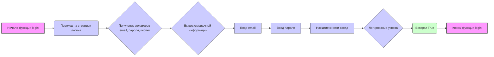

## <алгоритм>

1. **Начало**: Функция `login` вызывается.
2. **Переход по URL**:  Вызывается метод `self.get_url` для перехода на страницу авторизации по адресу `https://reseller.c-data.co.il/Login`.
    - *Пример:* `self.get_url('https://reseller.c-data.co.il/Login')` - открывает указанную страницу в браузере.
3. **Получение локаторов**: Извлекаются локаторы для email, пароля и кнопки входа из `self.locators['login']`.
    - *Пример:* `email_locator` получает значение `(By.ID, 'email')` если  `self.locators['login']` хранит эту информацию.
4. **Вывод отладочной информации**: Вывод в консоль локаторов для email, пароля и кнопки входа.
    - *Пример:*  `print(f'email_locator {email_locator}\n password_locator {password_locator}\n loginbutton_locator {loginbutton_locator}')` выведет кортежи локаторов, если, к примеру, они `email_locator: (By.ID, 'email')`, `password_locator: (By.NAME, 'password')` и `loginbutton_locator: (By.CSS_SELECTOR, '#login-button')`.
5. **Ввод email**: Нахождение элемента по локатору `email_locator` и ввод email.
    - *Пример:* `self.find(email_locator).send_keys(email)` - находит текстовое поле для ввода email и вставляет email.
6. **Ввод пароля**: Нахождение элемента по локатору `password_locator` и ввод пароля.
     - *Пример:* `self.find(password_locator).send_keys(password)` - находит текстовое поле для ввода пароля и вставляет пароль.
7. **Нажатие кнопки входа**: Нахождение элемента по локатору `loginbutton_locator` и нажатие на него.
    - *Пример:* `self.find(loginbutton_locator).click()` - кликает по кнопке.
8. **Логирование**: Запись в лог сообщения об успешной авторизации.
    - *Пример:*  `self.log('C-data logged in')` записывает сообщение "C-data logged in" в лог.
9. **Возврат значения**: Возврат `True` для сигнализации об успешной авторизации.
   - *Пример:* `return True` возвращает  `True` в случае успешной авторизации.
10. **Конец**: Завершение функции `login`.

## <mermaid>


**Объяснение `mermaid` диаграммы:**

*   **`graph LR`**: Определяет тип диаграммы как направленный граф слева направо.
*   **`A[Начало функции login]` и `J[Конец функции login]`**:  Обозначают начало и конец процесса.
*   **`B(Переход на страницу логина)`**: Обозначает действие перехода на страницу логина.
*    **`C{Получение локаторов email, пароля, кнопки}`**: Представляет блок, в котором  получаются локаторы для элементов.
*   **`D{Вывод отладочной информации}`**: Обозначает действие вывода отладочной информации.
*   **`E[Ввод email]`**: Обозначает действие ввода email.
*   **`F[Ввод пароля]`**: Обозначает действие ввода пароля.
*   **`G[Нажатие кнопки входа]`**: Обозначает действие нажатия кнопки входа.
*   **`H{Логирование успеха}`**: Представляет блок, в котором  логируется успешная авторизация.
*  **`I(Возврат True)`**: Представляет возврат `True`.
*   **`-->`**: Указывает направление потока выполнения между блоками.
*  `style A fill:#f9f,stroke:#333,stroke-width:2px` и `style J fill:#f9f,stroke:#333,stroke-width:2px`:  Стилизует начальный и конечный блоки.
* `classDef action fill:#ccf,stroke:#333,stroke-width:1px;`:  Стилизует блоки, представляющие действия.
* `class B,E,F,G action;`: Применяет стиль `action` к блокам `B`, `E`, `F`, `G`.
* `classDef condition fill:#ccf,stroke:#333,stroke-width:1px;`: Стилизует блоки, представляющие условия.
* `class C,D,H condition;`: Применяет стиль `condition` к блокам `C`, `D`, `H`.
* `classDef return fill:#cfc,stroke:#333,stroke-width:1px;`: Стилизует блоки, представляющие возвращаемое значение.
* `class I return;`: Применяет стиль `return` к блоку `I`.

## <объяснение>

**Импорты:**

*   В предоставленном коде отсутствуют явные операторы импорта (`import`). Однако предполагается, что `self` является экземпляром класса, который имеет методы `get_url`, `find`, `send_keys`, `click`, и `log`. Эти методы, вероятно, принадлежат к какому-то фреймворку для автоматизации веб-тестирования, например Selenium.

**Классы:**

*   Код не содержит явного определения классов. Предполагается, что функция `login` является методом некоторого класса, который имеет атрибуты `self.locators` и методы, упомянутые выше.
    *   `self.locators`: Словарь, который содержит локаторы веб-элементов для различных действий на странице. В данном случае, он содержит локаторы для входа в систему под ключом `login`.
    *  `self.get_url`: Метод для перехода по заданному URL.
    *  `self.find`: Метод для поиска веб-элемента на странице по заданному локатору.
    *   `self.send_keys`: Метод для ввода текста в текстовое поле.
    *   `self.click`: Метод для нажатия на кнопку.
    *   `self.log`: Метод для записи сообщения в лог.

**Функции:**

*   `login(self)`:
    *   **Аргументы**: Принимает один аргумент `self`, который является ссылкой на экземпляр класса.
    *   **Возвращаемое значение**: Возвращает `True`, если авторизация прошла успешно.
    *   **Назначение**: Функция реализует процесс авторизации на сайте c-data. Она открывает страницу авторизации, находит поля для ввода email и пароля, вводит данные, нажимает кнопку входа и логирует результат.
    *   **Пример**:
        ```python
         # Предположим, что существует класс CDataSupplier и его экземпляр supplier
         # и  locator был определен в конструкторе
         supplier = CDataSupplier()
         supplier.login() #  Вызов метода login
        ```

**Переменные:**

*   `MODE`: Глобальная переменная, объявленная как `'dev'`. Ее назначение не используется в данном коде, но может использоваться в других частях проекта для определения режима работы.
*   `email_locator`: Локатор для поля ввода email. Это кортеж, состоящий из двух элементов: способа поиска элемента (`by`) и селектора (`selector`).
*   `password_locator`: Локатор для поля ввода пароля, также является кортежем.
*   `loginbutton_locator`: Локатор для кнопки входа, также является кортежем.
*  `email`:  Предполагается, что существует переменная email, которая содержит адрес электронной почты пользователя.
*  `password`: Предполагается, что существует переменная password, которая содержит пароль пользователя.

**Потенциальные ошибки и улучшения:**

1.  **Отсутствие обработки исключений**: Код не обрабатывает возможные исключения, такие как `NoSuchElementException`, если элемент не найден на странице, или исключения, связанные с сетевыми ошибками.
2.  **Жестко закодированные URL и локаторы**: URL и локаторы жестко прописаны в коде. Желательно вынести их в конфигурационный файл или использовать переменные окружения, что облегчит поддержку и изменение.
3.  **Отсутствие проверки успешного входа**: Код предполагает, что если не возникло ошибок, то вход был успешным. Следует добавить явную проверку, что вход прошел успешно (например, проверяя наличие определенного элемента на странице после входа).
4.  **Опечатка в return**:  Возвращает `Truee` вместо `True`
5. **Отсутствует  email и password**:  В коде `emaiocators` это опечатка от email, `email` и `password` не объявлены, и должны передаваться в функцию.

**Цепочка взаимосвязей с другими частями проекта:**

*   Предполагается, что функция `login` является частью класса поставщика данных (например, `CDataSupplier`), который наследует от базового класса, реализующего методы взаимодействия с веб-драйвером.
*   `self.locators` вероятно инициализируется в другом месте, возможно, в конструкторе класса.
*   Данный код является частью процесса автоматической авторизации и, вероятно, используется в более широком контексте, например, для получения данных с сайта.

Этот подробный анализ предоставляет глубокое понимание логики, структуры и потенциальных проблем в коде, что способствует его улучшению и поддержке.