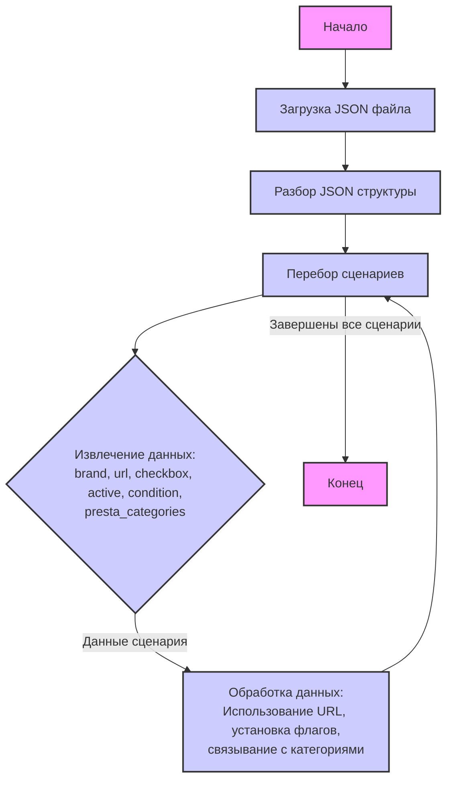

## <алгоритм>

Данный код представляет собой JSON-файл, описывающий сценарии для игровых ноутбуков ASUS, где каждый сценарий соответствует определенной модели ноутбука с различными характеристиками процессора (Intel i5, i7, i9 или AMD).

**Пошаговая блок-схема:**

1. **Начало:** Загрузка JSON-файла в программу.
2. **Разбор JSON:** Программа разбирает JSON-структуру, извлекая данные о сценариях, которые находятся в ключе `"scenarios"`.
3. **Итерация по сценариям:** Программа перебирает каждый сценарий, представленный в виде пары "ключ-значение", где ключ - название модели (например, "ASUS GAMING 14 I5"), а значение - объект с описанием параметров.
4. **Обработка параметров сценария:** Для каждого сценария программа извлекает следующие параметры:
   - `brand`: Производитель ноутбука (всегда "ASUS" в данном случае).
   - `url`: URL-адрес, относящийся к ноутбуку. В некоторых случаях это реальный URL, в других случаях - строка-заполнитель,
   - `checkbox`: Флаг (всегда `false` в данном случае)
   - `active`: Флаг (всегда `true` в данном случае)
   - `condition`: Состояние товара (всегда `"new"`).
   - `presta_categories`: строка, содержащая идентификаторы категорий PrestaShop, к которым относится данный ноутбук.

5. **Использование данных:** На основании полученных данных программа может:
    - Использовать `url` для доступа к странице продукта.
    - Устанавливать `checkbox` и `active` на основе флагов.
    - Связывать товар с определенными категориями (`presta_categories`).
6. **Конец:** Завершение обработки JSON-файла и использование данных.

**Примеры:**

- Для сценария `"ASUS GAMING 14 I5"`:
    - `brand` = "ASUS"
    - `url` = "-----------------------------------ASUS GAMING 14 I5----------------------------"
    - `presta_categories` = "3,49,50,48,98,10,5,434"

- Для сценария `"ASUS GAMING 15 I7"`:
    - `brand` = "ASUS"
    - `url` = "https://reseller.c-data.co.il/%D7%A0%D7%99%D7%99%D7%93%D7%99-gaming#/specFilters=227!#-!4635!-#!225m!#-!4663&manFilters=10"
    - `presta_categories` = "3,49,50,48,99,11,6,442"

## <mermaid>

**Объяснение:**

*   `Start`: Начало процесса.
*   `LoadJSON`: Блок, отвечающий за загрузку JSON-файла.
*   `ParseJSON`: Блок, выполняющий разбор JSON-структуры для извлечения данных о сценариях.
*  `LoopScenarios`: Блок, который отвечает за итерацию по всем сценариям, найденным в JSON.
*  `ExtractData`: Блок, который извлекает данные для каждого конкретного сценария.
*   `ProcessData`: Блок, который обрабатывает извлеченные данные, используя URL, флаги `checkbox` и `active`, а также привязку к категориям.
*   `End`: Конец процесса.

**Зависимости:**

Данная диаграмма не содержит импортированных зависимостей, поскольку описывает логику обработки JSON-файла, а не работу конкретного Python-скрипта или модуля. Это простое представление потока данных и обработки данных внутри JSON-структуры.

## <объяснение>

**Импорты:**

В данном коде нет импортов, так как это JSON-файл, а не исполняемый код на Python. JSON – это формат для хранения и передачи данных. Он не зависит от каких-либо библиотек.

**Классы:**

В данном коде нет классов, так как это JSON-файл.

**Функции:**

В данном коде нет функций, так как это JSON-файл.

**Переменные:**

В данном коде, переменные можно интерпретировать как ключи и значения в JSON-объекте.
- `"scenarios"`: Это ключ, который содержит объект с различными сценариями, где каждый ключ - название модели ноутбука, а значение - объект с параметрами этой модели.
- `"brand"`: Ключ, значение которого всегда `"ASUS"`.
- `"url"`: Ключ, значение которого - URL-адрес или строка-заполнитель.
- `"checkbox"`: Ключ, значение которого всегда `false` (логическое значение).
- `"active"`: Ключ, значение которого всегда `true` (логическое значение).
- `"condition"`: Ключ, значение которого всегда `"new"` (строка).
- `"presta_categories"`: Ключ, значение которого - строка с идентификаторами категорий PrestaShop, разделенными запятыми.

**Детальное объяснение:**

Этот JSON-файл используется для хранения настроек для парсинга и обработки игровых ноутбуков ASUS. Каждый сценарий представляет собой отдельную конфигурацию ноутбука, определяемую его моделью (например, ASUS GAMING 14 I5) и набором параметров.

*   `brand`: Указывает на производителя ноутбука, который в данном случае всегда ASUS.
*   `url`: Содержит URL-адрес страницы товара. Некоторые URL являются реальными ссылками, в то время как другие — это строки-заполнители.
*   `checkbox` и `active`: Вероятно, используются для управления отображением или обработкой сценариев. Флаг `checkbox` всегда `false`, и `active` всегда `true`, что подразумевает, что все сценарии активны по умолчанию и checkbox не влияет на их обработку.
*   `condition`: Указывает, что все товары являются новыми.
*   `presta_categories`: Содержит список категорий PrestaShop, к которым должен принадлежать данный товар. Категории представляют собой числа, разделенные запятыми.

**Цепочка взаимосвязей:**

Этот JSON-файл, скорее всего, используется как часть системы парсинга или интеграции данных с PrestaShop. Он служит источником данных для процесса, который, вероятно, будет:

1.  Загружать этот JSON-файл.
2.  Итерироваться по каждому сценарию.
3.  Использовать URL (если он существует), или формировать запрос на основе шаблона.
4.  Извлекать информацию о продукте с целевой страницы.
5.  Обновлять информацию в базе данных PrestaShop.

**Потенциальные ошибки и области для улучшения:**

1.  **Строки-заполнители для URL:** Наличие строк-заполнителей вместо реальных URL может привести к ошибкам при парсинге. Это следует заменить реальными URL или обработать их отдельно.
2.  **Жестко заданные значения `checkbox` и `active`:** Если эти поля не меняются, их можно убрать, чтобы упростить структуру JSON-файла. В противном случае нужно уточнить их назначение.
3.  **Отсутствие описания структуры `presta_categories`:**  Пользователю необходимо знать, что это строка, содержащая идентификаторы, разделенные запятыми, а также иметь доступ к таблице соответствия id и названия категорий. Это можно указать в сопровождающей документации.
4.  **Дублирование информации:** Поля `brand` и `condition` повторяются для каждого сценария, так как их значение всегда одно и то же. Можно вынести их на уровень выше, если в будущем они не будут меняться для каждого сценария.
5.  **Отсутствие обработки ошибок:** В коде, обрабатывающем данный JSON, должна быть предусмотрена обработка ошибок, которые могут возникнуть при парсинге или обращении к URL-адресам.