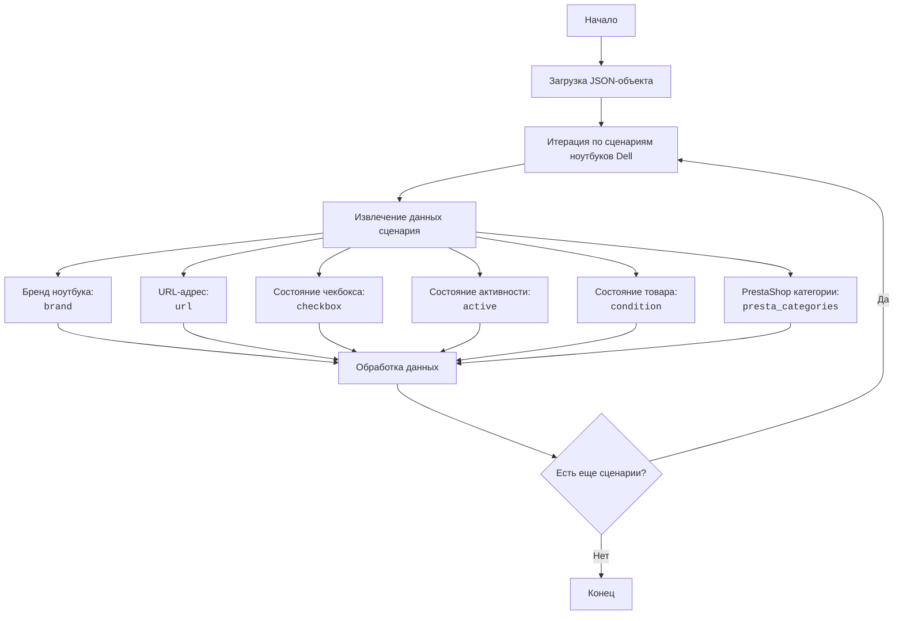

## ИНСТРУКЦИЯ:

Анализируй предоставленный код подробно и объясни его функциональность. Ответ должен включать три раздела:

1.  **<алгоритм>**: Опиши рабочий процесс в виде пошаговой блок-схемы, включая примеры для каждого логического блока, и проиллюстрируй поток данных между функциями, классами или методами.
2.  **<mermaid>**: Напиши код для диаграммы в формате `mermaid`, проанализируй и объясни все зависимости,
    которые импортируются при создании диаграммы.
    **ВАЖНО!** Убедитесь, что все имена переменных, используемые в диаграмме `mermaid`,
    имеют осмысленные и описательные имена. Имена переменных вроде `A`, `B`, `C`, и т.д., не допускаются!

    **Дополнительно**: Если в коде есть импорт `import header`, добавьте блок `mermaid` flowchart, объясняющий `header.py`:
    ```mermaid
    flowchart TD
        Start --> Header[<code>header.py</code><br> Determine Project Root]

        Header --> import[Import Global Settings: <br><code>from src import gs</code>]
    ```

3.  **<объяснение>**: Предоставьте подробные объяснения:
    -   **Импорты**: Их назначение и взаимосвязь с другими пакетами `src.`.
    -   **Классы**: Их роль, атрибуты, методы и взаимодействие с другими компонентами проекта.
    -   **Функции**: Их аргументы, возвращаемые значения, назначение и примеры.
    -   **Переменные**: Их типы и использование.
    -   Выделите потенциальные ошибки или области для улучшения.

Дополнительно, постройте цепочку взаимосвязей с другими частями проекта (если применимо).

Это обеспечивает всесторонний и структурированный анализ кода.
## Формат ответа: `.md` (markdown)
**КОНЕЦ ИНСТРУКЦИИ**

### <алгоритм>

1.  **Начало**:  Загрузка JSON-объекта, представляющего сценарии для ноутбуков Dell.
    *   Пример: `"scenarios": { "DELL 11.6 I3": { ... }, "DELL 11.6 I5": { ... }, ... }`

2.  **Итерация по сценариям**: Перебор каждого элемента внутри объекта "scenarios". Каждый элемент представляет собой сценарий для конкретной модели ноутбука Dell.
    *   Пример: Обработка сценария `"DELL 11.6 I3"`.

3.  **Извлечение данных**: Для каждого сценария извлекаются следующие данные:
    *   `brand`: Бренд ноутбука (всегда "DELL").
        *   Пример: `"brand": "DELL"`
    *   `url`: URL-адрес, связанный с этой моделью ноутбука, часто ссылка на страницу продукта.
        *   Пример: `"url": "------------DELL 11.6 I3 -------------r  "`
    *   `checkbox`: Логическое значение, указывающее, должна ли быть отмечена галочка (всегда `false`).
        *   Пример: `"checkbox": false`
    *   `active`: Логическое значение, указывающее, активен ли сценарий (всегда `true`).
        *   Пример: `"active": true`
    *   `condition`: Состояние продукта, в данном случае всегда `"new"`.
        *    Пример: `"condition":"new"`
    *   `presta_categories`: Строка, содержащая идентификаторы категорий PrestaShop, разделенные запятыми.
        *   Пример: `"presta_categories": "3,23,8,54,4,356,989"`

4.  **Обработка данных**: Данные, полученные на предыдущем этапе, используются для настройки процесса категоризации и/или создания соответствий для товаров. В данном случае они могут быть использованы для фильтрации и поиска товаров по категориям.

5.  **Конец**: После обработки всех сценариев, данные готовы для дальнейшего использования (например, для импорта в базу данных или применения в процессе категоризации).

### <mermaid>



### <объяснение>

**Импорты**:

В предоставленном коде нет импортов, это просто JSON-файл, представляющий данные, а не исполняемый код на Python.
Однако, для работы с этими данными в Python, скорее всего, понадобится импортировать модуль `json`.

**Структура JSON:**

-   **`scenarios`**: Корневой объект, содержащий в себе все сценарии.
-   Каждый ключ в объекте `scenarios` (например, "DELL 11.6 I3") представляет собой имя сценария (в данном случае, модель ноутбука DELL).
-   Значение для каждого ключа - это объект, содержащий данные для этого сценария:
    -   **`brand`**: Строка, указывающая бренд ноутбука (всегда "DELL").
    -   **`url`**: Строка, содержащая URL-адрес, связанный с данной моделью ноутбука. Может быть ссылкой на страницу продукта.
    -   **`checkbox`**: Логическое значение (всегда `false` в данном случае), указывающее состояние чекбокса.
    -   **`active`**: Логическое значение (всегда `true` в данном случае), указывающее, активен ли сценарий.
    -   **`condition`**: Строка, обозначающая состояние товара (всегда "new").
    -   **`presta_categories`**: Строка, содержащая идентификаторы категорий PrestaShop, разделенные запятыми.

**Функциональность**:

JSON-файл определяет конфигурацию для автоматизированной обработки категорий товаров, а конкретно ноутбуков Dell, для интеграции с PrestaShop. Каждый сценарий задает соответствие между конкретной моделью ноутбука Dell и категориями PrestaShop, к которым она должна быть отнесена.

**Использование в проекте:**

Данный файл может использоваться в `src/suppliers/cdata/` для настройки парсинга товаров и их привязки к категориям PrestaShop.

1.  **Парсинг данных**: Программа на Python может загрузить этот JSON файл и использовать его содержимое для определения, к каким категориям PrestaShop следует относить тот или иной товар Dell.
2.  **Интеграция с PrestaShop**: Информация из `presta_categories` используется для автоматической категоризации импортируемых товаров.
3.  **Автоматизация**: Сценарии позволяют автоматизировать процесс категоризации, вместо того чтобы делать это вручную.
4.  **Логика Фильтрации**: `url` служит для более точной идентификации товаров и их характеристик.

**Потенциальные проблемы и области для улучшения**:

1.  **Жестко заданные значения**: `checkbox` всегда `false`, `active` всегда `true`, `condition` всегда `"new"`.  Это может быть излишним и может указывать на то, что данные могут быть устаревшими. Эти значения можно сделать более гибкими, если это необходимо.
2.  **URL-адреса**: Некоторые `url` являются просто строками без фактических URL. Это может быть проблемой, если предполагается, что они будут использоваться для навигации. Стоит проверить и актуализировать эти данные.
3.  **`presta_categories`**:
    -   Идентификаторы категорий хранятся как строка с разделителями, что делает их обработку неэффективной.  Лучше хранить их как список целых чисел.
    -  Необходимо проверять наличие всех указанных категорий в PrestaShop для избежания ошибок при импорте.
4.  **Дублирование данных**:  В некоторых сценариях, значения `presta_categories` могут повторятся, это стоит учитывать при обработке данных.

**Цепочка взаимосвязей**:

Этот файл является частью процесса категоризации товаров для поставщика CData. Он может быть связан с другими частями проекта, такими как:

1.  **`src/suppliers/cdata/parser.py`**: Использует данные из этого файла для парсинга товаров и сопоставления их с категориями.
2.  **`src/presta/api.py`**:  Использует данные для импорта товаров и их категорий в PrestaShop.
3.  **`src/utils/data_processing.py`**: может содержать общие функции для работы с такими данными, как приведение `presta_categories` к списку.
4.  **`src/config/settings.py`**: может содержать базовые настройки для взаимодействия с PrestaShop, а так же путь к этому файлу.

**Заключение**:

Файл `cdata_categories_laptops_dell.json` представляет собой конфигурационный файл, используемый для автоматизации процесса категоризации ноутбуков Dell при интеграции с PrestaShop. Он определяет соответствия между моделями ноутбуков и категориями PrestaShop. Необходимо учесть потенциальные проблемы при обработки данных для повышения стабильности и гибкости программы.