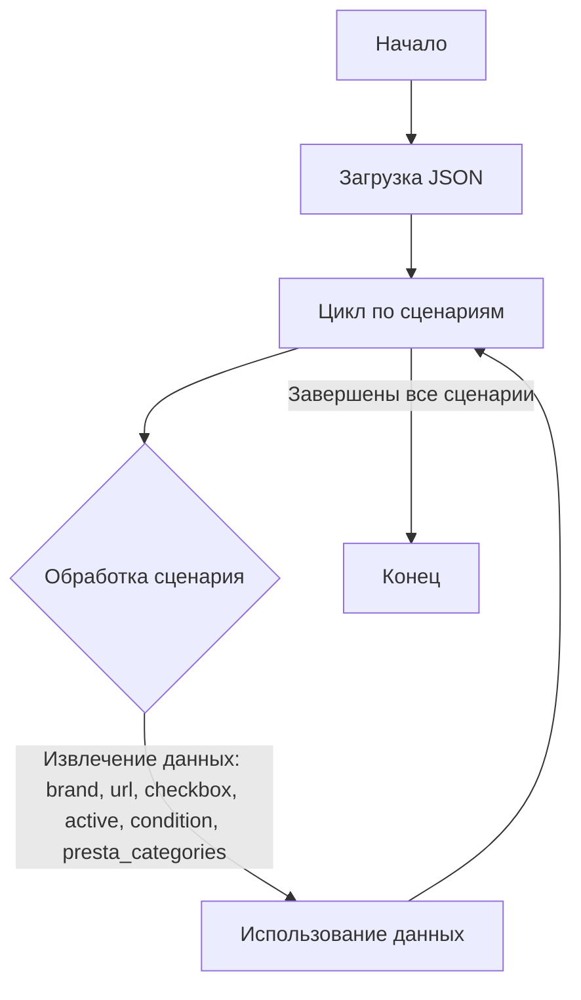

## <алгоритм>

1.  **Начало**: JSON-объект `scenarios` содержит наборы данных о рабочих станциях. Каждый набор данных идентифицируется по ключу, например "HP I7", "DELL I9" и т.д.

2.  **Итерация по сценариям**: Проходим по каждому ключу в словаре `scenarios`.

3.  **Обработка каждого сценария**: 
    -   Извлекаем данные для текущего ключа, такие как `brand`, `url`, `checkbox`, `active`, `condition`, и `presta_categories`.
    -   **Пример**: Для ключа "HP I7" извлекаем:
        -   `brand` = "HP"
        -   `url` = "https://reseller.c-data.co.il/%D7%AA%D7%97%D7%A0%D7%95%D7%AA-%D7%A2%D7%91%D7%95%D7%93%D7%94-%D7%9E%D7%A7%D7%A6%D7%95%D7%A2%D7%99%D7%95%D7%AA#/specFilters=227m!#-!4635&manFilters=2"
        -   `checkbox` = `false`
        -   `active` = `true`
        -    `condition` = "new"
        -   `presta_categories` = "91,242,246,237,89"

4.  **Применение данных**:
    -   Эти данные могут использоваться для:
        -   Фильтрации рабочих станций по бренду.
        -   Получения URL-адреса для конкретной рабочей станции.
        -   Управления отображением чекбокса для выбора.
        -   Определения, активен ли сценарий.
        -   Определения состояния (например, новое или б/у).
        -   Связывания с категориями PrestaShop.

5.  **Завершение**: После обработки всех сценариев, процесс завершается.

## <mermaid>

**Объяснение зависимостей в `mermaid` диаграмме:**

-   **`Start`**: Начало процесса, обозначает стартовую точку.
-   **`LoadJSON`**: Загрузка данных из JSON-файла. Это начало процесса, откуда происходит считывание данных.
-   **`LoopScenarios`**: Представляет цикл, проходящий по всем сценариям, которые хранятся в JSON.
-   **`ProcessScenario`**: Узел, который представляет процесс обработки каждого конкретного сценария. Внутри этого узла происходит извлечение данных.
-   **`UseData`**: Узел, который показывает, что извлеченные данные применяются.
-   **`End`**: Конечная точка процесса.

## <объяснение>

**Общая структура:**

-   JSON-файл содержит объект `scenarios`, который является словарем.
-   Ключи словаря представляют собой идентификаторы сценариев рабочих станций (например, "HP I7", "DELL I9").
-   Значения словаря - это объекты, содержащие свойства каждого сценария (бренд, URL, состояние, и т.д.).

**Разбор свойств каждого сценария:**

-   **`brand`**: Строка, указывающая на бренд производителя (например, "HP", "DELL").
-   **`url`**: Строка, содержащая URL-адрес, связанный с рабочей станцией на сайте поставщика.
-   **`checkbox`**: Логическое значение, указывающее, нужно ли отображать чекбокс для данного сценария. (в данном случае `false`, что подразумевает, что чекбокс отображать не нужно).
-   **`active`**: Логическое значение, определяющее, является ли сценарий активным (`true` означает активен).
-   **`condition`**: Строка, обозначающая состояние рабочей станции (например, "new").
-   **`presta_categories`**: Строка, содержащая идентификаторы категорий PrestaShop, к которым относится рабочая станция, разделенные запятыми (например, "91,242,246,237,89").

**Назначение:**

Этот JSON-файл является конфигурационным файлом, который может использоваться для:

1.  **Сбора данных о рабочих станциях**: Данные хранятся структурированно, что упрощает их обработку и использование в различных приложениях.
2.  **Фильтрации и поиска**: Можно фильтровать рабочие станции по бренду, условиям (новое, б/у), или категориям PrestaShop.
3.  **Интеграции с веб-сайтом**: URL-адреса используются для перенаправления на страницы товаров на сайте поставщика.
4.  **Настройки пользовательского интерфейса**: Флаги `checkbox` и `active` могут определять отображение элементов интерфейса.
5.  **Интеграции с PrestaShop**: `presta_categories` используются для связывания товаров с соответствующими категориями в магазине PrestaShop.

**Примеры использования данных:**

1.  **Отображение списка рабочих станций**: Данные могут быть отображены в таблице или списке с указанием бренда, модели, и других характеристик.
2.  **Фильтрация по бренду**: Пользователь может выбрать бренд (HP или DELL), чтобы увидеть соответствующие рабочие станции.
3.  **Связь с PrestaShop**: Данные `presta_categories` могут быть использованы для автоматической категоризации товаров при импорте в магазин PrestaShop.
4.  **Управление видимостью товаров**: Поле `active` можно использовать, чтобы определить, показывать ли конкретную станцию в списке или нет.

**Потенциальные ошибки и области для улучшения:**

1.  **Отсутствие валидации URL**: Нет валидации, что URL-адреса являются корректными и работоспособными.
2.  **Использование строк для категорий PrestaShop**: Лучше использовать списки целых чисел для категорий, а не строки, чтобы избежать ошибок парсинга.
3.  **Дублирование данных**: Присутствуют повторяющиеся значения для `presta_categories`.  Может привести к избыточности в данных.
4.  **Жесткая привязка к структуре данных**: Файл может быть негибким к изменениям в будущем.  Рассмотреть возможность использования более гибкой структуры или схемы.

**Взаимосвязь с другими частями проекта:**

Этот файл, вероятно, является частью системы, отвечающей за загрузку и управление каталогом товаров. Он может быть использован в следующих частях проекта:

1.  **Скрипты для сбора данных**: Скрипты, которые обрабатывают этот JSON-файл, и извлекают необходимую информацию для дальнейшего использования.
2.  **Импорт данных в PrestaShop**: Скрипты, которые используют `presta_categories` для импорта товаров в магазин PrestaShop.
3.  **Фронтенд**: Данные могут использоваться для отображения информации о рабочих станциях в пользовательском интерфейсе.
4.  **API**: Файл может использоваться в качестве источника данных для API, предоставляющего информацию о рабочих станциях.

В целом, файл представляет собой структурированный набор данных, который позволяет эффективно управлять информацией о рабочих станциях, их характеристиками и связью с различными платформами.  Необходимо улучшить валидацию и гибкость, чтобы сделать структуру данных более надежной.