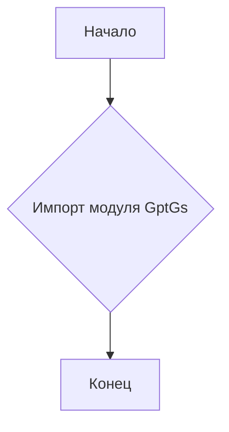
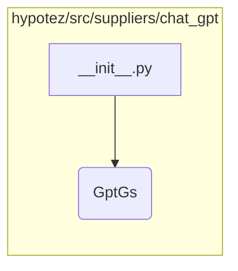

# <input code>

```python
## \file hypotez/src/suppliers/chat_gpt/__init__.py
# -*- coding: utf-8 -*-\
#! venv/Scripts/python.exe
#! venv/bin/python/python3.12

"""
.. module: src.suppliers.chat_gpt 
	:platform: Windows, Unix
	:synopsis:

"""
MODE = 'dev'

from .gsheet import GptGs
```

# <algorithm>



Пример:
Этот код выполняет импорт модуля `GptGs` из подпапки `gsheet` текущего каталога. После импорта выполнение программы переходит в следующую инструкцию.


# <mermaid>



**Объяснение диаграммы:**

Диаграмма показывает, что модуль `__init__.py` в каталоге `hypotez/src/suppliers/chat_gpt` импортирует модуль `GptGs` из вложенного подкаталога `gsheet`.


# <explanation>

**Импорты:**

- `from .gsheet import GptGs`: Этот импорт позволяет использовать класс `GptGs` из модуля `gsheet`, который, вероятно, находится в подпапке `gsheet` внутри папки `chat_gpt` в директории `suppliers`. Символ `.` перед именем модуля означает, что импорт выполняется из текущей директории (`hypotez/src/suppliers/chat_gpt`).

**Переменные:**

- `MODE = 'dev'`:  Определяет переменную `MODE` со строковым значением 'dev'. Вероятно, используется для настройки режима работы модуля (например, 'dev' для разработки, 'prod' для производства).

**Классы (присутствуют в `gsheet.py`):**

- `GptGs`:  В данном файле `__init__.py` этот класс не используется напрямую. Определён в `gsheet.py`.  Это класс, определяющий взаимодействие с Google Sheets, вероятно, для обработки или получения данных из таблиц. Необходимые для его работы методы и атрибуты будут определены в `gsheet.py`.

**Функции (присутствуют в `gsheet.py`):**

- `GptGs` class methods:  Этот класс, скорее всего, содержит методы для инициализации соединения с Google Sheets, чтения данных из таблиц, записи данных в таблицы и т.д.

**Возможные ошибки и улучшения:**

- **Отсутствие документации:**  Для `GptGs` не хватает документации.
- **Отсутствие обработки ошибок:**  Нет обработчиков ошибок, если возникает проблема с подключением к Google Sheets или чтением/записью данных.
- **Детали реализации:**  Без доступа к коду `gsheet.py` сложно сделать более подробный анализ.  Наличие более подробной документации, включая параметры конструкторов, методов и типов данных, значительно улучшит код.

**Взаимосвязь с другими частями проекта:**

Этот файл является частью модуля `chat_gpt`, который, скорее всего, взаимодействует с другими частями проекта, использующими данные из Google Sheets для обработки или анализа.  Для более детального анализа потребуется изучить код использующих `chat_gpt` модулей.  Прочие модули в `src` (`hypotez/src`) будут использовать класс `GptGs` для получения данных.  Без доступа к этому коду точно сказать невозможно, какова именно роль этого `GptGs`.

**Заключение:**

Данный файл `__init__.py` отвечает за импорт необходимых классов и конфигурацию режима работы.  Детали реализации и функциональность зависят от содержимого файла `gsheet.py` и взаимодействующих модулей.