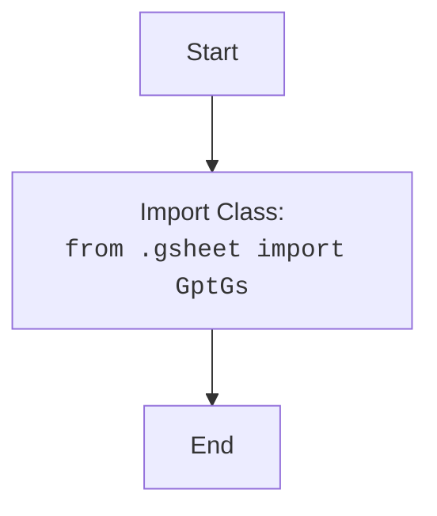

## Анализ кода `src/suppliers/chat_gpt/__init__.py`

### <алгоритм>

1. **Импорт `GptGs`:** Из модуля `gsheet`, находящегося в текущей директории (`.`), импортируется класс `GptGs`.
2. **Использование `GptGs` (не показано в этом файле):**  Импортированный класс `GptGs` предназначен для использования в других частях проекта. Этот класс, вероятно, предоставляет функциональность для взаимодействия с Google Sheets API, а также связывается с ChatGPT.
   -  *Пример:* В другом модуле может быть создан экземпляр `GptGs`:
     ```python
     from src.suppliers.chat_gpt import GptGs
     gpt_gsheet = GptGs(credentials='path/to/credentials.json', spreadsheet_id='your_spreadsheet_id')
     data = gpt_gsheet.fetch_data_from_sheet('Sheet1')
     response = gpt_gsheet.send_to_chat_gpt(data)
     gpt_gsheet.update_sheet('Sheet1', response)
     ```

### <mermaid>

### <объяснение>

- **Импорты:**
    - `from .gsheet import GptGs`: Этот импорт указывает на то, что класс `GptGs` находится в файле `gsheet.py` в той же директории, что и файл `__init__.py`. Это часть пакета `src.suppliers.chat_gpt`.
    - Назначение: Импорт позволяет использовать класс `GptGs` в других модулях, импортируя пакет `src.suppliers.chat_gpt`. `GptGs`  предположительно управляет взаимодействием с Google Sheets и ChatGPT,  согласно контексту проекта.

- **Классы:**
    -  `GptGs`: Этот класс, хотя и не определен здесь, будет определен в файле `gsheet.py`. Скорее всего, он имеет методы для:
        - аутентификации в Google Sheets API.
        - извлечения данных из Google Sheets.
        - отправки запросов к ChatGPT API.
        - записи результатов обратно в Google Sheets.
    - Класс `GptGs`  представляет основной функционал  интеграции между Google Sheets и ChatGPT.
   
- **Функции**:
   - В данном файле нет объявленных функций, но класс `GptGs` будет содержать методы, как описано выше.

- **Переменные**:
   - В данном файле нет объявленных переменных.

- **Потенциальные ошибки и области для улучшения:**
    - **Недостаток документации:** Файл `__init__.py` обычно содержит документацию о пакете, но здесь есть только комментарий модуля. Стоит добавить краткое описание пакета для лучшей читаемости и понимания его назначения.
    - **Отсутствие конкретики:**  В коде не видно явного примера использования `GptGs`. Необходимо проверить другие части проекта, чтобы понять, как он используется. 
    - **Абстракция:**  `__init__.py` используется для определения модуля пакета. В данном контексте он просто импортирует `GptGs`, поэтому может быть более информативным, если добавить docstring.
- **Взаимосвязь с другими частями проекта:**
    - Пакет `src.suppliers.chat_gpt` является частью более крупной системы, где, вероятно, есть другие модули, которые используют этот пакет для интеграции с Google Sheets и ChatGPT. Другие части проекта будут зависеть от функциональности, которую предоставляет `GptGs`.
    - `gs` (глобальные настройки) вероятно определены в `src/__init__.py` и могут быть импортированы в `gsheet.py` для настройки интеграции.