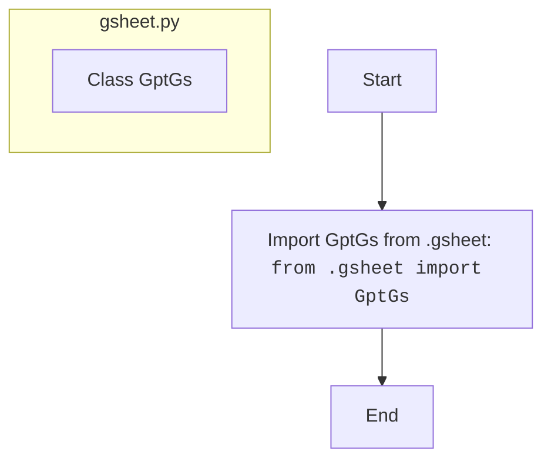

## Анализ кода `hypotez/src/suppliers/chat_gpt/__init__.py`

### <алгоритм>

1. **Импорт модуля:**
   - Импортируется модуль `GptGs` из пакета `.gsheet`.
   - Пример: `from .gsheet import GptGs`. Это означает, что в текущем пакете (`src.suppliers.chat_gpt`) есть подпакет `gsheet`, из которого импортируется класс или модуль `GptGs`.
   - В результате импорта, класс `GptGs` становится доступным для использования в данном файле (`__init__.py`).

### <mermaid>

### <объяснение>

**Импорты:**

*   `from .gsheet import GptGs`:
    *   **Назначение:** Этот импорт делает класс `GptGs` доступным для использования в файле `__init__.py`.
    *   **Взаимосвязь:** `.` означает текущий пакет (`src.suppliers.chat_gpt`). `gsheet` - это подпакет внутри текущего пакета. Этот импорт позволяет использовать класс `GptGs`, предположительно реализующий функциональность для работы с Google Sheets, связанную с ChatGPT.

**Файл `__init__.py`:**

*   **Роль:** Этот файл делает пакет `src.suppliers.chat_gpt` пакетом Python. Он может содержать инициализирующий код для пакета или просто обозначать наличие пакета.
*   **Содержимое:** В данном случае файл импортирует класс `GptGs`. Это означает, что после импорта пакета `src.suppliers.chat_gpt`, класс `GptGs` становится доступным через этот пакет (например, `from src.suppliers.chat_gpt import GptGs`).

**Класс `GptGs`:**

*   **Роль:** По имени и контексту можно предположить, что класс `GptGs` предназначен для работы с Google Sheets и, возможно, с ChatGPT.
*   **Атрибуты/методы:** Данный файл не содержит информации о конкретных атрибутах и методах класса `GptGs`, но можно предположить, что он будет содержать методы для чтения, записи или обработки данных в Google Sheets, а также методы для взаимодействия с API ChatGPT.
*   **Взаимодействие:** Класс `GptGs` будет взаимодействовать с Google Sheets и, возможно, с API ChatGPT. Детали зависят от реализации.

**Переменные:**

*   Файл не определяет переменных верхнего уровня.

**Потенциальные ошибки/улучшения:**
* Файл сам по себе не содержит ошибок. Однако, отсутствие документации внутри `__init__.py` и для класса `GptGs` (в файле `gsheet.py`) может затруднить дальнейшую поддержку и развитие кода.

**Цепочка взаимосвязей:**
* Файл `__init__.py` является частью пакета `src.suppliers.chat_gpt`.
* Он импортирует класс `GptGs` из подпакета `src.suppliers.chat_gpt.gsheet`.
* Класс `GptGs` предположительно взаимодействует с внешними ресурсами: Google Sheets и, возможно, API ChatGPT.