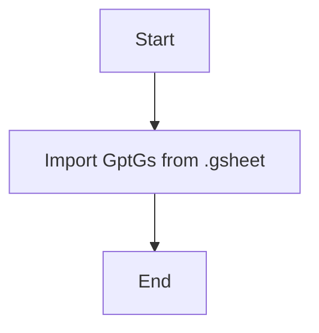

## Анализ кода `hypotez/src/suppliers/chat_gpt/__init__.py`

### 1. <алгоритм>

1.  **Импорт**: Импортируется класс `GptGs` из модуля `gsheet`, который находится в той же директории (`.`) пакета `chat_gpt`.
    *   Пример: `from .gsheet import GptGs` импортирует класс, позволяющий взаимодействовать с Google Sheets через ChatGPT.
2.  **Конец**: На этом выполнение скрипта завершается.

### 2. <mermaid>

**Объяснение:**

- `Start`: Начало выполнения кода.
- `ImportGptGs`: Операция импорта класса `GptGs` из модуля `gsheet`.
- `End`: Конец выполнения кода.

### 3. <объяснение>

**Импорты:**

-   `from .gsheet import GptGs`:
    -   `from .gsheet`:  Импортирует модуль `gsheet` из текущего пакета `chat_gpt`. Точка `.` обозначает, что модуль находится в той же директории.
    -   `import GptGs`: Импортирует класс `GptGs` из модуля `gsheet`. Этот класс, вероятно, отвечает за взаимодействие с Google Sheets через API ChatGPT.

**Файл `__init__.py`:**

-   Файл `__init__.py` в Python делает директорию `chat_gpt` пакетом. Это позволяет импортировать модули и классы из этого пакета.
-   В данном случае, файл импортирует класс `GptGs` из подмодуля `gsheet` и делает его доступным для импорта из пакета `chat_gpt`.
-   Следовательно, класс `GptGs` можно будет использовать через `from src.suppliers.chat_gpt import GptGs`

**Переменные:**

-   В данном коде отсутствуют переменные на уровне модуля.

**Цепочка взаимосвязей:**

-   `src.suppliers.chat_gpt` - это подпакет в структуре проекта `src`.
-   `src.suppliers` может содержать и других поставщиков, таких как, например, `openai` и т.д.
-   `src.suppliers.chat_gpt.gsheet` - это подмодуль, вероятно, содержащий реализацию взаимодействия с Google Sheets.
-   Импорт класса `GptGs` позволяет использовать его функциональность в других модулях и скриптах, импортирующих `src.suppliers.chat_gpt`.