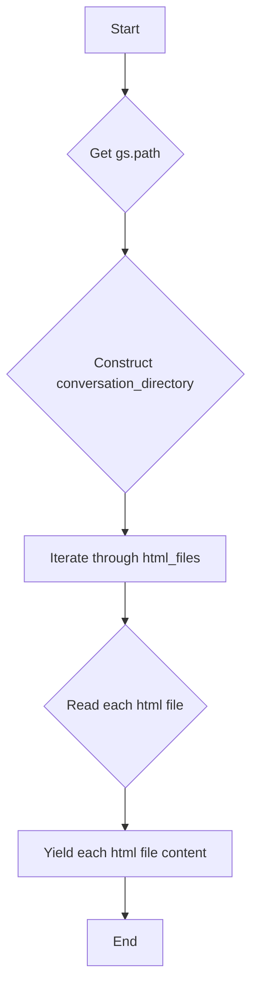
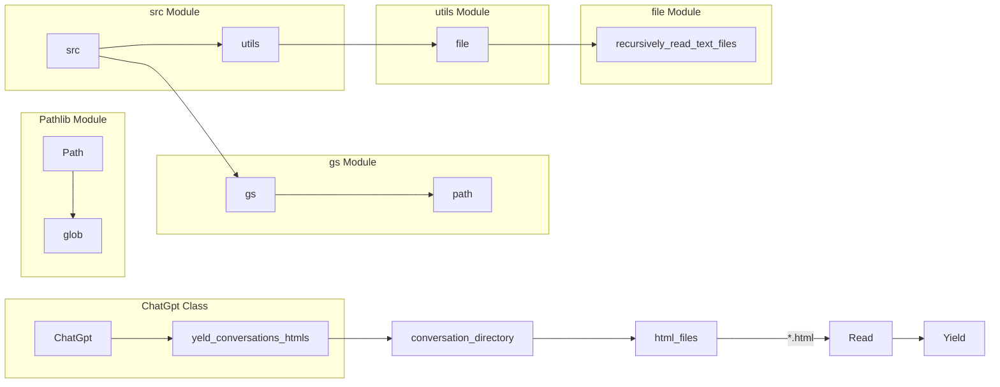

# <input code>

```python
## \file hypotez/src/suppliers/chat_gpt/chat_gpt.py
# -*- coding: utf-8 -*-
#! venv/Scripts/python.exe
#! venv/bin/python/python3.12

"""
.. module: src.suppliers.chat_gpt 
	:platform: Windows, Unix
	:synopsis:

"""
MODE = 'dev'

"""
	:platform: Windows, Unix
	:synopsis:

"""


"""
	:platform: Windows, Unix
	:synopsis:

"""


"""
  :platform: Windows, Unix

"""
"""
  :platform: Windows, Unix
  :platform: Windows, Unix
  :synopsis:
"""MODE = 'dev'
  
import header
from pathlib import Path
from src import gs
from src.utils.file import recursively_read_text_files
class ChatGpt:

    def yeld_conversations_htmls(self) -> str:
        """"""
        ...
        conversation_directory = Path(gs.path.data / 'chat_gpt' / 'conversations')
        html_files = conversation_directory.glob("*.html")

```

# <algorithm>



**Пример:**

Если `gs.path.data` равен `/data`, то `conversation_directory` будет `/data/chat_gpt/conversations`.  Функция будет итерироваться по всем файлам с расширением `.html` в этом каталоге и выводить их содержимое.


# <mermaid>



**Объяснение зависимостей:**

- `ChatGpt` использует класс `Path` из модуля `pathlib` для работы с файловой системой.
- `Path` использует методы `glob` для поиска файлов.
- `ChatGpt` использует переменную `gs.path` из модуля `gs`, который, предположительно, содержит информацию о пути к данным.
- `ChatGpt` использует функцию `recursively_read_text_files` из модуля `file` в подмодуле `utils` пакета `src`.


# <explanation>

**Импорты:**

- `header`: Этот импорт, вероятно, содержит общие заголовочные файлы или настройки для проекта.  Необходимые данные не видны из предоставленного кода.
- `pathlib.Path`: Предоставляет инструменты для работы с путями к файлам.
- `src.gs`:  Модуль, содержащий информацию о путях к данным проекта.  Важная зависимость, определяющая местонахождение файлов.
- `src.utils.file.recursively_read_text_files`: Функция для чтения текстовых файлов в определенном каталоге.  В коде, предоставленном здесь, она не используется.


**Классы:**

- `ChatGpt`:  Класс, скорее всего, представляет API для работы с данными чат-бота ChatGPT.  Метод `yeld_conversations_htmls` предназначен для получения HTML-содержимого из файлов.


**Функции:**

- `yeld_conversations_htmls`:  Возвращает содержимое файлов `.html` из директории `conversations` внутри папки данных.  Важно отметить, что в данном фрагменте кода отсутствует сам цикл обработки и чтение.

**Переменные:**

- `MODE`: Строковая константа, вероятно, определяющая режим работы приложения (например, 'dev', 'prod').
- `conversation_directory`:  Объект `Path`, представляющий путь к каталогу с диалогами.
- `html_files`: Объект, содержащий список путей к файлам *.html* в данном каталоге.

**Возможные ошибки и улучшения:**

- Отсутствует обработка исключений: Если `gs.path.data` не определен или каталог `conversations` не существует, произойдет ошибка.  Необходимо добавить обработку исключений (например, `try...except` блоки).
-  Отсутствует реализация `yeld` цикла.  Для получения результата необходимо добавить цикл для итерации по файлам и чтение их содержимого, а затем вернуть значение.
-  Не указан формат возвращаемого значения.  Используется анотация `-> str`, но в коде нет возврата строки.


**Цепочка взаимосвязей:**

Код связан с другими частями проекта через:

- `gs.path`: Связь с модулем `gs`, который, вероятно, управляет хранением данных.
- `recursively_read_text_files`: Связь с модулем обработки файлов.
- Вероятно, с другими частями проекта, которые взаимодействуют с чат-ботом ChatGPT и обрабатывают результаты разговоров.

Важно расширить код, добавив чтение файлов и обработку результата.