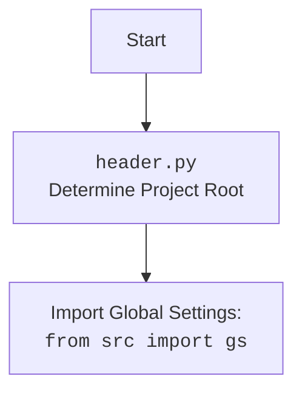

## <алгоритм>

1. **Начало**: Программа начинается с импорта необходимых модулей и определения класса `ChatGpt`.
   - Пример: `import header`, `from pathlib import Path`, `from src import gs`, `from src.utils.file import recursively_read_text_files`.

2. **Определение класса `ChatGpt`**: Создается класс `ChatGpt`, который содержит методы для обработки данных, связанных с ChatGPT.

3. **Метод `yeld_conversations_htmls`**: Этот метод предназначен для генерации HTML-файлов.
    -  Создается переменная `conversation_directory` как путь к директории, где хранятся файлы `html` чата `ChatGPT`.
    -  Используется `Path` для определения каталога `conversations` внутри каталога `data` (который определен в `gs.path`).
    -  Применяется `glob("*.html")` для получения итератора `html_files` для всех файлов с расширением `.html` в указанном каталоге.
    -  Метод имеет многоточие (`...`), что говорит о том, что реализация не закончена.

4. **Конец**: Программа завершается (или ожидает дальнейшей реализации методов).

## <mermaid>

```mermaid
flowchart TD
    Start --> ImportModules[Импорт модулей: <br><code>import header</code>, <br><code>from pathlib import Path</code>,<br> <code>from src import gs</code>, <br><code>from src.utils.file import recursively_read_text_files</code>]
    
    ImportModules --> ClassChatGpt[Определение класса <code>ChatGpt</code>]
    
    ClassChatGpt --> MethodYeldConversationsHtmls[Метод <code>yeld_conversations_htmls(self)</code>]
   
    MethodYeldConversationsHtmls --> SetConversationDirectory[Определение директории <code>conversation_directory</code>: <br><code>Path(gs.path.data / 'chat_gpt' / 'conversations')</code>]
    
    SetConversationDirectory --> GetHtmlFiles[Получение всех файлов <code>.html</code> в директории <br><code>conversation_directory.glob("*.html")</code>]
    
    GetHtmlFiles --> End[Конец]

    
    
    
```



## <объяснение>

### Импорты

*   `import header`: Импортирует модуль `header.py`, который, судя по mermaid, определяет корень проекта и загружает глобальные настройки. Этот модуль позволяет использовать переменные и настройки, общие для всего проекта.
*   `from pathlib import Path`: Импортирует класс `Path` из модуля `pathlib`. Этот класс используется для представления файловых путей в объектно-ориентированном виде, что упрощает работу с путями, делая код более читаемым и переносимым.
*   `from src import gs`: Импортирует глобальные настройки (`gs`) из пакета `src`. Эти настройки могут содержать различные параметры, например, пути к директориям, настройки API и т. д.
*    `from src.utils.file import recursively_read_text_files`: Импортирует функцию `recursively_read_text_files` из модуля `src.utils.file`. Эта функция, вероятно, предназначена для рекурсивного чтения текстовых файлов из директории. (Данный импорт не используется в предоставленном коде).

### Классы

*   `class ChatGpt`:
    *   **Роль**: Этот класс предназначен для обработки и управления данными, связанными с ChatGPT. В данном коде представлен только метод `yeld_conversations_htmls`, но, скорее всего, в классе будут и другие методы.
    *   **Атрибуты**: На данный момент класс не имеет явно определенных атрибутов в предоставленном коде.
    *   **Методы**:
        *   `yeld_conversations_htmls(self) -> str`: Этот метод, предположительно, предназначен для обработки HTML файлов с диалогами ChatGPT. Он определяет путь к директории с файлами, используя глобальные настройки `gs.path.data`, и генерирует их в виде итератора.  Используется `glob("*.html")`, чтобы отобрать только файлы с расширением `.html`.  Метод пока не имеет реализации и возвращает `...`.

### Функции

*   `yeld_conversations_htmls(self) -> str`:
    *   **Аргументы**: Принимает `self` (ссылка на экземпляр класса).
    *   **Возвращаемое значение**: Должен возвращать `str`, но в текущей реализации возвращает многоточие (`...`).
    *   **Назначение**: Предназначен для генерации HTML файлов.
    *   **Примеры**: Пока нет готового примера, так как реализация метода отсутствует.

### Переменные

*   `conversation_directory`: Тип `pathlib.Path`. Представляет путь к директории, где хранятся файлы HTML с диалогами ChatGPT.
*   `html_files`: Тип `generator`. Представляет итератор, который содержит пути ко всем файлам с расширением `.html` в директории `conversation_directory`.

### Потенциальные ошибки и области для улучшения

*   **Метод `yeld_conversations_htmls` не реализован**:  Его нужно дописать, чтобы метод выполнял задачу:  генерацию html файлов.
*   **Отсутствие обработки исключений**:  Необходимо добавить обработку исключений для случая, когда директория `conversation_directory` не существует или возникают другие ошибки при работе с файлами.
*   **Неиспользуемый импорт**: Импорт `recursively_read_text_files` не используется в данном коде. Нужно либо удалить его, либо использовать.
*   **Расширение функционала**:  Класс `ChatGpt` может быть расширен другими методами,  которые обрабатывают различные аспекты взаимодействия с ChatGPT,  например,  загрузка,  парсинг,  анализ и т.д.

### Взаимосвязи с другими частями проекта

*   Модуль `header` определяет корень проекта и загружает глобальные настройки, которые используются через `gs`.
*   Переменные и пути к файлам зависят от глобальных настроек, определенных в `gs.path`.
*   Функция `recursively_read_text_files` из `src.utils.file` (хотя и не используется в предоставленном коде) указывает на потенциальное взаимодействие с другими файлами и утилитами в рамках проекта.
*   Этот модуль, вероятно, будет использоваться для работы с другими компонентами, которые обрабатывают или анализируют HTML-файлы, сгенерированные из диалогов ChatGPT.

**Цепочка взаимосвязей:**

`header.py` (определяет корень проекта, загружает `gs`) -> `gs` (глобальные настройки проекта) -> `ChatGpt` (использует `gs.path.data` для формирования путей к файлам).