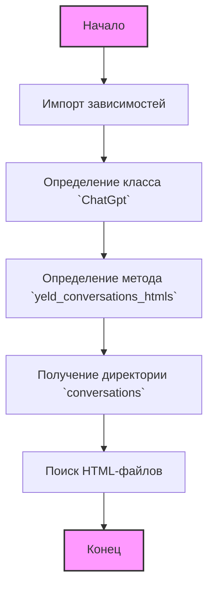
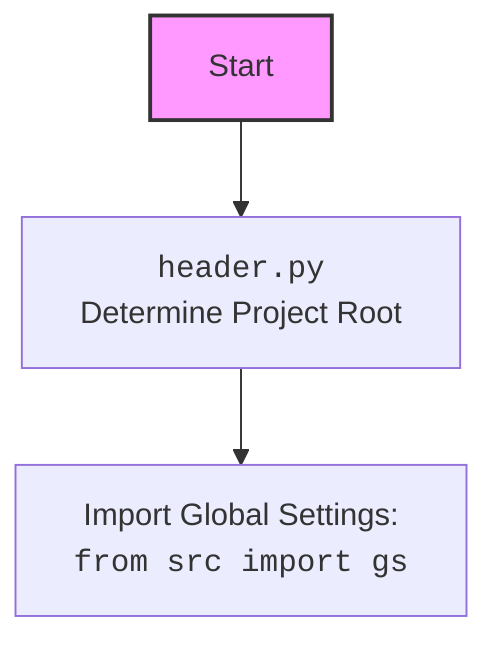

## Анализ кода `src/suppliers/chat_gpt/chat_gpt.py`

### 1. <алгоритм>

**Блок-схема:**



**Примеры:**

1.  **`ImportDependencies`**: Импортируются модули `header`, `pathlib.Path`, `src.gs`, `src.utils.file.recursively_read_text_files`.
2.  **`DefineClass`**: Определяется класс `ChatGpt`.
3.  **`DefineMethod`**: В классе `ChatGpt` определяется метод `yeld_conversations_htmls`.
4.  **`GetConversationDir`**: Метод `yeld_conversations_htmls` получает путь к директории с разговорами, используя `gs.path.data` (путь к данным из глобальных настроек) и константы `'chat_gpt'` и `'conversations'`. Пример: `Path('/path/to/data/chat_gpt/conversations')`.
5.  **`FindHtmlFiles`**:  Метод ищет все файлы с расширением `.html` в директории `conversations` с помощью метода `glob()`. Пример: `['/path/to/data/chat_gpt/conversations/conversation1.html', '/path/to/data/chat_gpt/conversations/conversation2.html']`.
6. **`End`**: Завершение работы метода.

### 2. <mermaid>

```mermaid
flowchart TD
    Start --> header[<code>header.py</code><br> Determine Project Root];
    header --> import_gs[Import Global Settings:<br><code>from src import gs</code>]
    import_gs --> define_ChatGpt[Define Class <code>ChatGpt</code>]
    define_ChatGpt --> define_method[Define method <code>yeld_conversations_htmls()</code>]
    define_method --> get_conversation_directory[Get conversation directory <br> <code>Path(gs.path.data / 'chat_gpt' / 'conversations')</code>]
    get_conversation_directory --> find_html_files[Find HTML files: <br> <code>conversation_directory.glob("*.html")</code>]
    find_html_files --> End

    style Start fill:#f9f,stroke:#333,stroke-width:2px
    style End fill:#f9f,stroke:#333,stroke-width:2px
```
**mermaid** для `header.py`:


**Объяснение:**

*   **`Start`**: Начало процесса.
*   **`header`**:  Импорт модуля `header.py`, который определяет корень проекта и загружает глобальные настройки.
*   **`import_gs`**: Импорт глобальных настроек из модуля `src.gs`.
*   **`define_ChatGpt`**: Объявление класса `ChatGpt`, который предназначен для работы с чатами.
*   **`define_method`**: Определение метода `yeld_conversations_htmls()` в классе `ChatGpt`, который должен предоставить HTML-файлы разговоров.
*   **`get_conversation_directory`**: Получение пути к директории с разговорами, используя глобальные настройки `gs`.
*  **`find_html_files`**: Поиск всех HTML файлов в директории разговоров.
*   **`End`**: Завершение процесса.

### 3. <объяснение>

**Импорты:**

*   `import header`: Импортирует модуль `header.py`, который, вероятно, отвечает за определение корневого пути проекта и загрузку глобальных настроек.
*   `from pathlib import Path`: Импортирует класс `Path` из модуля `pathlib` для работы с путями к файлам и директориям. Этот класс предоставляет объектно-ориентированный способ взаимодействия с файловой системой.
*   `from src import gs`: Импортирует модуль `gs` из пакета `src`, который, по всей видимости, содержит глобальные настройки приложения, включая пути к данным и конфигурации.
*   `from src.utils.file import recursively_read_text_files`: Импортирует функцию `recursively_read_text_files` из модуля `src.utils.file`. Эта функция, вероятно, предназначена для рекурсивного чтения текстовых файлов из указанной директории. **В данном коде не используется.**

**Классы:**

*   `class ChatGpt`:
    *   **Роль:**  Предположительно, класс отвечает за функциональность, связанную с обработкой данных, полученных от ChatGPT.
    *   **Атрибуты:**  Пока нет явных атрибутов, но возможно появятся в будущем.
    *   **Методы:**
        *   `yeld_conversations_htmls(self) -> str`: Этот метод, судя по названию, должен возвращать HTML-контент из файлов диалогов. В текущей версии метод не имеет логики реализации.
        *   Использует `Path` для создания пути к директории (`conversations`) внутри директории данных, полученной из глобальных настроек (`gs.path.data`).
        *   Использует `glob("*.html")` для поиска всех HTML-файлов в этой директории.

**Функции:**

*   `yeld_conversations_htmls`:
    *   **Аргументы:** `self` (экземпляр класса).
    *   **Возвращаемое значение:** Ожидается, что метод будет возвращать HTML контент (`str`). На данный момент не реализовано.
    *   **Назначение:** Найти и обработать HTML файлы из директории `conversations`, вероятно, для дальнейшего анализа или отображения.

**Переменные:**

*   `conversation_directory`: Объект типа `pathlib.Path`, представляющий путь к директории, где хранятся HTML-файлы разговоров.
*   `html_files`:  Объект, полученный через `glob`, итератор, представляющий коллекцию путей к HTML-файлам.

**Потенциальные ошибки и области для улучшения:**

*   Метод `yeld_conversations_htmls` не содержит логики, кроме определения пути к директории и поиска файлов. Требуется добавить код для чтения HTML-файлов и, возможно, их обработки.
*   В коде есть импорт `recursively_read_text_files`, но он не используется. Возможно, планировалось использовать его для обработки файлов, но этот функционал не был реализован.
*   Нет обработки ошибок. При работе с файловой системой необходимо добавить обработку исключений.
*   Добавить `docstring` для `class ChatGpt`.

**Взаимосвязь с другими частями проекта:**

*   Зависимость от `header.py` для инициализации корневого пути проекта.
*   Использует `src.gs` для доступа к глобальным настройкам проекта.
*   Может взаимодействовать с другими частями проекта, предоставляя HTML-контент для анализа или отображения.