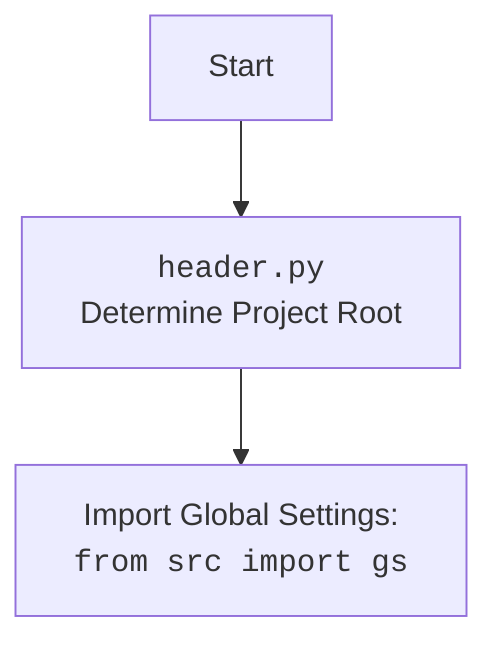

## <алгоритм>

1.  **Начало**: Запускается скрипт `converstions_parser.py`.
2.  **Импорт библиотек**: Импортируются необходимые библиотеки, включая `header`, `gs` (из `src`), `Path` (из `pathlib`) и `BeautifulSoup` (из `bs4`).
    *   Пример: `from pathlib import Path`, `from bs4 import BeautifulSoup`
3.  **Определение функции `extract_conversations_from_html`**: Определяется функция, которая принимает путь к HTML-файлу в качестве аргумента (`file_path`).
    *   Пример: `def extract_conversations_from_html(file_path: Path):`
4.  **Открытие HTML-файла**: Файл открывается для чтения в режиме `r` и с кодировкой `utf-8`.
    *   Пример: `with file_path.open('r', encoding='utf-8') as file:`
5.  **Парсинг HTML**: Содержимое HTML-файла передаётся в `BeautifulSoup` для парсинга.
    *   Пример: `soup = BeautifulSoup(file, 'html.parser')`
6.  **Поиск элементов**: На странице ищутся все элементы `div` с классом `conversation`.
    *   Пример: `conversations = soup.find_all('div', class_='conversation')`
7.  **Генерация бесед**: Функция `extract_conversations_from_html` возвращает по одной найденной беседе (элементу `div`) за раз с помощью `yield`.
    *   Пример: `yield conversation`
8.  **Использование функции**: Определяется путь к файлу `chat.html` с использованием `gs.path.data`.
    *   Пример: `file_path = Path(gs.path.data / 'chat_gpt'  / 'chat.html')`
9.  **Перебор бесед**: Запускается цикл, который перебирает все найденные беседы.
    *   Пример: `for conversation in extract_conversations_from_html(file_path):`
10. **Вывод беседы**: Содержимое каждой найденной беседы выводится на экран.
    *   Пример: `print(conversation.prettify())`
11. **Конец**: Завершение работы скрипта.

## <mermaid>

```mermaid
flowchart TD
    Start[Начало] --> ImportLibraries[Импорт библиотек: <br><code>header</code>, <code>gs</code>, <code>Path</code>, <code>BeautifulSoup</code>];
    ImportLibraries --> DefineFunction[Определение функции <br><code>extract_conversations_from_html(file_path)</code>];
    DefineFunction --> OpenFile[Открыть HTML файл: <br><code>file_path.open('r', encoding='utf-8')</code>];
    OpenFile --> ParseHTML[Парсинг HTML: <br><code>BeautifulSoup(file, 'html.parser')</code>];
    ParseHTML --> FindConversations[Поиск <code>div</code> элементов с классом 'conversation': <br><code>soup.find_all('div', class_='conversation')</code>];
    FindConversations --> IterateConversations[Итерация по найденным беседам: <br><code>for conversation in conversations</code>];
    IterateConversations --> YieldConversation[Возврат беседы через <code>yield</code>];
    YieldConversation --> UseFunction[Использование функции: <br><code>file_path = Path(gs.path.data / 'chat_gpt'  / 'chat.html')</code>, <br><code>for conversation in extract_conversations_from_html(file_path)</code>];
    UseFunction --> PrintConversation[Печать содержимого беседы: <br><code>print(conversation.prettify())</code>];
    PrintConversation --> End[Конец];
    
     
    style Start fill:#f9f,stroke:#333,stroke-width:2px
    style End fill:#f9f,stroke:#333,stroke-width:2px
```



## <объяснение>

**Импорты:**

*   `import header`: Импортирует модуль `header`, который, вероятно, содержит общие настройки и конфигурации проекта, включая определение корневого каталога проекта.
*   `from src import gs`: Импортирует объект `gs` из пакета `src`, который, по всей видимости, содержит глобальные настройки и переменные, включая пути к каталогам проекта.
*   `from pathlib import Path`: Импортирует класс `Path` из модуля `pathlib`, который используется для представления путей к файлам и каталогам в более удобном виде.
*   `from bs4 import BeautifulSoup`: Импортирует класс `BeautifulSoup` из библиотеки `bs4`, который используется для парсинга HTML и XML документов.

**Функция `extract_conversations_from_html(file_path: Path)`:**

*   **Аргументы**:
    *   `file_path: Path`: Путь к HTML файлу, из которого нужно извлечь беседы.
*   **Возвращаемое значение**:
    *   Функция является генератором, возвращает по одной беседе (элементу `div` с классом `conversation`) за раз.
*   **Назначение**:
    Функция открывает HTML файл, парсит его содержимое с помощью `BeautifulSoup`, находит все элементы `div` с классом `conversation` и возвращает их по одному, используя `yield`. Это позволяет обрабатывать большие файлы, не загружая их целиком в память.
*   **Пример**:
    ```python
    file_path = Path(gs.path.data / 'chat_gpt' / 'chat.html')
    for conversation in extract_conversations_from_html(file_path):
        print(conversation.prettify())
    ```

**Переменные:**

*   `file_path`: Переменная типа `Path`, содержащая путь к HTML файлу.
*   `soup`: Объект `BeautifulSoup`, содержащий разобранное содержимое HTML файла.
*   `conversations`: Список объектов `Tag` (из `bs4`), содержащий все найденные элементы `div` с классом `conversation`.
*   `conversation`: Переменная, используемая в цикле `for`, представляющая отдельный элемент `div` с классом `conversation`, возвращенный генератором.

**Взаимосвязи с другими частями проекта:**

*   `header.py`: Этот модуль используется для определения базовой директории проекта и загрузки глобальных параметров. Он важен для определения `gs` и, как следствие, пути к файлу HTML.
*   `src.gs`: Модуль `gs` содержит глобальные настройки, включая пути к каталогам, которые используются для формирования пути к файлу HTML, например, `gs.path.data / 'chat_gpt' / 'chat.html'`.

**Потенциальные ошибки и области для улучшения:**

*   **Обработка ошибок**: Код не содержит обработки ошибок, например, если файл не существует или имеет неверный формат. Можно добавить `try-except` блоки для обработки этих ситуаций.
*   **Улучшение производительности**: Если HTML файл очень большой, то можно оптимизировать работу с `BeautifulSoup`, используя более специфичные селекторы CSS для поиска элементов, а не `find_all`.
*   **Более гибкая настройка**: Вместо жестко заданного пути к файлу `chat.html`, можно передавать имя файла как аргумент или использовать настройки из `gs`.
*   **Логирование**: Можно добавить логирование, чтобы отслеживать процесс извлечения бесед.
*   **Обработка исключений**: Функция `extract_conversations_from_html` не обрабатывает исключения, которые могут возникнуть при открытии файла. Необходимо добавить обработку исключений (`try...except`) чтобы сделать код более надежным.

**Цепочка взаимосвязей:**

1.  Скрипт `converstions_parser.py` использует `header.py`, который в свою очередь определяет корневую директорию проекта.
2.  Затем скрипт импортирует `gs` из `src`, чтобы получить доступ к глобальным настройкам, включая пути к данным.
3.  С использованием `gs` формируется путь к HTML файлу `chat.html`, который затем обрабатывается с помощью `BeautifulSoup`.
4.  Функция `extract_conversations_from_html`  извлекает из HTML файла все нужные `div` и передает их на печать.

Таким образом, `converstions_parser.py` зависит от `header.py` и `src.gs`, чтобы корректно определить пути к файлам и обработать HTML.