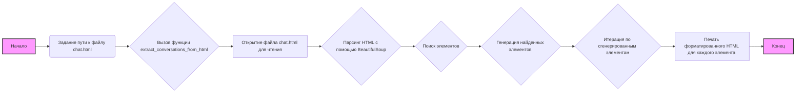

## Анализ кода `hypotez/src/suppliers/chat_gpt/converstions_parser.py`

### 1. <алгоритм>

**Блок-схема:**

1.  **Начало**: Задается путь к файлу `chat.html`.
    *   Пример: `file_path = Path(gs.path.data / 'chat_gpt'  / 'chat.html')`
2.  **`extract_conversations_from_html`**: Функция вызывается с путем к файлу `chat.html`.
    *   Пример: `extract_conversations_from_html(file_path)`
3.  **Открытие файла**: Файл открывается на чтение с кодировкой `utf-8`.
    *   Пример: `with file_path.open('r', encoding='utf-8') as file:`
4.  **Парсинг HTML**: Содержимое файла парсится с использованием `BeautifulSoup`.
    *   Пример: `soup = BeautifulSoup(file, 'html.parser')`
5.  **Поиск бесед**: В HTML-коде ищутся все элементы `<div>` с классом `conversation`.
    *   Пример: `conversations = soup.find_all('div', class_='conversation')`
6.  **Генерация бесед**: Каждая найденная беседа (элемент `<div>`) последовательно возвращается генератором.
    *   Пример: `for conversation in conversations: yield conversation`
7.  **Итерация и печать**: Происходит итерация по результатам генератора.
    *   Пример: `for conversation in extract_conversations_from_html(file_path): print(conversation.prettify())`
8.  **Печать беседы**: Каждая беседа печатается с форматированием.
    *   Пример: `print(conversation.prettify())`
9.  **Конец**: Завершение работы программы.

**Поток данных:**

*   Путь к файлу `chat.html` (тип `Path`) передается в функцию `extract_conversations_from_html`.
*   Функция открывает файл и передает его содержимое в `BeautifulSoup`.
*   `BeautifulSoup` парсит HTML и возвращает список элементов `<div>` с классом `conversation`.
*   Генератор возвращает каждый элемент `<div>` поочередно.
*   Основной цикл итерируется по этим элементам и вызывает метод `prettify()` для вывода на печать.

### 2. <mermaid>



**Анализ зависимостей:**

*   `graph LR` : Определяет тип диаграммы как направленный граф.
*   `A[Начало]`: Обозначает начало процесса.
*   `B(Задание пути к файлу chat.html)`: Указывает на этап задания пути к файлу HTML с беседами.
*   `C{Вызов функции extract_conversations_from_html}`: Обозначает вызов основной функции для извлечения бесед.
*   `D[Открытие файла chat.html для чтения]`: Этап открытия файла для чтения.
*   `E{Парсинг HTML с помощью BeautifulSoup}`: Указывает на использование библиотеки `BeautifulSoup` для парсинга HTML.
*   `F{Поиск элементов <div class="conversation">}`: Этап поиска нужных элементов.
*   `G{Генерация найденных элементов <div class="conversation">}`: Обозначает генерацию найденных элементов.
*   `H{Итерация по сгенерированным элементам}`: Этап итерации по сгенерированным элементам.
*    `I[Печать форматированного HTML для каждого элемента <div class="conversation">]`: Этап форматированного вывода HTML.
*   `J[Конец]`: Обозначает конец процесса.

Все имена переменных осмысленные и описывают действия, происходящие на каждом этапе.

### 3. <объяснение>

**Импорты:**

*   `import header`: Импорт модуля `header`,  назначение не описано.
*   `from src import gs`: Импортируется модуль `gs` из пакета `src`, вероятно, для доступа к глобальным настройкам, включая пути.
*   `from pathlib import Path`: Импортируется класс `Path` из модуля `pathlib` для работы с файловыми путями.
*   `from bs4 import BeautifulSoup`: Импортируется класс `BeautifulSoup` из библиотеки `bs4` (Beautiful Soup) для парсинга HTML.

**Классы:**

*   В данном коде нет классов, только функция.

**Функции:**

*   `extract_conversations_from_html(file_path: Path)`:
    *   **Аргументы:**
        *   `file_path` (`Path`): Путь к файлу HTML.
    *   **Возвращаемое значение:** Генератор, который выдает поочередно HTML-элементы `<div>` с классом `conversation`.
    *   **Назначение:** Читает HTML-файл, находит все элементы `<div class="conversation">` и возвращает их в виде итератора (генератора), что позволяет обрабатывать их по одному.
    *   **Пример:**
        ```python
        file_path = Path('path/to/chat.html')
        for conversation in extract_conversations_from_html(file_path):
            print(conversation.prettify())
        ```

**Переменные:**

*   `MODE`: Глобальная переменная, обозначающая режим работы программы, установлена в `'dev'`.
*    `file_path`: Переменная типа `Path`, представляющая путь к файлу `chat.html`.

**Потенциальные ошибки и области для улучшения:**

*   **Обработка ошибок**: Отсутствует обработка исключений при открытии и парсинге файла. Следует добавить блок `try-except` для обработки `FileNotFoundError` и других возможных ошибок.
*   **Логирование**: Отсутствует логирование. В случае ошибок или для отслеживания работы программы было бы полезно добавить логирование.
*   **Модульность**: Код довольно простой. Возможно, стоило бы вынести логику обработки каждой беседы в отдельную функцию.
*   **Константы**: Строку 'conversation' в `find_all` лучше вынести в константу.
*   **Описание модуля**: В начале файла есть много пустых docstring, которые не имеют пользы.
*   **Использование MODE**: Переменная `MODE` задана, но не используется.

**Взаимосвязи с другими частями проекта:**

*   Код использует `gs.path.data` из модуля `gs` для получения пути к файлу. Это говорит о том, что `gs` предоставляет глобальные настройки путей.
*   Модуль, вероятно, является частью процесса обработки данных, связанных с Chat GPT, и служит для извлечения данных из HTML-файлов.

В целом, код выполняет свою основную функцию: извлечение бесед из HTML-файла. Однако он требует улучшения в плане обработки ошибок, логирования и модульности.