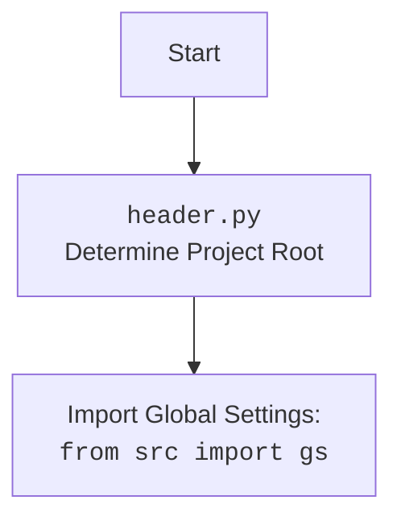

## АНАЛИЗ КОДА: `src/suppliers/chat_gpt/converstions_parser.py`

### 1. <алгоритм>

**Блок-схема:**

```mermaid
graph TD
    A[Начало] --> B{Получение пути к файлу};
    B --> C{Открытие HTML файла};
    C --> D{Парсинг HTML с BeautifulSoup};
    D --> E{Поиск всех div элементов с class="conversation"};
    E --> F{Итерация по найденным conversation};
    F --> G{Вывод отформатированного HTML conversation};
    G --> H{Конец итерации};
    H -- Есть еще conversation? --> F;
    H -- Нет conversation --> I[Конец];
```

**Примеры:**
1.  **Начало**: Запускается скрипт.
2.  **Получение пути к файлу**: Путь к файлу `chat.html` получается через `gs.path.data / 'chat_gpt' / 'chat.html'`, где `gs.path.data` это путь к директории data в проекте, а `'chat_gpt'` папка, где хранится файл `chat.html`
3.  **Открытие HTML файла**: Файл `chat.html` открывается для чтения.
4.  **Парсинг HTML с BeautifulSoup**: HTML-код анализируется с помощью `BeautifulSoup`, создавая объект `soup` для удобной навигации и поиска элементов.
5.  **Поиск всех div элементов с class="conversation"**: Функция `find_all` используется для поиска всех элементов `div` с классом `conversation`, результат сохраняется в переменной `conversations`.
6. **Итерация по найденным conversation**: Цикл `for` перебирает все найденные `conversation`
7.  **Вывод отформатированного HTML conversation**: Для каждого найденного `conversation` выводится отформатированный HTML с помощью метода `prettify()`.
8.  **Конец итерации**: Проверяется, есть ли еще conversation, если да, то происходит переход к шагу 6, если нет то завершается выполнение функции.
9.  **Конец**: Завершение программы.

### 2. <mermaid>

```mermaid
flowchart TD
    Start --> GetFilePath[Get File Path: <br><code>file_path = Path(gs.path.data / 'chat_gpt'  / 'chat.html')</code>];
    GetFilePath --> OpenFile[Open HTML File: <br><code>with file_path.open('r', encoding='utf-8') as file:</code>];
    OpenFile --> ParseHTML[Parse HTML: <br><code>soup = BeautifulSoup(file, 'html.parser')</code>];
    ParseHTML --> FindConversations[Find Conversations: <br><code>conversations = soup.find_all('div', class_='conversation')</code>];
    FindConversations --> LoopStart[Start Loop: <br><code>for conversation in conversations:</code>];
    LoopStart --> PrettyPrint[Pretty Print Conversation: <br><code>print(conversation.prettify())</code>];
    PrettyPrint --> LoopEnd[End Loop];
    LoopEnd -- More Conversations? --> LoopStart;
    LoopEnd -- No More Conversations --> End;

    classDef grey fill:#f9f,stroke:#333,stroke-width:2px
    class GetFilePath,OpenFile,ParseHTML,FindConversations,LoopStart,PrettyPrint,LoopEnd grey
```

**Импортированные зависимости:**

-   `header`: Этот модуль импортируется, но не используется напрямую в коде, он используется для определения корневой директории проекта, что позволяет импортировать необходимые модули.
-   `from src import gs`: Импортирует глобальные настройки `gs` из пакета `src`. `gs` используется для доступа к путям к файлам.
-   `from pathlib import Path`: Импортирует класс `Path` из модуля `pathlib`, который предоставляет способ работы с путями к файлам в виде объектов.
-   `from bs4 import BeautifulSoup`: Импортирует класс `BeautifulSoup` из библиотеки `bs4`, которая используется для парсинга HTML и XML файлов.

**mermaid для `header.py`**



### 3. <объяснение>

#### Импорты:

-   **`import header`**: Импорт модуля `header`, который, как правило, используется для определения корневого каталога проекта и настройки глобальных параметров.
-   **`from src import gs`**: Импорт глобальных настроек (`gs`) из пакета `src`. `gs` содержит параметры, которые могут быть использованы в разных частях проекта, включая пути к файлам.
-   **`from pathlib import Path`**: Импорт класса `Path` из модуля `pathlib`. Этот класс предоставляет удобный способ представления и манипуляции путями к файлам и директориям в разных операционных системах.
-   **`from bs4 import BeautifulSoup`**: Импорт класса `BeautifulSoup` из библиотеки `bs4`, которая используется для парсинга HTML и XML.

#### Функции:

-   **`extract_conversations_from_html(file_path: Path)`**:
    -   **Аргументы**:
        -   `file_path` (`Path`): Путь к HTML-файлу, который нужно проанализировать.
    -   **Возвращаемое значение**:
        -   `Generator`: Функция является генератором, который последовательно возвращает каждый найденный элемент `div` с классом `conversation` из HTML-файла.
    -   **Назначение**:
        -   Открывает HTML-файл, парсит его с помощью `BeautifulSoup`, находит все блоки с классом `conversation`, итерируется по ним и возвращает каждый блок.
    -   **Пример**:
        ```python
        file_path = Path(gs.path.data / 'chat_gpt' / 'chat.html')
        for conversation in extract_conversations_from_html(file_path):
            print(conversation.prettify())
        ```
        Этот пример итерируется по всем найденным элементам и выводит их в консоль.

#### Переменные:

-   **`file_path`**: Объект типа `Path`, представляющий путь к файлу `chat.html`. Он создается путем объединения пути к директории с данными (`gs.path.data`), папки `'chat_gpt'` и имени файла `'chat.html'`.
-   **`soup`**: Объект типа `BeautifulSoup`, представляющий разобранный HTML-код.
-    **`conversations`**: Список всех элементов `div` с классом `conversation`, найденных в HTML.
-   **`conversation`**: Внутри цикла `for` является каждым элементом `div` с классом `conversation`.

#### Ошибки и улучшения:

-   **Обработка ошибок**: В коде отсутствует обработка возможных ошибок, таких как `FileNotFoundError` при открытии файла или ошибок парсинга HTML. Рекомендуется добавить блоки `try-except` для обработки таких ситуаций.
-   **Логирование**: Нет логирования событий, таких как успешное открытие файла или количество найденных разговоров. Логирование может помочь в отладке и мониторинге работы скрипта.
-   **Проверка на существование файла**: Перед открытием файла желательно добавить проверку на его существование.

#### Цепочка взаимосвязей:
1.  **`header.py`**: Обеспечивает корректное определение корневой директории проекта, что позволяет корректно использовать пути к файлам.
2.  **`src.gs`**: Предоставляет глобальные настройки проекта, в том числе путь к директории с данными, которая используется для определения местоположения файла `chat.html`.
3. **`pathlib.Path`**: Позволяет создавать объект представляющий путь к файлу.
4.  **`bs4.BeautifulSoup`**: Обеспечивает парсинг HTML-файла, позволяя удобно находить необходимые элементы.
5.  **Использование**:  Функция `extract_conversations_from_html` используется для извлечения бесед из HTML-файла.

Этот код предоставляет функциональность для извлечения и обработки бесед из HTML-файлов, что может быть полезно для анализа данных, полученных из чата.