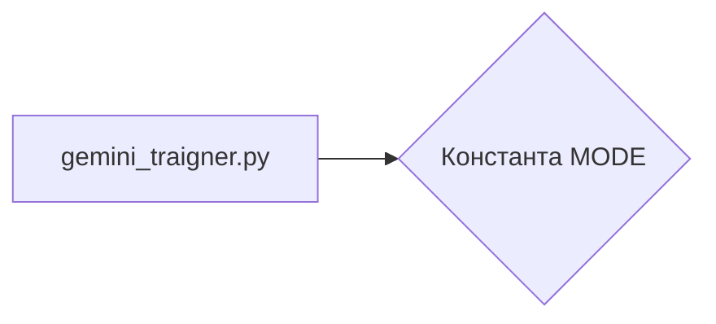

# <input code>

```python
## \file hypotez/src/suppliers/chat_gpt/gemini_traigner.py
# -*- coding: utf-8 -*-\
#! venv/Scripts/python.exe
#! venv/bin/python/python3.12

"""
.. module: src.suppliers.chat_gpt 
	:platform: Windows, Unix
	:synopsis:

"""
MODE = 'dev'

"""
	:platform: Windows, Unix
	:synopsis:

"""

"""
	:platform: Windows, Unix
	:synopsis:

"""


"""
  :platform: Windows, Unix

"""
"""
  :platform: Windows, Unix
  :platform: Windows, Unix
  :synopsis:
"""MODE = 'dev'
```

# <algorithm>

Этот код не содержит алгоритма в привычном понимании. Это просто файл с некоторыми комментариями и константой.  В нем нет циклов, ветвлений или функций, которые бы обрабатывали данные.

**Блок-схема (не требуется, так как нет логики):**

Не представлена, так как код не выполняет действий с данными.

# <mermaid>



# <explanation>

Этот Python-файл (`gemini_traigner.py`) находится в структуре проекта `hypotez/src/suppliers/chat_gpt/`. Он, вероятно, предназначен для будущей реализации тренировочного процесса для модели Gemini.

**1. Импорты:**

В данном коде нет импортированных модулей.  Отсутствуют импорты из `src` или других пакетов.  Это обычный файл с описанием, а не с реализацией.

**2. Классы:**

В файле нет объявлений классов.

**3. Функции:**

Нет функций, нет логики.

**4. Переменные:**

Существует глобальная строковая переменная `MODE` со значением `'dev'`.  Эта переменная, вероятно, используется для настройки режима работы (например, 'dev' - для разработки, 'prod' - для производства).

**5. Возможные ошибки или области для улучшений:**

* **Недостаток кода:** Файл содержит только документацию и объявление константы, но не реализует логику. Для полноценного тренировочного процесса требуется значительная часть кода, включая:
    * Обработку данных (загрузка, подготовка).
    * Создание/инициализацию моделей Gemini.
    * Обучение моделей (алгоритм обучения).
    * Сохранение обученных моделей.

* **Недостаток структуры:**  Хотя переменная `MODE` может использоваться, полезно было бы определиться с тем, какие константы/переменные будут существовать и куда их размещать. Это могло бы быть в отдельном файле настроек.


**Цепочка взаимосвязей:**

Этот файл, скорее всего, связан с другими файлами в проекте `hypotez/src/suppliers/chat_gpt/`, которые будут отвечать за:
* Подготовку данных для обучения.
* Интерфейс взаимодействия с API модели Gemini.
*  Функции управления обучением модели (тренировкой).

Без реализации функций и классов, этот файл является фрагментом, который, скорее всего, будет дополняться последующим кодом.  Для анализа дальнейшей функциональности необходимы другие файлы.