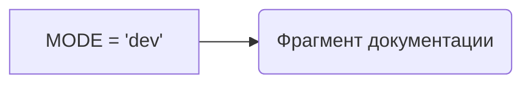

1. <input code>

```python
## \file hypotez/src/suppliers/chat_gpt/gemini_traigner.py
# -*- coding: utf-8 -*-
#! venv/Scripts/python.exe
#! venv/bin/python/python3.12

"""
.. module: src.suppliers.chat_gpt 
	:platform: Windows, Unix
	:synopsis:

"""
MODE = 'dev'

"""
	:platform: Windows, Unix
	:synopsis:

"""


"""
	:platform: Windows, Unix
	:synopsis:

"""


"""
  :platform: Windows, Unix

"""
"""
  :platform: Windows, Unix
  :platform: Windows, Unix
  :synopsis:
"""MODE = 'dev'
```

2. <algorithm>

Этот код не содержит никакого алгоритма. Он представляет собой лишь фрагмент документации и константного определения.  Нет циклов, условий или вызовов функций, которые могли бы задавать алгоритм.  Блок-схема не требуется.

3. <mermaid>



4. <explanation>

* **Импорты:**  В коде отсутствуют импорты.  Он определяет константу `MODE` внутри модуля `gemini_traigner.py`.  Если в дальнейшем потребуется использование других модулей, они будут импортированы (например, для работы с API Gemini).

* **Классы:** Нет классов в данном фрагменте кода.

* **Функции:** Нет функций в данном фрагменте кода.

* **Переменные:**  `MODE` - строковая переменная, которая хранит значение "dev".  Это, скорее всего, константа, определяющая режим работы программы (например, режим разработки `dev`, производство `prod`).

* **Возможные ошибки или области для улучшений:** Код является очень простым и неполным.  Отсутствует функциональность.  Вместо множества пустых строк и комментариев, лучше было бы сразу определить функционал, который планируется реализовать.

* **Взаимосвязи с другими частями проекта:** Сложно определить связи с другими частями проекта без дополнительного контекста.  Вероятно, константа `MODE` будет использована в других частях проекта, чтобы определить режим работы, например, при взаимодействии с API, сохранении данных или других операциях.   Для понимания взаимосвязей необходимы другие файлы проекта.


**Дополнительные замечания:**
Строки `#! venv/Scripts/python.exe` и `#! venv/bin/python/python3.12`  - это *хедеры* Python, используемые для указания интерпретатора Python.  Они не являются обязательными в современных Python-скриптах, но могут встречаться в более старых.  В современном коде их, как правило, заменяют указание интерпретатора в файле `requirements.txt` или `pyproject.toml`.  Непонятно, почему эти строки присутствуют в коде, если не требуется особая версия Python.  Рекомендуется избегать использования подобных инструкций, если в проекте используется стандартный способ управления зависимостями.