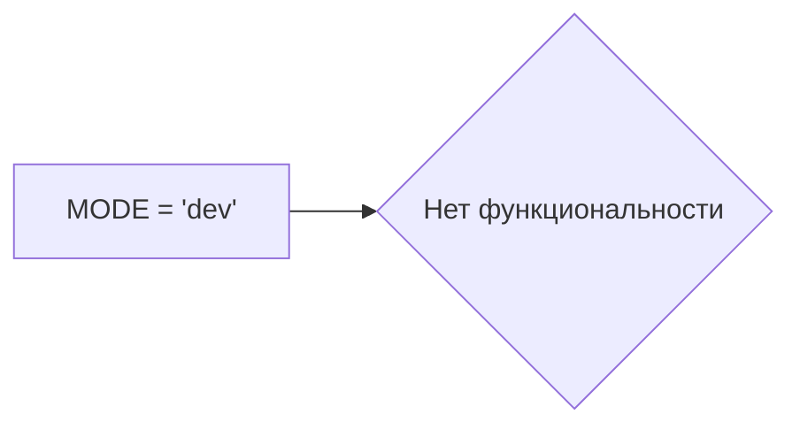

```MD
# Анализ кода файла `hypotez/src/suppliers/chat_gpt/gemini_traigner.py`

## <input code>

```python
## \file hypotez/src/suppliers/chat_gpt/gemini_traigner.py
# -*- coding: utf-8 -*-\
#! venv/Scripts/python.exe
#! venv/bin/python/python3.12

"""
.. module:: src.suppliers.chat_gpt 
	:platform: Windows, Unix
	:synopsis:

"""
MODE = 'dev'

"""
	:platform: Windows, Unix
	:synopsis:

"""


"""
	:platform: Windows, Unix
	:synopsis:

"""


"""
  :platform: Windows, Unix

"""
"""
  :platform: Windows, Unix
  :platform: Windows, Unix
  :synopsis:
"""MODE = 'dev'
```

## <algorithm>

Код представляет собой фрагмент Python-скрипта, который, судя по комментариям, вероятно, предназначен для обучения модели Gemini (или подобной модели). Алгоритм, представленный этим фрагментом, не определен. Он содержит только переменную MODE, которая задаёт режим работы (в данном случае 'dev').  Так как нет функций или классов, пошаговая блок-схема невозможна.


## <mermaid>



## <explanation>

Этот код – очень простой фрагмент Python-скрипта. Он не содержит никакой функциональности.

* **Импорты:** Нет импортов.
* **Классы:** Нет классов.
* **Функции:** Нет функций.
* **Переменные:** Единственная переменная `MODE` хранит строковое значение 'dev'. Вероятно, это константа, используемая для настройки режима работы программы, например, 'dev' (разработка), 'prod' (производство).

**Возможные ошибки или области для улучшений:**

* **Недостаточная функциональность:**  Код не выполняет каких-либо действий, кроме определения переменной MODE.  Ему нужна реализация обучения и вычислений.
* **Отсутствие логики:**  Нет алгоритма, который бы показал, как данная переменная используется.
* **Документация:**  Документация (в виде комментариев) неполна и не описывает назначение кода в достаточной мере.

**Взаимосвязь с другими частями проекта:**

Без дополнительного контекста невозможно определить взаимосвязь с другими частями проекта.  Фрагмент предполагает существование остальных файлов проекта, которые будут использовать эту переменную `MODE` для определения конфигурации.


**Дополнительные замечания:**

Строки `#! venv/Scripts/python.exe` и `#! venv/bin/python/python3.12` — это шебанги, указывающие интерпретатор Python. Они не являются обязательными, но могут быть полезны для запуска скрипта в определенной среде (например, виртуальном окружении).

В целом, код нуждается в существенном расширении, чтобы стать функциональным.  Без контекста, описывающего назначение переменной `MODE`, сложно дать более подробный анализ.