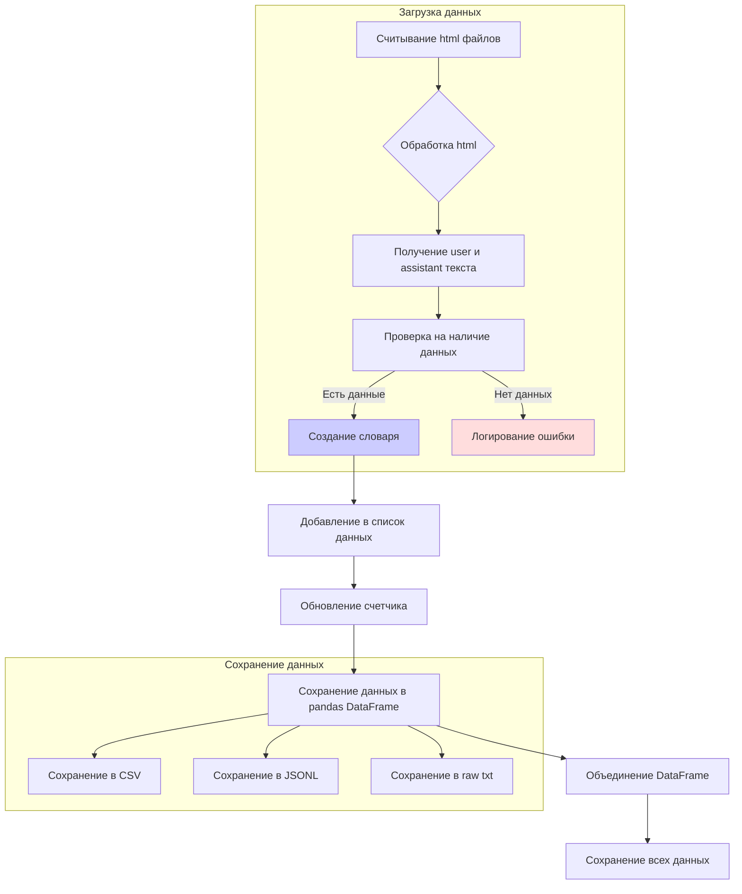

# <input code>

```python
## \file hypotez/src/suppliers/chat_gpt/gpt_traigner.py
# -*- coding: utf-8 -*-\
#! venv/Scripts/python.exe
#! venv/bin/python/python3.12

"""
.. module: src.suppliers.chat_gpt 
	:platform: Windows, Unix
	:synopsis:

"""
MODE = 'dev'


"""
	:platform: Windows, Unix
	:synopsis:

"""


"""
	:platform: Windows, Unix
	:synopsis:

"""


"""
  :platform: Windows, Unix

"""
"""
  :platform: Windows, Unix
  :platform: Windows, Unix
  :synopsis:
"""MODE = 'dev'
  
""" module: src.suppliers.chat_gpt """


import re
import argparse
import asyncio
from pathlib import Path
from itertools import zip_longest

import pandas as pd
from aioconsole import ainput

import header
from src import gs
from src.logger import logger
from src.suppliers.chat_gpt import GptGs
from src.webdriver.driver import Driver, Chrome, Firefox, Edge
from src.ai.openai.model import Model
from src.utils.jjson import j_dumps, j_loads, j_loads_ns, clean_string
from src.utils.convertors import dict2csv, json2csv
from src.utils.printer import pprint

locator = j_loads_ns(gs.path.src / 'suppliers' / 'chat_gpt' / 'locators' / 'chat.json')


class GPT_Traigner:
    """  """
    ...
    driver = Driver(Chrome)
    
    def __init__(self):
        """"""
        ...
        self.gs = GptGs()

    def determine_sentiment(self, conversation_pair: dict[str, str], sentiment: str = 'positive') -> str:
        """ Determine sentiment label for a conversation pair """
        ...
        if sentiment:
            return "positive"
        else:
            return "negative"

    def save_conversations_to_jsonl(self, data: list[dict], output_file: str):
        """ Save conversation pairs to a JSONL file """
        with open(output_file, 'w', encoding='utf-8') as f:
            for item in data:
                f.write(j_dumps(clean_string(item)) + '\n')

    def dump_downloaded_conversations(self):
        """ Collect conversations from the chatgpt page """
        ...
        conversation_directory = Path(gs.path.google_drive / 'chat_gpt' / 'conversation')
        html_files = conversation_directory.glob("*.html")

        all_data = []
        counter: int = 0  # <- counter

        for local_file_path in html_files:
            # Get the HTML content
            file_uri = local_file_path.resolve().as_uri()
            self.driver.get_url(file_uri)
            
            user_elements = self.driver.execute_locator(locator.user)
            assistant_elements = self.driver.execute_locator(locator.assistant)
            
            user_content = [element.text for element in user_elements] if isinstance(user_elements, list) else [user_elements.text] if user_elements  else None
            assistant_content = [element.text for element in assistant_elements] if isinstance(assistant_elements, list) else [assistant_elements.text] if assistant_elements  else None

            if not user_content and not assistant_content:
                logger.error(f"Где данные?")
                continue

            for user_text, assistant_text in zip_longest(user_content, assistant_content):
                if user_text and assistant_text:
                    data = {
                        'role': ['user', 'assistant'],
                        'content': [clean_string(user_text), clean_string(assistant_text)],
                        'sentiment': ['neutral', 'neutral']
                    }
                    all_data.append(pd.DataFrame(data))
                    print(f'{counter} - {local_file_path}')
                    counter += 1

        if all_data:
            all_data_df = pd.concat(all_data, ignore_index=True)

            # Save all accumulated results to a single CSV file
            csv_file_path = gs.path.google_drive / 'chat_gpt' / 'conversation' / 'all_conversations.csv'
            all_data_df.to_csv(csv_file_path, index=False, encoding='utf-8')

            # Save all accumulated results to a single JSONL file
            jsonl_file_path = gs.path.google_drive / 'chat_gpt' / 'conversation' / 'all_conversations.jsonl'
            all_data_df.to_json(jsonl_file_path, orient='records', lines=True, force_ascii=False)
            
            # Save raw conversations to a single line without formatting
            raw_conversations = ' '.join(all_data_df['content'].dropna().tolist())
            raw_file_path = gs.path.google_drive / 'chat_gpt' / 'conversation' / 'raw_conversations.txt'
            with open(raw_file_path, 'w', encoding='utf-8') as raw_file:
                raw_file.write(raw_conversations)

traigner = GPT_Traigner()
traigner.dump_downloaded_conversations()
model = Model()
model.stream_w(data_file_path=Path(gs.path.google_drive / 'chat_gpt' / 'conversation' / 'all_conversations.csv'))

```



```markdown
# <algorithm>

**Шаг 1**: Считывание файлов `.html` из каталога `conversation` на Google Drive.

**Шаг 2**: Обработка каждого файла:
   - Получение текста из элементов `user` и `assistant` в HTML.
   - Проверка на отсутствие данных в `user` или `assistant`. Если данных нет, выводится ошибка и файл пропускается.

**Шаг 3**: Создание словаря:
   - Если оба элемента найдены, создается словарь с данными `user`, `assistant` и `sentiment`.

**Шаг 4**: Добавление в список данных:
   - Словарь добавляется в список `all_data`.
   - Увеличивается счетчик обработки файлов.

**Шаг 5**: Сохранение данных в Pandas DataFrame.
   - Данные объединяются в DataFrame.

**Шаг 6**: Сохранение данных в различные форматы:
    - CSV: Все данные из DataFrame сохраняются в файл `all_conversations.csv`.
    - JSONL: Все данные из DataFrame сохраняются в файл `all_conversations.jsonl` в формате JSONL.
    - raw_conversations.txt: Все очищенные тексты из `content` колонки сохраняются в один строку в файл `raw_conversations.txt`.


**Пример данных (input):**

Файл `conversation/file1.html` содержит HTML с разметкой диалога.
`user` содержит текст "Привет!". `assistant` содержит текст "Привет!".

**Пример данных (output):**

Создается словарь `data`  с ролью пользователя и помощника, содержащий чистые тексты "Привет!" и "Привет!" соответственно.
Этот словарь добавляется в `all_data`.

**Взаимодействие между классами и функциями:**

Класс `GPT_Traigner` содержит методы для обработки данных.
`dump_downloaded_conversations` использует методы класса `Driver` для получения HTML-содержимого и определения элементов `user` и `assistant` .
`GptGs` и `Driver` - внешние классы.
Класс `Model`  используется для обработки данных, но в данном случае используется только метод `stream_w`.

# <explanation>

**Импорты:**

- `re`, `argparse`, `asyncio`, `pathlib`, `zip_longest`: Стандартные библиотеки Python для работы с регулярными выражениями, парсингом аргументов, асинхронностью, путями к файлам и итерациями.
- `pandas`: Библиотека для работы с данными.
- `aioconsole`: Для асинхронного ввода-вывода.
- `header`: Вероятно, модуль для заголовков и настроек проекта.
- `gs`, `logger`: Модули из `src` для работы с глобальными настройками и логированием.
- `GptGs`, `Driver`, `Chrome`, `Firefox`, `Edge`, `Model`: Классы из модулей `src.suppliers.chat_gpt`, `src.webdriver.driver` и `src.ai.openai.model` соответственно.
- `j_dumps`, `j_loads`, `j_loads_ns`, `clean_string`, `dict2csv`, `json2csv`, `pprint`: Утилиты из `src.utils` для работы с JSON, очисткой строк и конвертацией данных.

**Классы:**

- `GPT_Traigner`: Класс для сбора и обработки данных из чатов GPT.
    - `driver`: Экземпляр класса `Driver`, используемого для взаимодействия с веб-драйвером (Chrome).
    - `__init__`: Инициализирует экземпляр `GptGs`.
    - `determine_sentiment`: Определяет эмоциональную окраску (положительную или отрицательную) диалога. В данном коде всегда возвращает "positive".
    - `save_conversations_to_jsonl`: Сохраняет диалоги в файл в формате JSONL.
    - `dump_downloaded_conversations`: Основной метод для загрузки диалогов из файлов HTML.

**Функции:**

- `dump_downloaded_conversations`: Проходит по всем файлам html, извлекает пары диалог user/assistant, очищает данные, и сохраняет их в csv, jsonl, и txt формате.


**Переменные:**

- `MODE`, `locator`: Глобальные переменные. `locator` хранит данные о расположении элементов на веб-странице, загружаемые из `chat.json`.

**Возможные ошибки/улучшения:**

- Отсутствие обработки ошибок при чтении файлов (некорректный формат HTML).
- Обработка пустых значений `user_content` и `assistant_content`.
- Возможность настройки параметров (например, пути к файлам).
- Непонятно, для чего нужен `aioconsole`.
- Недостаточная документация для понимания взаимосвязей с другими частями проекта.
- Низкая гибкость, если нужно использовать другой браузер или другие модели.

**Взаимосвязи с другими частями проекта:**

Код использует модули из `src` и их подмодулей.  Это указывает на существование других частей проекта, отвечающих за логирование (`logger`), работу с файловой системой (`gs`), веб-драйверами (`Driver`, `Chrome`, `Firefox`, `Edge`),  обработку JSON-данных (`j_dumps`, `j_loads`), конвертацию (`dict2csv`, `json2csv`), и модели (`Model`).  `GptGs`  вероятно, отвечает за взаимодействие с Google Drive.