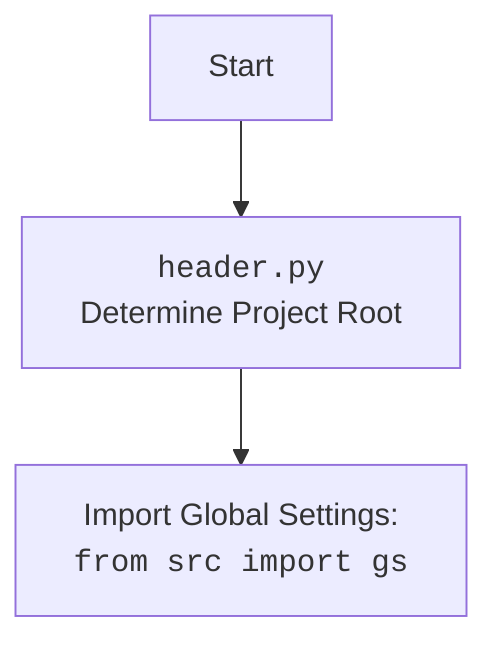

## <алгоритм>

1. **Инициализация**:
   - Создается экземпляр класса `GPT_Traigner`.
   - Инициализируется драйвер браузера (`Chrome`) через класс `Driver`.
   - Инициализируется экземпляр класса `GptGs` как `self.gs`.
   
   *Пример*:
   ```python
   traigner = GPT_Traigner() # Создание экземпляра
   self.driver = Driver(Chrome)  # Инициализация драйвера
   self.gs = GptGs()  # Инициализация GptGs
   ```

2. **`dump_downloaded_conversations()`**:
   - Определяется директория для хранения HTML файлов с разговорами (`conversation_directory`).
   - Получаются все HTML файлы из указанной директории.
   - Создается пустой список `all_data` для хранения данных.
   - Итерация по всем HTML файлам:
     - Загружается HTML контент из файла через `driver.get_url()`.
     - Извлекаются элементы, содержащие текст пользователя и ассистента, с помощью `driver.execute_locator()` по локаторам, определенным в `locator.user` и `locator.assistant`.
     - Полученные элементы преобразуются в текстовые списки `user_content` и `assistant_content`.
     - Если оба списка пусты, выводится сообщение об ошибке.
     - Итерация по парам текстов `user_text`, `assistant_text` с использованием `zip_longest`.
       - Если есть оба текста, создается словарь `data`, содержащий роли, текст и сентимент ('neutral').
       - Словарь `data` преобразуется в pandas DataFrame и добавляется в список `all_data`.
       - Выводится сообщение с номером и путем к файлу.
   - Если список `all_data` не пуст:
     - Все DataFrame объединяются в один `all_data_df`.
     - `all_data_df` сохраняется в CSV файл (`all_conversations.csv`).
     - `all_data_df` сохраняется в JSONL файл (`all_conversations.jsonl`).
     - Содержимое столбца 'content' объединяется в одну строку `raw_conversations` и сохраняется в TXT файл (`raw_conversations.txt`).
   
   *Пример*:
   ```python
   # Путь к html файлу = google_drive/chat_gpt/conversation/file.html
   # user_elements = [<element1>, <element2>]  , element.text = ['user_text1', 'user_text2']
   # assistant_elements = [<element1>, <element2>] , element.text = ['assistant_text1', 'assistant_text2']
   # data = {'role': ['user', 'assistant'], 'content': ['user_text1', 'assistant_text1'], 'sentiment': ['neutral', 'neutral']}
   # data_df = pd.DataFrame(data)
   # all_data = [data_df1, data_df2, ...]
   # all_data_df = pd.concat(all_data)
   ```

3. **Вызов методов и обработка**:
   - Вызывается метод `dump_downloaded_conversations()` экземпляра `traigner`.
   - Создается экземпляр класса `Model`.
   - Вызывается метод `stream_w` экземпляра `model`, передавая путь к CSV файлу.

   *Пример*:
   ```python
   traigner.dump_downloaded_conversations()
   model = Model()
   model.stream_w(data_file_path="google_drive/chat_gpt/conversation/all_conversations.csv")
   ```

## <mermaid>

```mermaid
flowchart TD
    subgraph GPT_Traigner Class
        A[__init__] --> B(Initialize GptGs)
        C[dump_downloaded_conversations] --> D(Get HTML Files)
        D --> E{For Each HTML File}
        E -- true --> F(Get HTML Content)
        F --> G(Extract User Content)
        G --> H(Extract Assistant Content)
        H --> I{User and Assistant Content Exists?}
        I -- true --> J{For Each Conversation Pair}
        J -- true --> K(Create Data Dictionary)
        K --> L(Append DataFrame to all_data)
        J -- false --> E
        I -- false --> E
        E -- false --> M{all_data is not empty?}
        M -- true --> N(Concatenate DataFrames)
        N --> O(Save to CSV)
        O --> P(Save to JSONL)
         P --> Q(Extract Raw Text)
         Q --> R(Save Raw Text)
    
    end
    
    subgraph Global
        S[Create GPT_Traigner Instance] --> C
        T[Create Model Instance]
        R --> T
         T --> U[Call stream_w()]

    end
    
    
    classDef classStyle fill:#f9f,stroke:#333,stroke-width:2px
    class A,B,C,D,E,F,G,H,I,J,K,L,M,N,O,P,Q,R,S,T classStyle;
```



**Объяснение зависимостей `mermaid`:**

-   **`GPT_Traigner Class`**: Этот подграф представляет класс `GPT_Traigner` и его методы.
    -   `__init__`: Метод инициализации класса.
    -   `dump_downloaded_conversations`: Метод для обработки загруженных разговоров.
-   **`Global`**: Этот подграф представляет глобальный поток выполнения программы.
    -   `Create GPT_Traigner Instance`: Создание экземпляра класса `GPT_Traigner`.
    -   `Create Model Instance`: Создание экземпляра класса `Model`.
    -   `Call stream_w()`: Вызов метода `stream_w` для обработки данных.
-   **Логические блоки:**
    -   Круги: Начало/конец, процессы.
    -   Прямоугольники: Действия/шаги.
    -   Ромбы: Условные переходы/решения.
-   Стрелки указывают последовательность операций и поток данных.
-   Диаграмма наглядно демонстрирует взаимодействие между методами класса и глобальными операциями, а также процесс обработки данных.

## <объяснение>

### Импорты:

-   **`re`**: Используется для работы с регулярными выражениями. В данном коде явно не используется, но может присутствовать в зависимостях других модулей.
-   **`argparse`**: Используется для парсинга аргументов командной строки. В данном коде явно не используется, но может присутствовать в зависимостях других модулей.
-   **`asyncio`**: Используется для асинхронного программирования. В данном коде явно не используется, но может присутствовать в зависимостях других модулей.
-   **`pathlib.Path`**: Используется для работы с путями к файлам и директориям в объектно-ориентированном стиле.
-   **`itertools.zip_longest`**: Используется для итерации по нескольким итерируемым объектам, заполняя недостающие элементы `None`.
-   **`pandas as pd`**: Используется для работы с данными в табличном формате (DataFrame).
-   **`aioconsole.ainput`**:  Используется для асинхронного ввода с консоли. В данном коде явно не используется, но может присутствовать в зависимостях других модулей.
-   **`header`**: Пользовательский модуль для определения корневого каталога проекта и импорта глобальных настроек (`gs`).
-   **`src.gs`**: Модуль с глобальными настройками проекта.
-   **`src.logger.logger`**: Модуль для логирования.
-   **`src.suppliers.chat_gpt.GptGs`**: Модуль с настройками для ChatGPT.
-   **`src.webdriver.driver`**: Модуль для управления браузером. Импортирует классы `Driver`, `Chrome`, `Firefox`, `Edge`.
-  **`src.ai.openai.model`**: Модуль, содержащий класс `Model` для работы с OpenAI.
-   **`src.utils.jjson`**: Модуль для работы с JSON, включая кастомную загрузку (`j_loads_ns`) и дамп (`j_dumps`).
-   **`src.utils.convertors`**: Модуль для конвертации данных из `dict` в `csv` и из `json` в `csv`.
-   **`src.utils.printer`**: Модуль для красивой печати.

### Классы:

-   **`GPT_Traigner`**:
    -   **Роль**: Класс для обработки и обучения на данных, полученных от ChatGPT.
    -   **Атрибуты**:
        -   `driver`: Экземпляр класса `Driver` для управления браузером.
        -   `gs`: Экземпляр класса `GptGs` для доступа к настройкам.
    -   **Методы**:
        -   `__init__(self)`: Инициализирует объект, создает экземпляр `GptGs`.
        -   `determine_sentiment(self, conversation_pair: dict[str, str], sentiment: str = 'positive') -> str`: Определяет тональность, всегда возвращает "positive" или "negative".
        -   `save_conversations_to_jsonl(self, data: list[dict], output_file: str)`: Сохраняет данные в JSONL файл.
        -   `dump_downloaded_conversations(self)`: Собирает диалоги из HTML-файлов, сохраняет их в CSV, JSONL и текстовые файлы.
    -   **Взаимодействие**:
        -   Использует `Driver` для получения HTML-контента.
        -   Использует `GptGs` для доступа к путям.
        -   Использует `logger` для логирования ошибок.
        -   Использует `pandas` для обработки данных.
        -   Использует `src.utils.jjson` для работы с json.
        -   Использует `zip_longest` для обработки пар разговоров.

### Функции:

-   `determine_sentiment(self, conversation_pair: dict[str, str], sentiment: str = 'positive') -> str`:
    -   **Аргументы**: `conversation_pair` (словарь), `sentiment` (строка, по умолчанию 'positive').
    -   **Возвращаемое значение**: строка "positive" или "negative".
    -   **Назначение**: Определяет тональность диалога (фиктивный метод, всегда возвращает 'positive', если `sentiment` определен, или 'negative' в противном случае).
-   `save_conversations_to_jsonl(self, data: list[dict], output_file: str)`:
    -   **Аргументы**: `data` (список словарей), `output_file` (путь к выходному файлу).
    -   **Возвращаемое значение**: `None`.
    -   **Назначение**: Сохраняет данные в формате JSON Lines.
-   `dump_downloaded_conversations(self)`:
    -   **Аргументы**: `None`.
    -   **Возвращаемое значение**: `None`.
    -   **Назначение**: Собирает диалоги из HTML-файлов, сохраняет в CSV, JSONL и TXT.

### Переменные:

-   `locator`: Словарь с локаторами для поиска элементов на странице, полученный из `chat.json` с помощью `j_loads_ns`.
-   `traigner`: Экземпляр класса `GPT_Traigner`.
-   `model`: Экземпляр класса `Model` из `src.ai.openai.model`.

### Потенциальные ошибки и области для улучшения:

-   Метод `determine_sentiment` не выполняет реального определения тональности, а просто возвращает "positive" или "negative" в зависимости от входного параметра, что требует доработки.
-   Отсутствует обработка возможных ошибок при работе с файлами и веб-драйвером.
-   Не используется `asyncio`, хотя импорт присутствует.
-   Логика сбора и обработки данных может быть оптимизирована.

### Взаимосвязи с другими частями проекта:

-   Использует `gs` для получения путей к директориям.
-   Использует `logger` для логирования.
-   Использует `Driver` из `src.webdriver.driver` для управления браузером.
-   Использует `Model` из `src.ai.openai.model` для работы с OpenAI.
-   Использует утилиты из `src.utils` для работы с JSON и CSV.

Этот код представляет собой часть системы для обучения моделей обработки естественного языка на данных, полученных из ChatGPT. Он загружает HTML-страницы, извлекает диалоги, и сохраняет их в различных форматах для дальнейшей обработки и обучения.