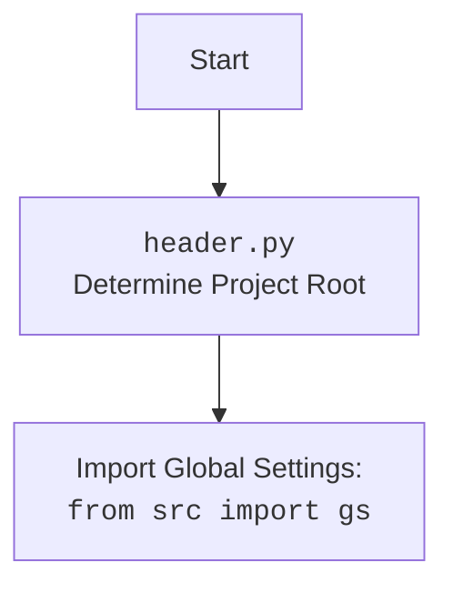

## <алгоритм>

1.  **Инициализация:**
    *   Создается экземпляр класса `GPT_Traigner`.
    *   Инициализируется объект `GptGs` для доступа к глобальным настройкам.
    *   Инициализируется драйвер веб-браузера (Chrome).
    *   Инициализируется модель `Model` для работы с OpenAI.
    *   Загружаются локаторы для поиска элементов на веб-странице из JSON-файла.

2.  **Сбор данных:**
    *   Функция `dump_downloaded_conversations` собирает данные из HTML файлов, находящихся в директории `gs.path.google_drive / 'chat_gpt' / 'conversation'`.
    *   Для каждого HTML файла:
        *   Открывается HTML файл в браузере.
        *   Извлекаются элементы с текстом пользователя (`user_elements`) и ассистента (`assistant_elements`) с помощью локаторов.
        *   Извлекаются текстовые значения из HTML элементов.
        *   Создаются пары диалогов из текстов пользователя и ассистента с добавлением ролей (`'user'`, `'assistant'`) и нейтральным (`'neutral'`) настроением.
        *   Сохраняются все диалоги в список `all_data` в виде DataFrame Pandas.
    *   Если `all_data` не пустой, то выполняется следующее:
        *   Все DataFrame-ы из списка `all_data` объединяются в один `all_data_df`.
        *   Сохраняется `all_data_df` в CSV-файл (`all_conversations.csv`).
        *   Сохраняется `all_data_df` в JSONL-файл (`all_conversations.jsonl`).
        *   Извлекается текст из всех диалогов, объединяется в одну строку и сохраняется в TXT-файл (`raw_conversations.txt`).
    
    *Пример:*
    
     Пусть есть папка `conversation` с двумя файлами `dialog_1.html` и `dialog_2.html`.
    
    *   **`dialog_1.html`**:
    
        ```html
          <div class="user">User: Hello!</div>
          <div class="assistant">Assistant: Hi there!</div>
           <div class="user">User: How are you?</div>
            <div class="assistant">Assistant: I'm fine, thank you.</div>
        ```
    *   **`dialog_2.html`**:
    
       ```html
            <div class="user">User: What's the weather like?</div>
           <div class="assistant">Assistant: It's sunny.</div>
        ```
    
    Результатом будет:
    * CSV файл `all_conversations.csv` с данными, где каждая строка это диалог:
    
        ```csv
        role,content,sentiment
        "['user', 'assistant']","['Hello!', 'Hi there!']","['neutral', 'neutral']"
        "['user', 'assistant']","['How are you?', 'I'm fine, thank you.']","['neutral', 'neutral']"
        "['user', 'assistant']","['What's the weather like?', 'It's sunny.']","['neutral', 'neutral']"
        ```
    
    * JSONL файл `all_conversations.jsonl` с данными в формате JSON:
    
        ```json
        {"role": ["user", "assistant"], "content": ["Hello!", "Hi there!"], "sentiment": ["neutral", "neutral"]}
        {"role": ["user", "assistant"], "content": ["How are you?", "I'm fine, thank you."], "sentiment": ["neutral", "neutral"]}
         {"role": ["user", "assistant"], "content": ["What's the weather like?", "It's sunny."], "sentiment": ["neutral", "neutral"]}
        ```
    * TXT файл `raw_conversations.txt` c текстами из всех диалогов:
    
        ```text
        Hello! Hi there! How are you? I'm fine, thank you. What's the weather like? It's sunny.
        ```
    

3. **Обучение модели:**
    *   Создается экземпляр класса `Model`.
    *   Вызывается метод `stream_w` модели, который получает путь к `all_conversations.csv` для обучения.
    *   Идет процесс обучения модели (в предоставленном коде деталей обучения нет).

## <mermaid>

```mermaid
flowchart TD
    subgraph GPT_Traigner Class
        A[Initialize GPT_Traigner Class] --> B(Initialize GptGs:  <br> <code>self.gs = GptGs()</code>);
        B --> C(Initialize Driver: <br><code>self.driver = Driver(Chrome)</code>);
        C --> D[Call dump_downloaded_conversations()];
    end
        
    subgraph dump_downloaded_conversations Function
    
        D --> E{Find HTML files};
        E -- For each HTML file --> F(Open HTML file in browser: <br><code>self.driver.get_url()</code>);
        F --> G(Get user elements: <br><code>self.driver.execute_locator(locator.user)</code>);
        G --> H(Get assistant elements: <br><code>self.driver.execute_locator(locator.assistant)</code>);
        H --> I{Is user_content and assistant_content exists?};
        I -- No --> E
        I -- Yes --> J(Extract text from elements);
         J --> K{Combine user and assistant text into pairs};
        K --> L(Create DataFrame from pairs);
        L --> M(Append DataFrame to all_data);
         M --> N(Save result to CSV, JSONL, TXT file);
    
    end
    
    subgraph Model Class
       
       N --> O(Initialize Model Class);
       O --> P(Call Model.stream_w():  <br>Train with data from  <br><code>all_conversations.csv</code>);
    
    end
     
    Start --> A
```



### Объяснение зависимостей `mermaid`
* `GPT_Traigner Class`: Описывает класс `GPT_Traigner`, который управляет процессом сбора и обработки данных для обучения модели. 
    *   `Initialize GPT_Traigner Class`: Начало инициализации класса `GPT_Traigner`.
    *   `Initialize GptGs`: Инициализация объекта `GptGs` для доступа к глобальным настройкам.
    *   `Initialize Driver`: Инициализация драйвера браузера Chrome для работы с веб-страницами.
    *   `Call dump_downloaded_conversations()`: Вызов метода для сбора данных из HTML файлов.
* `dump_downloaded_conversations Function`: Описывает рабочий процесс функции `dump_downloaded_conversations`, которая отвечает за обработку HTML файлов и формирование набора данных.
    *   `Find HTML files`: Поиск HTML файлов в указанной директории.
    *   `Open HTML file in browser`: Открытие HTML файла в браузере с помощью драйвера.
    *   `Get user elements`: Извлечение элементов, содержащих текст пользователя, с использованием локаторов.
    *   `Get assistant elements`: Извлечение элементов, содержащих текст ассистента, с использованием локаторов.
    *   `Is user_content and assistant_content exists?`: Проверка наличия данных от пользователя и ассистента.
    *   `Extract text from elements`: Извлечение текста из HTML элементов.
    *   `Combine user and assistant text into pairs`: Формирование пар диалогов из текста пользователя и ассистента.
    *   `Create DataFrame from pairs`: Создание DataFrame Pandas для хранения пары диалога.
     *   `Append DataFrame to all_data`: Добавление DataFrame к общему списку `all_data`.
    *   `Save result to CSV, JSONL, TXT file`: Сохранение результатов в CSV, JSONL и TXT файлы.
* `Model Class`: Описывает класс `Model` и процесс обучения модели.
    *   `Initialize Model Class`: Инициализация класса `Model`.
    *   `Call Model.stream_w()`: Вызов метода обучения модели с использованием данных из `all_conversations.csv`.

## <объяснение>

### Импорты:

*   `re`: Модуль для работы с регулярными выражениями. Не используется непосредственно в предоставленном коде, но может использоваться в других частях проекта.
*   `argparse`: Модуль для создания интерфейса командной строки. Не используется в данном файле, но может быть использован в других частях проекта для настройки параметров запуска.
*   `asyncio`: Модуль для асинхронного программирования. Используется для `ainput` из `aioconsole`, что позволяет ожидать ввод пользователя без блокировки.
*   `pathlib.Path`: Модуль для работы с путями к файлам и директориям. Позволяет более удобно и кросс-платформенно работать с файловой системой.
*   `itertools.zip_longest`: Функция для объединения двух итераций, заполняя недостающие значения `None`.
*   `pandas as pd`: Библиотека для работы с табличными данными. Используется для создания, обработки и сохранения данных в форматах CSV и JSONL.
*    `aioconsole.ainput`: Асинхронный аналог input(), используется для ожидания ввода от пользователя в асинхронном контексте.
*   `header`: Пользовательский модуль для определения корневой директории проекта.
*   `src.gs`: Модуль, содержащий глобальные настройки проекта.
*   `src.logger.logger`: Модуль для логирования.
*   `src.suppliers.chat_gpt.GptGs`: Модуль с настройками для работы с ChatGPT.
*   `src.webdriver.driver`: Модуль для управления веб-драйвером.
*   `src.ai.openai.model.Model`: Модуль для работы с моделью OpenAI.
*   `src.utils.jjson`: Модуль для работы с JSON, включая загрузку JSON с удалением лишних пробелов и специальных символов.
*    `src.utils.convertors`: Модуль с функциями для конвертации данных, например из словаря в CSV и из JSON в CSV.
*   `src.utils.printer`: Модуль для форматированного вывода.
   
### Классы:

*   `GPT_Traigner`:
    *   **Роль:** Отвечает за сбор данных из HTML файлов с диалогами, их обработку и подготовку для обучения модели.
    *   **Атрибуты:**
        *   `driver`: Объект класса `Driver` для управления браузером.
        *   `gs`: Объект класса `GptGs` для доступа к глобальным настройкам.
    *   **Методы:**
        *   `__init__`: Инициализирует объект `GPT_Traigner`, создавая экземпляры `GptGs` и `Driver`.
        *   `determine_sentiment`:  Определяет настроение (sentiment) для диалога. В предоставленном коде возвращает всегда "positive" или "negative" в зависимости от наличия параметра.
        *   `save_conversations_to_jsonl`: Сохраняет список диалогов в файл JSONL.
        *   `dump_downloaded_conversations`: Собирает диалоги из HTML файлов, обрабатывает их и сохраняет в CSV, JSONL и TXT.

### Функции:
*  `determine_sentiment`:
    *   **Аргументы:** `conversation_pair` - словарь с диалогом, `sentiment` - строка с настроением.
    *   **Возвращаемое значение:** Строка `"positive"` если `sentiment` не пустая или `"negative"` если пустая.
    *   **Назначение:** Устанавливает метку настроения для пары диалогов (в текущей реализации упрощена).

*   `save_conversations_to_jsonl`:
    *   **Аргументы:** `data` - список словарей с диалогами, `output_file` - путь к файлу.
    *   **Возвращаемое значение:** Ничего.
    *   **Назначение:** Сохраняет данные в формате JSONL в файл.

*  `dump_downloaded_conversations`:
    *   **Аргументы:** Нет.
    *   **Возвращаемое значение:** Ничего.
    *   **Назначение:** Собирает данные диалогов из HTML файлов, преобразует их в DataFrame, сохраняет в CSV, JSONL и TXT файлы.

### Переменные:
*   `locator`: Словарь с локаторами для поиска элементов на веб-странице, загружается из JSON.
*   `traigner`: Экземпляр класса `GPT_Traigner`.
*   `model`: Экземпляр класса `Model`.
* `conversation_directory`:  `Path` объект с директорией для хранения файлов диалогов.
* `html_files`: Список `Path` объектов для каждого HTML файла в директории диалогов.
* `all_data`: Список `DataFrame`  с данными диалогов.
* `counter`:  Счетчик количества обработанных диалогов.
* `local_file_path`: `Path` объект текущего обрабатываемого HTML файла.
* `file_uri`: URI текущего обрабатываемого HTML файла.
* `user_elements`: Список HTML элементов с текстом пользователя, полученых из браузера с помощью драйвера.
* `assistant_elements`: Список HTML элементов с текстом ассистента, полученых из браузера с помощью драйвера.
* `user_content`: Список строк с текстом пользователя.
* `assistant_content`: Список строк с текстом ассистента.
* `data`: Словарь с данными для DataFrame (роли, контент, настроение) для одной пары диалога.
* `all_data_df`: DataFrame со всеми диалогами.
* `csv_file_path`: Путь к CSV файлу для сохранения.
* `jsonl_file_path`: Путь к JSONL файлу для сохранения.
* `raw_conversations`: Строка со всеми текстами диалогов.
* `raw_file_path`: Путь к TXT файлу для сохранения.

### Потенциальные ошибки и области для улучшения:

*   **Отсутствие обработки ошибок:** В коде не предусмотрена обработка ошибок, которые могут возникнуть при работе с файлами, веб-драйвером или при парсинге HTML.
*   **Негибкость локаторов:** Локаторы для поиска элементов в HTML-файлах могут быть хрупкими и сломаться при изменении HTML-структуры веб-страницы.
*   **Упрощенное определение настроения:** Метод `determine_sentiment` в текущей реализации всегда возвращает либо positive либо negative. Требуется доработка для определения настроения диалога.
*   **Жестко заданные пути:** Использование `gs.path.google_drive` может ограничить гибкость кода. Возможно, стоит сделать пути настраиваемыми.
*   **Отсутствие асинхронности:** Сбор данных и обработка файлов происходит последовательно, что может быть медленным для большого количества файлов. Можно рассмотреть асинхронное выполнение операций.
*   **Общий код для обработки текста**: `clean_string` применяется ко всему тексту, при этом не учитывается, что  какой то текст может быть важным со специальными символами, которые потом могут быть использованны для токенизации модели.

### Цепочка взаимосвязей с другими частями проекта:

1.  **`header.py`**: Определяет корневую директорию проекта.
2.  **`src.gs`**: Содержит глобальные настройки проекта, пути к файлам и директориям.
3.  **`src.logger.logger`**: Используется для логирования ошибок и событий.
4.  **`src.suppliers.chat_gpt.GptGs`**: Содержит настройки для работы с ChatGPT.
5.  **`src.webdriver.driver`**: Предоставляет интерфейс для управления веб-драйвером (Chrome, Firefox, Edge).
6.  **`src.ai.openai.model.Model`**: Обеспечивает взаимодействие с моделью OpenAI.
7.  **`src.utils.jjson`**: Позволяет работать с JSON, включая загрузку локаторов.
8.  **`src.utils.convertors`**: Используется для преобразования данных в CSV и JSONL форматы.
9.  **`src.utils.printer`**: Обеспечивает форматированный вывод данных.
   
    Этот код является частью более крупного проекта, который, по всей видимости, предназначен для автоматизации сбора данных из ChatGPT, их обработки и использования для обучения модели.