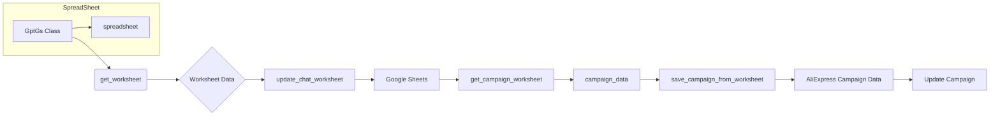

# <input code>

```python
## \file hypotez/src/suppliers/chat_gpt/gsheet.py
# -*- coding: utf-8 -*-\n#! venv/Scripts/python.exe\n#! venv/bin/python/python3.12\n
"""
.. module: src.suppliers.chat_gpt 
	:platform: Windows, Unix
	:synopsis:

"""
MODE = 'dev'

"""
	:platform: Windows, Unix
	:synopsis:

"""

"""
	:platform: Windows, Unix
	:synopsis:

"""


"""
  :platform: Windows, Unix

"""
"""
  :platform: Windows, Unix
  :platform: Windows, Unix
  :synopsis:
"""MODE = 'dev'
  
""" module: src.suppliers.chat_gpt """


""" AliExpress Campaign Editor via Google Sheets """


from lib2to3.pgen2.driver import Driver
import time
from types import SimpleNamespace
from typing import List
from gspread.worksheet import Worksheet
from src.goog.spreadsheet.spreadsheet import SpreadSheet

from src.utils.jjson import j_dumps
from src.utils.printer import pprint
from src.logger import logger


class GptGs(SpreadSheet):
    """ Class for managing Google Sheets within AliExpress campaigns.

    Inherits from `SpreadSheet` and `AliCampaignEditor` to manage Google Sheets,
    write category and product data, and format sheets.
    """
    ...

    def __init__(self):
        """ Initialize AliCampaignGoogleSheet with specified Google Sheets spreadsheet ID and additional parameters.
        @param campaign_name `str`: The name of the campaign.
        @param category_name `str`: The name of the category.
        @param language `str`: The language for the campaign.
        @param currency `str`: The currency for the campaign.
        """
        # Initialize SpreadSheet with the spreadsheet ID
        super().__init__('1nu4mNNFMzSePlggaaL_QM2vdKVP_NNBl2OG7R9MNrs0')


    def clear(self):
        """ Clear contents.
        Delete product sheets and clear data on the categories and other specified sheets.
        """
        try:
            self.delete_products_worksheets()
            # ws_to_clear = ['category','categories','campaign']
            # for ws in self.spreadsheet.worksheets():
            #     self.get_worksheet(ws).clear()
                
        except Exception as ex:
            logger.error("Ошибка очистки",ex)

    # ... (other methods)
```

# <algorithm>

The code manages data interaction with Google Sheets.  A high-level algorithm would be:

1. **Initialization (`__init__`)**:  The class initializes a connection to a Google Sheet with a specific ID.  This creates a `SpreadSheet` object that handles the communication.

2. **Data Clearing (`clear`)**: Deletes worksheets based on their name. This method could be improved to check for existing sheets instead of just deleting all.

3. **Data Writing (`update_chat_worksheet`, `set_category_worksheet`, `set_categories_worksheet`, `set_product_worksheet`)**: These methods write data (campaign, category, or product) to the corresponding worksheets.  Each method takes data as input (e.g., a `SimpleNamespace` object) and formats it into updates for Google Sheets API.

4. **Data Reading (`get_campaign_worksheet`, `get_category_worksheet`, `get_categories_worksheet`, `get_product_worksheet`)**: These methods read data from specific worksheets and return the results as `SimpleNamespace` objects. These provide structured access to data extracted from the spreadsheet.

5. **Data Handling (`save_categories_from_worksheet`, `save_campaign_from_worksheet`)**: These functions specifically save updated data from Google sheets to python objects.  


**Example Data Flow (update_chat_worksheet):**

```
+-----------------+     +---------------------+
| Python Object (data) | --> | GptGs Class (self) |
+-----------------+     +---------------------+
    |                   |       |
    | Extract data      |       | Access Worksheet (ws)|
    |                   |       | Update data in sheet  |
    |                   |       |
+-----------------+     +---------------------+
```

# <mermaid>


**Explanation of Dependencies and Relationships:**

- `GptGs` class inherits from `SpreadSheet`, indicating a dependency on `spreadsheet.py`.  The `spreadsheet.py` module likely provides methods for interacting with the Google Sheets API.
- `j_dumps`, `pprint` and `logger` are utils modules which provide functions to work with json, formatting and logging respectively.
- `lib2to3` is a library needed for the initial execution in the code's header.  This is most likely an artifact and does not indicate a direct code dependency.

# <explanation>

**Imports:**

- `lib2to3.pgen2.driver`: Not used directly in the current logic, likely a leftover from a previous step.  Should be removed.
- `time`: Used for pausing execution in the `set_product_worksheet` method, likely for handling API rate limits (important consideration).
- `types.SimpleNamespace`: Used to create structured data containers.
- `typing.List`: Used for type hinting, specifying that some functions return lists.
- `gspread.worksheet`: Allows interaction with Google Sheets worksheets.
- `src.goog.spreadsheet.spreadsheet`: Likely a custom module for Google Sheets interactions.  This is a direct dependency within the project.
- `src.utils.jjson`: This is likely part of a custom utility module for JSON handling.
- `src.utils.printer`: Likely part of a custom utility module for data printing.
- `src.logger`: Handles logging within the application. This is used for error reporting and informational messages; essential for debugging and monitoring.


**Classes:**

- `GptGs`: Manages Google Sheets interactions specifically for AliExpress campaigns.  The class acts as a bridge between the Python application and the Google Sheets API. Its methods are critical for data retrieval and manipulation.


**Functions:**

- `__init__`: Initializes the `GptGs` object with a spreadsheet ID. Crucial for connecting to the specific sheet.
- `clear`: Clears data from specific sheets. This function is important for ensuring the data in the sheet is up-to-date.
- `update_chat_worksheet`: Writes campaign data into a Google Sheet worksheet.  Its input `data` is crucial, as it controls what and how data is written.
- `get_campaign_worksheet`: Reads data from the 'campaign' worksheet.  Crucial for reading campaign details.
- `set_category_worksheet`, `set_categories_worksheet`, `get_category_worksheet`: These methods handle category data in the Google Sheet.
- `set_product_worksheet`: Writes product data.  The formatting in this method needs careful review.
- `get_product_worksheet`: Reads product data from the spreadsheet.
- `delete_products_worksheets`: Crucial method for data hygiene.  Deleting old product worksheets is essential for managing data.
- `save_categories_from_worksheet`, `save_campaign_from_worksheet`: Save updated spreadsheet data to corresponding Python objects, important to integrate with the campaign management system.


**Variables:**

- `MODE`: A global variable likely for controlling execution modes.
- Spreadsheet ID:  Hardcoded.  A key weakness, as it exposes the spreadsheet ID and should be configurable (e.g., using environment variables or configuration files).
- `data`:  Various functions take `data` as input; its exact definition (and use) varies, indicating potential issues in maintainability.


**Possible Errors and Improvements:**

- **Error Handling:** While error handling is present in most methods, it could be more comprehensive to include checks for `None` values or other potential errors within the `SimpleNamespace` data.
- **Data Validation:** The code lacks robust data validation.  Input data should be validated to ensure correctness (e.g., checking for required fields or correct data types).
- **Spreadsheet ID:** Hardcoded spreadsheet ID should be replaced with a configurable mechanism.
- **Batch Updates:** The `set_categories_worksheet` function could use batch updates for efficiency, especially when writing many items.
- **Type Hinting:**  The type hinting can be more specific to prevent unexpected types in some functions.
- **Unused Imports:** The `Driver` import is unused. Remove it.


**Relationships to Other Project Parts:**

- The code depends heavily on the `SpreadSheet` class (likely in `src.goog.spreadsheet`) for Google Sheets interactions.
- The `logger` module suggests other parts of the application use logging.
- The `utils` module provides useful tools to work with JSON and printing.  Any interaction with those classes would mean further analysis into these packages.


The code is well-structured and demonstrates a clear intent.  However, improvements as suggested above would significantly enhance robustness, maintainability, and overall code quality.  The error handling and data validation are key areas for improvement.