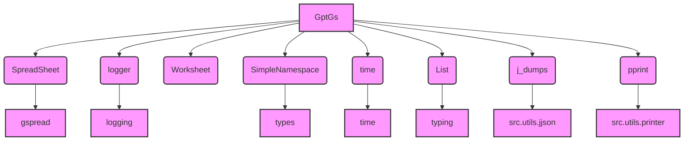

# Проект `hypotez`
# Роль `code explainer`

## АНАЛИЗ:

Файл `gsheet.py` расположен в `hypotez/src/suppliers/chat_gpt/`. Это указывает на то, что он является частью функциональности, связанной с поставщиком услуг ChatGPT, и отвечает за взаимодействие с Google Sheets. В частности, этот файл содержит класс `GptGs`, который расширяет класс `SpreadSheet` и предназначен для управления Google Sheets в контексте рекламных кампаний AliExpress. Он включает методы для чтения, записи и очистки данных в Google Sheets, а также для управления листами продуктов.

### 1. **<алгоритм>**:

**Блок-схема рабочего процесса класса `GptGs`**

```mermaid
graph LR
    A[Начало] --> B(Инициализация класса `GptGs` с помощью `__init__`);
    B --> C{Вызов `super().__init__()` для инициализации `SpreadSheet`};
    C --> D(Установка ID Google Sheets);
    D --> E{Вызов метода `clear()`};
    E --> F{Вызов `delete_products_worksheets()` для удаления листов продуктов};
    F --> G{Вызов метода `update_chat_worksheet()` для записи данных кампании};
    G --> H{Получение данных из объекта `SimpleNamespace`};
    H --> I(Подготовка обновлений для Google Sheets);
    I --> J{Вызов метода `get_campaign_worksheet()` для чтения данных кампании};
    J --> K{Чтение данных из Google Sheets};
    K --> L(Создание объекта `SimpleNamespace` с данными кампании);
    L --> M{Вызов метода `set_category_worksheet()` для записи данных категории};
    M --> N{Преобразование данных категории в формат для записи};
    N --> O(Запись данных в Google Sheets);
    O --> P{Вызов метода `get_category_worksheet()` для чтения данных категории};
    P --> Q{Чтение данных из Google Sheets};
    Q --> R(Создание объекта `SimpleNamespace` с данными категории);
    R --> S{Вызов метода `set_categories_worksheet()` для записи данных категорий};
    S --> T{Итерация по атрибутам объекта `categories`};
    T --> U{Извлечение данных для каждой категории};
    U --> V(Подготовка обновлений для Google Sheets);
    V --> W{Вызов метода `get_categories_worksheet()` для чтения данных категорий};
    W --> X{Чтение данных из Google Sheets};
    X --> Y(Извлечение данных из столбцов A-E);
    Y --> Z{Вызов метода `set_product_worksheet()` для записи данных продукта};
    Z --> AA{Копирование шаблона листа продукта};
    AA --> BB(Подготовка данных продукта для записи);
    BB --> CC(Запись данных в Google Sheets);
    CC --> DD{Вызов метода `get_product_worksheet()` для чтения данных продукта};
    DD --> EE{Чтение данных из Google Sheets};
    EE --> FF(Создание объекта `SimpleNamespace` с данными продукта);
    FF --> GG{Вызов метода `set_products_worksheet()` для записи данных продуктов};
    GG --> HH{Итерация по списку объектов `SimpleNamespace` продуктов};
    HH --> II(Извлечение данных для каждого продукта);
    II --> JJ(Подготовка обновлений для Google Sheets);
    JJ --> KK{Вызов метода `delete_products_worksheets()` для удаления листов продуктов};
    KK --> LL{Получение списка листов};
    LL --> MM{Удаление листов, кроме 'categories' и 'product_template'};
    MM --> NN[Конец];
```

### 2. **<mermaid>**:



**Объяснение зависимостей:**

-   `GptGs` зависит от `SpreadSheet` для операций с Google Sheets.
-   `GptGs` использует `logger` для логирования.
-   `GptGs` использует `Worksheet` для работы с листами Google Sheets.
-   `GptGs` использует `SimpleNamespace` для представления данных.
-   `GptGs` использует `time` для задержек.
-   `GptGs` использует `List` для типизации списков.
-   `GptGs` использует `j_dumps` для сериализации данных в JSON.
-   `GptGs` использует `pprint` для красивого вывода данных.

### 3. **<объяснение>**:

**Импорты**:

-   `from lib2to3.pgen2.driver import Driver`: Импорт класса `Driver` из модуля `lib2to3.pgen2.driver`. Этот класс, кажется, не используется в предоставленном коде.
-   `import time`: Импорт модуля `time` для работы со временем, например, для задержек.
-   `from types import SimpleNamespace`: Импорт класса `SimpleNamespace` для создания объектов с произвольными атрибутами.
-   `from typing import List`: Импорт класса `List` для аннотации типов списков.
-   `from gspread.worksheet import Worksheet`: Импорт класса `Worksheet` для работы с листами Google Sheets.
-   `from src.goog.spreadsheet.spreadsheet import SpreadSheet`: Импорт класса `SpreadSheet` из модуля `src.goog.spreadsheet.spreadsheet`. Этот класс, вероятно, содержит общую логику для работы с Google Sheets.
-   `from src.utils.jjson import j_dumps`: Импорт функции `j_dumps` из модуля `src.utils.jjson`. Эта функция, вероятно, используется для сериализации данных в JSON.
-   `from src.utils.printer import pprint`: Импорт функции `pprint` из модуля `src.utils.printer`. Эта функция, вероятно, используется для красивого вывода данных.
-   `from src.logger.logger import logger`: Импорт объекта `logger` из модуля `src.logger.logger`. Этот объект используется для логирования.

**Классы**:

-   `GptGs(SpreadSheet)`: Класс для управления Google Sheets в контексте рекламных кампаний AliExpress.
    -   Наследуется от `SpreadSheet`, что позволяет использовать общую логику для работы с Google Sheets.
    -   Метод `__init__(self)`: Инициализирует класс, вызывая конструктор родительского класса `SpreadSheet` с указанием ID Google Sheets.
    -   Метод `clear(self)`: Очищает содержимое Google Sheets, удаляя листы продуктов и очищая данные на других листах.
    -   Метод `update_chat_worksheet(self, data: SimpleNamespace|dict|list, conversation_name:str, language: str = None)`: Записывает данные кампании в лист Google Sheets.
        -   Параметр `data` может быть объектом `SimpleNamespace`, словарем или списком.
        -   Параметр `conversation_name` указывает имя листа.
        -   Параметр `language` (необязательный) указывает язык кампании.
    -   Метод `get_campaign_worksheet(self) -> SimpleNamespace`: Читает данные кампании из листа 'campaign'.
        -   Возвращает объект `SimpleNamespace` с данными кампании.
    -   Метод `set_category_worksheet(self, category: SimpleNamespace | str)`: Записывает данные категории в лист 'category'.
        -   Параметр `category` может быть объектом `SimpleNamespace` или строкой.
    -   Метод `get_category_worksheet(self) -> SimpleNamespace`: Читает данные категории из листа 'category'.
        -   Возвращает объект `SimpleNamespace` с данными категории.
    -   Метод `set_categories_worksheet(self, categories: SimpleNamespace)`: Записывает данные категорий в лист 'categories'.
        -   Параметр `categories` является объектом `SimpleNamespace`, содержащим атрибуты для каждой категории.
    -   Метод `get_categories_worksheet(self) -> List[List[str]]`: Читает данные категорий из листа 'categories'.
        -   Возвращает список списков строк с данными категорий.
    -   Метод `set_product_worksheet(self, product: SimpleNamespace | str, category_name: str)`: Записывает данные продукта в новый лист Google Sheets.
        -   Параметр `product` является объектом `SimpleNamespace` с данными продукта.
        -   Параметр `category_name` указывает имя категории продукта.
    -   Метод `get_product_worksheet(self) -> SimpleNamespace`: Читает данные продукта из листа 'products'.
        -   Возвращает объект `SimpleNamespace` с данными продукта.
    -   Метод `set_products_worksheet(self, category_name:str)`: Записывает данные продуктов в лист Google Sheets.
        -   Параметр `category_name` указывает имя категории продукта.
    -   Метод `delete_products_worksheets(self)`: Удаляет все листы, кроме 'categories', 'product' , 'category' и 'campaign'.
    -   Метод `save_categories_from_worksheet(self, update:bool=False)`: Сохраняет данные, отредактированные в гугл таблице.
    -   Метод `save_campaign_from_worksheet(self)`: Сохраняет рекламную кампанию.

**Функции**:

-   `__init__(self)`: конструктор класса
-   `clear(self)`: очищает листы
-   `update_chat_worksheet(self, data: SimpleNamespace|dict|list, conversation_name:str, language: str = None)`: обновляет лист чата
-   `get_campaign_worksheet(self) -> SimpleNamespace`: получает лист кампании
-   `set_category_worksheet(self, category: SimpleNamespace | str)`: устанавливает лист категории
-   `get_category_worksheet(self) -> SimpleNamespace`: получает лист категории
-   `set_categories_worksheet(self, categories: SimpleNamespace)`: устанавливает листы категорий
-   `get_categories_worksheet(self) -> List[List[str]]`: получает листы категорий
-   `set_product_worksheet(self, product: SimpleNamespace | str, category_name: str)`: устанавливает лист продукта
-   `get_product_worksheet(self) -> SimpleNamespace`: получает лист продукта
-   `set_products_worksheet(self, category_name:str)`: устанавливает лист продуктов
-   `delete_products_worksheets(self)`: удаляет листы продуктов
-   `save_categories_from_worksheet(self, update:bool=False)`: сохраняет категории из листа
-   `save_campaign_from_worksheet(self)`: сохраняет кампанию из листа

**Переменные**:

-   `ws`: Объект `Worksheet`, представляющий лист Google Sheets.
-   `data`: Данные, прочитанные из Google Sheets.
-   `campaign_data`: Объект `SimpleNamespace`, содержащий данные кампании.
-   `category_data`: Объект `SimpleNamespace`, содержащий данные категории.
-   `updates`: Список обновлений для пакетной записи в Google Sheets.
-   `excluded_titles`: Набор исключенных названий листов при удалении листов продуктов.
-   `edited_categories`: список категорий, отредактированных в гугл таблице
-   `_categories_ns`: SimpleNamespace для хранения категорий

**Потенциальные ошибки и области для улучшения**:

-   Обработка исключений: Многие методы содержат блоки `try...except` для обработки исключений. Однако, в некоторых случаях, исключения просто логируются и затем снова вызываются (`raise`), что может привести к прекращению выполнения программы. Возможно, стоит добавить более детальную обработку исключений, например, попытки повторной записи данных или уведомление пользователя об ошибке.
-   Использование `time.sleep(10)` в методе `set_product_worksheet`: Задержка в 10 секунд может замедлить выполнение программы. Возможно, стоит использовать более эффективный способ ожидания завершения операции записи данных в Google Sheets.
-   Дублирование кода: В методах `set_categories_worksheet` и `update_chat_worksheet` есть повторяющийся код для извлечения данных из объектов `SimpleNamespace` и подготовки обновлений для Google Sheets. Возможно, стоит выделить этот код в отдельную функцию.
-   Отсутствие документации для некоторых методов и аргументов: Некоторые методы и аргументы не имеют документации, что затрудняет понимание их назначения и использования.
-   Не используется `Driver` из `lib2to3.pgen2.driver`. Следует удалить неиспользуемый импорт.
-   В методе `set_products_worksheet` несколько раз добавляются данные в столбец `F` `'F{index}'`. Следует проверить и исправить этот момент.

**Взаимосвязи с другими частями проекта**:

-   `src.goog.spreadsheet.spreadsheet`: Класс `GptGs` наследуется от класса `SpreadSheet`, что указывает на тесную связь между этими двумя классами. Класс `SpreadSheet`, вероятно, предоставляет общую логику для работы с Google Sheets, которую использует класс `GptGs`.
-   `src.utils.jjson`: Класс `GptGs` использует функцию `j_dumps` для сериализации данных в JSON. Это указывает на то, что класс `GptGs` может использоваться для работы с данными, которые хранятся в формате JSON.
-   `src.utils.printer`: Класс `GptGs` использует функцию `pprint` для красивого вывода данных.
-   `src.logger.logger`: Класс `GptGs` использует объект `logger` для логирования. Это позволяет отслеживать выполнение программы и выявлять ошибки.

В целом, файл `gsheet.py` предоставляет функциональность для управления Google Sheets в контексте рекламных кампаний AliExpress, используя классы и функции из других модулей проекта `hypotez`.