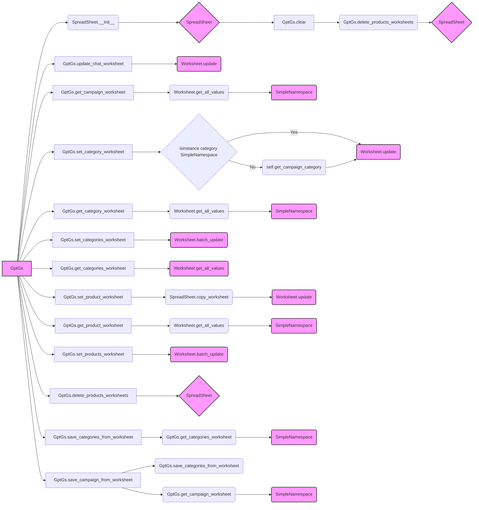

## <алгоритм>

1. **Инициализация `GptGs`**:
   - Создается экземпляр класса `GptGs`, который наследуется от `SpreadSheet`.
   - При инициализации вызывается конструктор родительского класса `SpreadSheet` с ID гугл-таблицы `'1nu4mNNFMzSePlggaaL_QM2vdKVP_NNBl2OG7R9MNrs0'`.

2. **Очистка данных**:
   - Функция `clear()` удаляет все листы с товарами в гугл-таблице, вызывая `delete_products_worksheets()`.

3. **Запись данных чата**:
   - Функция `update_chat_worksheet()` принимает данные чата (`data`: `SimpleNamespace` или `dict` или `list`), имя чата (`conversation_name`) и язык (`language`, опционально).
   - Извлекает данные (имя, заголовок, описание, теги, кол-во товаров) из объекта `data`.
   - Формирует список `updates` для записи данных в определенные ячейки листа `conversation_name`.
   - Выполняет обновление листа.

4. **Чтение данных кампании**:
   - Функция `get_campaign_worksheet()` читает данные из листа `'campaign'`.
   - Извлекает значения полей (имя, заголовок, язык, валюта, описание) из листа.
   - Возвращает объект `SimpleNamespace` с данными кампании.

5. **Запись данных категории**:
   - Функция `set_category_worksheet()` принимает объект категории (`category`: `SimpleNamespace` или имя категории).
    - Если `category` это строка, то получает данные из `self.get_campaign_category()`.
   - Извлекает данные (имя, заголовок, описание, теги, кол-во товаров) из объекта `category`.
   - Записывает данные в виде вертикального списка в лист `'category'`.

6. **Чтение данных категории**:
   - Функция `get_category_worksheet()` читает данные из листа `'category'`.
   - Извлекает значения полей (имя, заголовок, описание, теги, кол-во товаров) из листа.
   - Возвращает объект `SimpleNamespace` с данными категории.

7. **Запись данных категорий**:
   - Функция `set_categories_worksheet()` принимает объект категорий (`categories`: `SimpleNamespace`).
   - Перебирает атрибуты объекта `categories`. Если атрибут - SimpleNamespace, содержащий данные категории, извлекает (имя, заголовок, описание, теги, кол-во товаров).
   - Формирует список `updates` для записи данных в определенные ячейки листа `'categories'` для каждой категории.
   - Выполняет обновление листа.

8. **Чтение данных категорий**:
   - Функция `get_categories_worksheet()` читает данные из листа `'categories'`.
   - Извлекает все значения из листа, начиная со второй строки, и оставляет только первые 5 колонок.
   - Возвращает список строк с данными категорий.

9. **Запись данных продукта**:
   - Функция `set_product_worksheet()` принимает объект продукта (`product`: `SimpleNamespace`) и имя категории (`category_name`).
   - Копирует лист `'product_template'` и переименовывает в `category_name`.
   - Извлекает данные продукта из `product` (цены, ссылки, id и т.д.)
   - Записывает заголовки в первую строку и данные продукта во вторую строку листа.

10. **Чтение данных продукта**:
    - Функция `get_product_worksheet()` читает данные из листа `'products'`.
    - Извлекает значения полей (id, имя, заголовок, описание, теги, цена) из листа.
    - Возвращает объект `SimpleNamespace` с данными продукта.

11. **Запись данных продуктов**:
    - Функция `set_products_worksheet()` принимает имя категории (`category_name`)
    - Проверяет наличие `category_name` если нет, то выходит из функции.
    - получает `SimpleNamespace` `category` и `products` из `campaign`.
    - Для каждого продукта формирует список `updates` для записи данных в лист `category_name`.
    - Выполняет обновление листа.

12. **Удаление листов товаров**:
    - Функция `delete_products_worksheets()` удаляет все листы, кроме `'categories'`, `'product'`, `'category'` и `'campaign'`

13. **Сохранение категорий из листа**:
    - Функция `save_categories_from_worksheet()` читает данные из листа `'categories'` с помощью `get_categories_worksheet()`.
    - Создает `SimpleNamespace` объекты для каждой категории и добавляет их к общему `SimpleNamespace` `_categories_ns`.
    - Присваивает объект `_categories_ns` атрибуту `category` объекта `campaign`.
    - Если `update = True`, вызывается метод `self.update_campaign()`.

14. **Сохранение кампании из листа**:
    - Функция `save_campaign_from_worksheet()` вызывает `save_categories_from_worksheet(False)`.
    - Получает данные кампании из листа `'campaign'` с помощью `get_campaign_worksheet()`.
    - Добавляет к данным `data` атрибут `category` с текущими категориями из `self.campaign.category`.
    - Присваивает `data` объекту `self.campaign` и вызывает `self.update_campaign()`.

## <mermaid>



**Описание зависимостей:**

-   `GptGs` (класс) зависит от `SpreadSheet` через наследование и вызов конструктора родительского класса `__init__`.
-   `GptGs` использует методы класса `Worksheet` для взаимодействия с листами Google Sheets (`update`, `get_all_values`, `batch_update`).
-   `GptGs` использует `SimpleNamespace` для хранения и передачи данных.
-   `GptGs` использует `copy_worksheet` для создания копии шаблона листа.
-   Метод `get_campaign_category` вызывается при обработке категории, если передан параметр `category` - строка.
-   `GptGs` использует методы `get_categories_worksheet` и `get_campaign_worksheet` для получения данных.
-  В классе определены методы для записи в таблицу (set_) и для чтения из таблицы (get_).
-   Метод `save_categories_from_worksheet` используется для сохранения отредактированных категорий.
-   Метод `save_campaign_from_worksheet` используется для сохранения отредактированной рекламной кампании, включая категории.

## <объяснение>

**Импорты:**

-   `lib2to3.pgen2.driver.Driver`: Импортируется, но не используется в коде. Это может быть устаревший или лишний импорт, который нужно удалить.
-   `time`: Используется для добавления задержки в `set_product_worksheet`, чтобы избежать ошибок API из-за частых запросов к Google Sheets.
-   `types.SimpleNamespace`: Используется для создания объектов с произвольными атрибутами, что удобно для хранения данных.
-   `typing.List`: Используется для аннотации типов, указывая, что функция возвращает список.
-   `gspread.worksheet.Worksheet`: Представляет рабочий лист в Google Sheets. Используется для взаимодействия с данными.
-   `src.goog.spreadsheet.spreadsheet.SpreadSheet`: Базовый класс для работы с Google Sheets. `GptGs` наследует его функциональность.
-   `src.utils.jjson.j_dumps`: Импортируется, но не используется в коде. Это может быть устаревший или лишний импорт, который нужно удалить.
-   `src.utils.printer.pprint`: Используется для форматированного вывода данных.
-   `src.logger.logger.logger`: Используется для логирования ошибок, информации и успеха.

**Классы:**

-   `GptGs(SpreadSheet)`:
    -   **Роль**: Класс для управления Google Sheets в контексте кампаний AliExpress. Он расширяет возможности `SpreadSheet`, предоставляя методы для записи и чтения данных о кампаниях, категориях и продуктах.
    -   **Атрибуты**:
        -   Не имеет собственных атрибутов, использует атрибуты родительского класса `SpreadSheet`.
    -   **Методы**:
        -   `__init__(self)`: Конструктор класса, инициализирует родительский класс `SpreadSheet` с заданным ID таблицы.
        -   `clear(self)`: Очищает данные, удаляя листы продуктов.
        -   `update_chat_worksheet(self, data, conversation_name, language=None)`: Записывает данные чата в указанный лист.
        -   `get_campaign_worksheet(self)`: Читает данные кампании из листа `campaign`.
        -   `set_category_worksheet(self, category)`: Записывает данные категории в лист `category` в виде вертикального списка.
        -  `get_category_worksheet(self)`: Читает данные категории из листа `category`.
        -   `set_categories_worksheet(self, categories)`: Записывает данные нескольких категорий в лист `categories`.
        -   `get_categories_worksheet(self)`: Читает данные категорий из листа `categories`.
        -   `set_product_worksheet(self, product, category_name)`: Записывает данные продукта в новый лист.
        -   `get_product_worksheet(self)`: Читает данные продукта из листа `products`.
        -   `set_products_worksheet(self, category_name)`: Записывает данные нескольких продуктов в лист `category_name`.
        -   `delete_products_worksheets(self)`: Удаляет все листы товаров, кроме основных.
        -   `save_categories_from_worksheet(self, update=False)`: Сохраняет данные категорий, отредактированные в Google Sheets.
        -   `save_campaign_from_worksheet(self)`: Сохраняет данные всей рекламной кампании, включая категории.

**Функции:**

-   Все методы класса `GptGs` являются функциями, которые выполняют определенные операции чтения и записи данных в Google Sheets.
-   Примеры аргументов:
    -   `data: SimpleNamespace|dict|list` (данные чата, кампании, категории, продукта)
    -   `conversation_name: str` (имя листа для чата)
    -   `category: SimpleNamespace | str` (объект или имя категории)
    -   `categories: SimpleNamespace` (объект категорий)
    -   `product: SimpleNamespace` (объект продукта)
    -   `category_name: str` (имя категории или листа продукта)
    -   `language: str` (язык)
    -    `update:bool=False`: Если True то после сохранения категорий в гугл таблицу будет обновлена кампания.
-   Примеры возвращаемых значений:
    -  `SimpleNamespace` (данные кампании, категории, продукта)
    -  `List[List[str]]` (список строк с данными категорий)
    -  `None` (методы записи данных, удаления, очистки)

**Переменные:**

-   `MODE`: Глобальная переменная, определенная как `'dev'`.
-   `start_row`: Используется для отслеживания текущей строки при записи данных в таблицу.
-   `ws`: Представляет рабочий лист Google Sheets.
-   `updates`: Список словарей для выполнения пакетного обновления листа.
-    `_`: Временная переменная, используемая для хранения словаря атрибутов `SimpleNamespace`.
-   `vertical_data`:  Список для вертикальной записи данных в лист
-   `headers`: Список с именами колонок для листа продуктов
-   `row_data`: Список данных для одной строки продукта.
-   `campaign_data`, `category_data`, `product_data`: Объекты `SimpleNamespace`, хранящие данные, полученные из Google Sheets.
-    `excluded_titles`: Множество названий листов, которые не нужно удалять.
-   `_categories_ns`: Объект `SimpleNamespace` для хранения списка отредактированных категорий.
-   `edited_categories`: Список словарей с отредактированными категориями из листа `'categories'`
-   `_cat_ns`: Временный `SimpleNamespace`, хранящий данные одной категории.

**Потенциальные ошибки и области для улучшения:**

1.  **Устаревшие импорты**: `lib2to3.pgen2.driver.Driver` и `src.utils.jjson.j_dumps` импортируются, но не используются. Следует их удалить.
2.  **Жестко заданный ID таблицы**: ID Google Sheets `'1nu4mNNFMzSePlggaaL_QM2vdKVP_NNBl2OG7R9MNrs0'` жестко прописан в коде. Нужно передавать его через параметры, чтобы можно было использовать этот класс с разными таблицами.
3.  **Ошибки при чтении**: При чтении данных из Google Sheets (например, в `get_category_worksheet`) используется индексация `data[1][1]`, `data[2][1]` и т.д. Если структура таблицы изменится, возникнет ошибка `IndexError`. Необходимо добавить проверку на длину и существование строк и столбцов.
4.  **Необработанные ошибки**: Некоторые функции, особенно `set_product_worksheet`, могут генерировать ошибки, если, например, не найден лист шаблона или возникла проблема при копировании листа. Нужна более подробная обработка ошибок.
5.  **Задержка в `set_product_worksheet`**: Использование `time.sleep(10)` может быть неэффективным решением для избежания ошибок API. Лучше использовать более гибкий подход с экспоненциальной задержкой или асинхронными запросами.
6. **Логика `set_products_worksheet`**: Происходит несколько апдейтов в колонку "F" (target_sale_price) вместо разных столбцов.
7.  **Не всегда ясные комментарии**:  Некоторые комментарии не совсем понятные, например ```""" module: src.suppliers.chat_gpt """``` .
8.  **Использование SimpleNamespace**:  SimpleNamespace подходит для хранения простых данных, но для более сложных структур можно использовать dataclasses.
9. **Дублирование кода**:  Присутствует дублирование кода при формировании `updates` для `set_chat_worksheet` и `set_categories_worksheet`, можно выделить в отдельную функцию.

**Взаимосвязь с другими частями проекта:**

-   Этот модуль (`gsheet.py`) является частью пакета `src.suppliers.chat_gpt`. Он использует:
    -   `src.goog.spreadsheet.spreadsheet.SpreadSheet` для работы с Google Sheets API.
    -   `src.utils.printer.pprint` для форматированного вывода данных.
    -   `src.logger.logger.logger` для логирования.
-   Модуль предназначен для интеграции с другими частями проекта, в которых будут формироваться данные о кампаниях, категориях и товарах в виде объектов `SimpleNamespace`  и передавать их в этот модуль для сохранения или чтения данных из Google Sheets. Также в модуле происходит обратное действие, когда данные из Google Sheets читаются в виде объектов `SimpleNamespace`.

Этот подробный анализ обеспечивает полное понимание кода, его функциональности, потенциальных проблем и его места в структуре проекта.