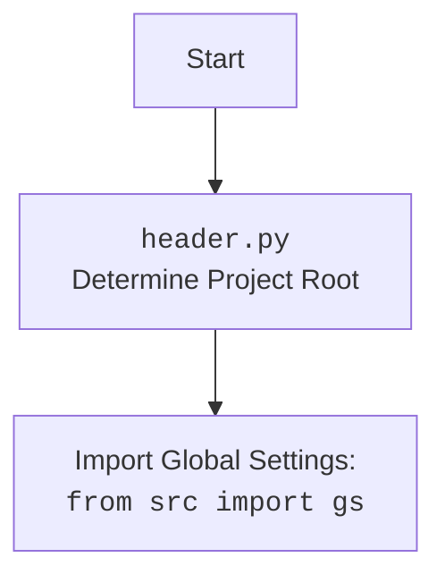

## <алгоритм>

### 1. Инициализация
   - **Пример:** `gpt_gs = GptGs()`
   - Создается экземпляр класса `GptGs`, который наследуется от `SpreadSheet`.
   - Вызывается конструктор родительского класса `SpreadSheet` с ID гугл таблицы `'1nu4mNNFMzSePlggaaL_QM2vdKVP_NNBl2OG7R9MNrs0'`.
   
### 2. Очистка данных
   - **Пример:** `gpt_gs.clear()`
   - Вызывается метод `delete_products_worksheets` для удаления всех листов, кроме `'categories'`, `'product'`, `'category'` и `'campaign'`.
    
### 3. Обновление данных листа чата (chat worksheet)
   - **Пример:** `gpt_gs.update_chat_worksheet(data, "chat_name", "en")`
   - Метод принимает `SimpleNamespace` или `dict` или `list` с данными, название листа (`conversation_name`) и язык.
   - Получает лист по названию `conversation_name`.
   - Извлекает данные (name, title, description, tags, products_count) из входного объекта.
   - Подготавливает массив `updates` с данными для записи в лист.
   - Записывает данные в указанные ячейки (`A{start_row}`, `B{start_row}`, и т.д.).

### 4. Получение данных из листа campaign
   - **Пример:** `campaign_data = gpt_gs.get_campaign_worksheet()`
   - Получает лист с именем `'campaign'`.
   - Извлекает данные из ячеек и создает `SimpleNamespace` объект с полями (name, title, language, currency, description).
   - Возвращает объект `campaign_data`.

### 5. Запись данных на лист category
   - **Пример:** `gpt_gs.set_category_worksheet(category_data)`
   - Принимает объект `SimpleNamespace` `category` или имя категории.
   - Получает лист с именем `'category'`.
   - Форматирует данные в вертикальный список (name, title, description, tags, products_count).
   - Записывает данные в лист, начиная с ячейки `A1`.

### 6. Получение данных из листа category
   - **Пример:** `category_data = gpt_gs.get_category_worksheet()`
   - Получает лист с именем `'category'`.
   - Извлекает данные из ячеек и создает `SimpleNamespace` объект с полями (name, title, description, tags, products_count).
   - Возвращает объект `category_data`.

### 7. Запись данных на лист categories
   - **Пример:** `gpt_gs.set_categories_worksheet(categories_data)`
   - Принимает объект `SimpleNamespace` с категориями.
   - Получает лист с именем `'categories'`.
   - Итерируется по атрибутам объекта `categories_data`.
   - Для каждого атрибута (категории) извлекает данные (name, title, description, tags, products_count).
   - Записывает данные в указанные ячейки (`A{start_row}`, `B{start_row}`, и т.д.) на листе.

### 8. Получение данных из листа categories
   - **Пример:** `categories_list = gpt_gs.get_categories_worksheet()`
   - Получает лист с именем `'categories'`.
   - Извлекает данные из столбцов A-E, начиная со второй строки.
   - Возвращает список строк.

### 9. Запись данных на лист product
   - **Пример:** `gpt_gs.set_product_worksheet(product_data, "category_name")`
   - Копирует лист `product_template`, переименовывая его в `category_name`.
   - Записывает заголовки в первую строку (A1:Y1).
   - Извлекает данные из `product_data` (product_id, app_sale_price, и т.д.).
   - Записывает данные в лист, начиная со второй строки (A2:Y2).

### 10. Получение данных из листа product
   - **Пример:** `product_data = gpt_gs.get_product_worksheet()`
   - Получает лист с именем `'products'`.
   - Извлекает данные из ячеек и создает `SimpleNamespace` объект с полями (id, name, title, description, tags, price).
   - Возвращает объект `product_data`.

### 11. Запись данных на лист products
   - **Пример:** `gpt_gs.set_products_worksheet("category_name")`
   - Получает данные `products_ns` из `self.campaign.category` по `category_name`
   - Получает лист по имени `category_name`
   - Готовит массив `updates` для пакетной записи данных в лист (product_id, product_title, и т.д.)
   - Выполняет пакетную запись на лист

### 12. Удаление всех листов, кроме указанных
   - **Пример:** `gpt_gs.delete_products_worksheets()`
   - Получает все листы таблицы.
   - Удаляет все листы, кроме `'categories'`, `'product'`, `'category'` и `'campaign'`.

### 13. Сохранение категорий из листа
    - **Пример:** `gpt_gs.save_categories_from_worksheet(True)`
    - Получает список категорий из листа `'categories'` с помощью `self.get_categories_worksheet()`.
    - Преобразует каждую категорию в `SimpleNamespace`.
    - Записывает `SimpleNamespace` категорий в `self.campaign.category`.
    - Вызывает `self.update_campaign()`, если `update` равно `True`.

### 14. Сохранение кампании из листа
    - **Пример:** `gpt_gs.save_campaign_from_worksheet()`
    - Вызывает `self.save_categories_from_worksheet(False)`
    - Записывает данные кампании из листа `'campaign'` в `self.campaign`
    - Вызывает `self.update_campaign()`.

## <mermaid>
```mermaid
flowchart TD
    Start(Start) --> Init[Initialize GptGs Class]
    Init --> ClearData{Clear Data}
    ClearData -- "Call delete_products_worksheets" --> DeleteWorksheets[Delete Product Worksheets]
    ClearData -- "Clear Content" --> ClearContent[Clear Contents from other Worksheets]
    
    Init --> UpdateChatWorksheet{Update Chat Worksheet}
    UpdateChatWorksheet --> GetWorksheetChat[Get Worksheet by Name]
    GetWorksheetChat --> ExtractDataChat[Extract Data from SimpleNamespace]
    ExtractDataChat --> PrepareUpdatesChat[Prepare Updates for Worksheet]
    PrepareUpdatesChat --> WriteToSheetChat[Write Updates to Worksheet]
    
    Init --> GetCampaignWorksheet{Get Campaign Worksheet}
    GetCampaignWorksheet --> GetWorksheetCampaign[Get 'campaign' Worksheet]
    GetWorksheetCampaign -- "Not Found" --> ErrorGetCampaign("Error: Worksheet 'campaign' not found")
    GetWorksheetCampaign -- "Found" --> ReadDataCampaign[Read Data from 'campaign' Worksheet]
    ReadDataCampaign --> CreateSimpleNamespaceCampaign[Create SimpleNamespace Object]
    CreateSimpleNamespaceCampaign --> ReturnCampaignData[Return Campaign Data]
    
    Init --> SetCategoryWorksheet{Set Category Worksheet}
     SetCategoryWorksheet --> GetWorksheetCategory[Get 'category' Worksheet]
    GetWorksheetCategory --> PrepareVerticalData[Prepare Vertical Data from SimpleNamespace]
    PrepareVerticalData --> WriteVerticalDataCategory[Write Vertical Data to 'category' Worksheet]

    Init --> GetCategoryWorksheet{Get Category Worksheet}
    GetCategoryWorksheet --> GetWorksheetCategory2[Get 'category' Worksheet]
    GetWorksheetCategory2 -- "Not Found" --> ErrorGetCategory("Error: Worksheet 'category' not found")
    GetWorksheetCategory2 -- "Found" --> ReadDataCategory[Read Data from 'category' Worksheet]
    ReadDataCategory --> CreateSimpleNamespaceCategory[Create SimpleNamespace Object]
    CreateSimpleNamespaceCategory --> ReturnCategoryData[Return Category Data]
    
    Init --> SetCategoriesWorksheet{Set Categories Worksheet}
    SetCategoriesWorksheet --> GetWorksheetCategories[Get 'categories' Worksheet]
    GetWorksheetCategories --> IterateCategories[Iterate Through Categories]
    IterateCategories --> PrepareUpdatesCategories[Prepare Updates for each Category]
    PrepareUpdatesCategories --> WriteToSheetCategories[Write Updates to Worksheet]
    
    Init --> GetCategoriesWorksheet{Get Categories Worksheet}
    GetCategoriesWorksheet --> GetWorksheetCategories2[Get 'categories' Worksheet]
    GetWorksheetCategories2 -- "Not Found" --> ErrorGetCategories("Error: Worksheet 'categories' not found")
    GetWorksheetCategories2 -- "Found" --> ReadDataCategories[Read Data from 'categories' Worksheet]
    ReadDataCategories --> ReturnCategoriesData[Return Categories Data]

    Init --> SetProductWorksheet{Set Product Worksheet}
    SetProductWorksheet --> CopyTemplateWorksheet[Copy 'product_template' Worksheet]
    CopyTemplateWorksheet --> WriteHeaders[Write Headers to New Worksheet]
     WriteHeaders --> ExtractDataProduct[Extract Data from SimpleNamespace Product]
    ExtractDataProduct --> WriteDataProduct[Write Data to New Worksheet]
    
    Init --> GetProductWorksheet{Get Product Worksheet}
     GetProductWorksheet --> GetWorksheetProduct[Get 'products' Worksheet]
    GetWorksheetProduct -- "Not Found" --> ErrorGetProduct("Error: Worksheet 'products' not found")
    GetWorksheetProduct -- "Found" --> ReadDataProduct[Read Data from 'products' Worksheet]
    ReadDataProduct --> CreateSimpleNamespaceProduct[Create SimpleNamespace Object]
    CreateSimpleNamespaceProduct --> ReturnProductData[Return Product Data]
    
     Init --> SetProductsWorksheet{Set Products Worksheet}
     SetProductsWorksheet --> GetWorksheetProducts[Get Worksheet by Category Name]
      GetWorksheetProducts --> ExtractDataProducts[Extract data from SimpleNamespace products]
     ExtractDataProducts --> PrepareUpdatesProducts[Prepare Updates for Worksheet]
    PrepareUpdatesProducts --> WriteToSheetProducts[Write Updates to Worksheet]

    Init --> DeleteWorksheets[Delete Product Worksheets]
    DeleteWorksheets --> GetWorksheets[Get All Worksheets]
    GetWorksheets --> FilterWorksheets[Filter Worksheets to Delete]
    FilterWorksheets --> DeleteFilteredWorksheets[Delete Filtered Worksheets]
    
    Init --> SaveCategoriesFromWorksheet{Save Categories From Worksheet}
    SaveCategoriesFromWorksheet --> GetCategoriesFromSheet[Get Categories Data From Worksheet]
    GetCategoriesFromSheet --> ConvertToSimpleNamespace[Convert Category Data to SimpleNamespace]
    ConvertToSimpleNamespace --> SaveCategoriesToCampaign[Save Categories to Campaign]
    SaveCategoriesToCampaign --> UpdateCampaignFromSaveCategory[Update Campaign If Needed]
    
    Init --> SaveCampaignFromWorksheet{Save Campaign From Worksheet}
    SaveCampaignFromWorksheet --> SaveCategoriesFromSaveCampaign[Save Categories From Worksheet]
    SaveCategoriesFromSaveCampaign --> GetCampaignDataFromSaveCampaign[Get Campaign Data From Worksheet]
    GetCampaignDataFromSaveCampaign --> SaveCampaignDataToCampaign[Save Campaign Data to Campaign]
     SaveCampaignDataToCampaign --> UpdateCampaignFromSaveCampaign[Update Campaign]
    
     classDef error fill:#f9f,stroke:#333,stroke-width:2px
    ErrorGetCampaign,ErrorGetCategory,ErrorGetCategories,ErrorGetProduct  :::error
```


## <объяснение>

### Импорты
- **`lib2to3.pgen2.driver.Driver`**: Этот импорт не используется в коде. Это часть стандартной библиотеки python, связанной с разбором кода, но не применяется в данном контексте. Скорее всего, это остаток от предыдущих итераций или ошибочный импорт.
- **`time`**: Используется для управления временем. В коде есть `time.sleep(10)` перед созданием нового листа.
- **`types.SimpleNamespace`**: Используется для создания простых объектов с атрибутами, к которым можно обращаться через точечную нотацию. Это делает данные более организованными и понятными в использовании.
- **`typing.List`**: Используется для аннотации типов, например `List[List[str]]` указывает, что функция возвращает список списков строк.
- **`gspread.worksheet.Worksheet`**: Тип для представления листа гугл таблицы.
- **`src.goog.spreadsheet.spreadsheet.SpreadSheet`**: Базовый класс для работы с гугл таблицами.
- **`src.utils.jjson.j_dumps`**: Функция из модуля `jjson`, используется для сериализации объектов в JSON, но не используется в этом коде.
- **`src.utils.printer.pprint`**: Функция из модуля `printer`, используется для форматированного вывода объектов, для отладки.
- **`src.logger.logger.logger`**: Объект для логирования, используется для записи ошибок и информационных сообщений.

### Классы

- **`GptGs(SpreadSheet)`**:
    - **Роль**: Класс для управления Google Sheets в контексте кампаний AliExpress.
    - **Наследование**: Наследуется от `SpreadSheet`, что позволяет использовать функциональность работы с Google Sheets.
    - **`__init__(self)`**: Инициализирует класс `GptGs`, вызывая конструктор родительского класса `SpreadSheet` с идентификатором Google Sheets.
    - **`clear(self)`**: Очищает содержимое листов. Вызывает метод `delete_products_worksheets()`.
    - **`update_chat_worksheet(self, data, conversation_name, language=None)`**: Записывает данные чата в Google Sheets.
    - **`get_campaign_worksheet(self)`**: Считывает данные кампании с листа "campaign".
    - **`set_category_worksheet(self, category)`**: Записывает данные категории на лист "category".
    - **`get_category_worksheet(self)`**: Считывает данные категории с листа "category".
    - **`set_categories_worksheet(self, categories)`**: Записывает данные категорий на лист "categories".
    - **`get_categories_worksheet(self)`**: Считывает данные категорий с листа "categories".
    - **`set_product_worksheet(self, product, category_name)`**: Записывает данные продукта на лист `category_name`.
    - **`get_product_worksheet(self)`**: Считывает данные продукта с листа "products".
     - **`set_products_worksheet(self, category_name)`**: Записывает данные продуктов на лист `category_name`.
    - **`delete_products_worksheets(self)`**: Удаляет все листы, кроме `categories`, `product_template`, `category` и `campaign`.
    - **`save_categories_from_worksheet(self, update=False)`**: Сохраняет отредактированные данные категорий из таблицы.
    - **`save_campaign_from_worksheet(self)`**: Сохраняет данные кампании из гугл таблицы.

### Функции

- **`__init__(self)`**:
    - **Аргументы**: `self`.
    - **Назначение**: Инициализирует экземпляр класса, вызывая конструктор родительского класса `SpreadSheet`.
    - **Пример**: `super().__init__('1nu4mNNFMzSePlggaaL_QM2vdKVP_NNBl2OG7R9MNrs0')` инициализирует `SpreadSheet` с конкретным ID.
- **`clear(self)`**:
   - **Аргументы**: `self`.
   - **Назначение**: Очищает содержимое листов, вызывая `delete_products_worksheets()`.
   - **Пример**: `self.clear()` удалит все листы, кроме 'categories', 'product', 'category' и 'campaign'.
- **`update_chat_worksheet(self, data, conversation_name, language=None)`**:
    - **Аргументы**:
        - `data`: `SimpleNamespace` | `dict` | `list`  с данными для записи.
        - `conversation_name`: Название листа для обновления.
        - `language`: Язык (не используется).
    - **Назначение**: Записывает данные в указанный лист Google Sheets.
    - **Пример**: `self.update_chat_worksheet(SimpleNamespace(name='Test', title='Test Title'), 'chat1')` запишет данные в лист `chat1`.
- **`get_campaign_worksheet(self)`**:
    - **Аргументы**: `self`.
    - **Возвращаемое значение**: `SimpleNamespace` с данными кампании (name, title, language, currency, description).
    - **Назначение**: Получает данные из листа 'campaign'.
    - **Пример**: `campaign_data = self.get_campaign_worksheet()`.
- **`set_category_worksheet(self, category)`**:
    - **Аргументы**: `category` - `SimpleNamespace` с данными категории или имя категории.
    - **Назначение**: Записывает данные категории на лист 'category'.
    - **Пример**: `self.set_category_worksheet(SimpleNamespace(name='test', title='Test Category', description='test', tags=['tag1', 'tag2']))`.
- **`get_category_worksheet(self)`**:
    - **Аргументы**: `self`.
    - **Возвращаемое значение**: `SimpleNamespace` с данными категории.
    - **Назначение**: Получает данные из листа 'category'.
    - **Пример**: `category_data = self.get_category_worksheet()`.
- **`set_categories_worksheet(self, categories)`**:
    - **Аргументы**: `categories` - `SimpleNamespace` с данными категорий.
    - **Назначение**: Записывает данные категорий на лист 'categories'.
    - **Пример**: `self.set_categories_worksheet(SimpleNamespace(cat1=SimpleNamespace(name='test1', title='Test Category1'), cat2=SimpleNamespace(name='test2', title='Test Category2')))`.
- **`get_categories_worksheet(self)`**:
    - **Аргументы**: `self`.
    - **Возвращаемое значение**: `List[List[str]]` список строк с данными категорий из листа 'categories'
    - **Назначение**: Получает данные из листа 'categories'.
    - **Пример**: `categories_data = self.get_categories_worksheet()`.
- **`set_product_worksheet(self, product, category_name)`**:
    - **Аргументы**:
        - `product`: `SimpleNamespace` с данными продукта.
        - `category_name`: Название листа для записи продукта.
    - **Назначение**: Записывает данные продукта на новый лист.
    - **Пример**: `self.set_product_worksheet(SimpleNamespace(product_id='123', product_title='Test Product'), 'product1')`
- **`get_product_worksheet(self)`**:
    - **Аргументы**: `self`.
    - **Возвращаемое значение**: `SimpleNamespace` с данными продукта.
    - **Назначение**: Получает данные из листа 'products'.
    - **Пример**: `product_data = self.get_product_worksheet()`.
- **`set_products_worksheet(self, category_name)`**:
    -  **Аргументы**: `category_name`: Название листа
    -   **Назначение**: Записывает данные продуктов на лист `category_name`
    -   **Пример**: `self.set_products_worksheet('category_1')`
- **`delete_products_worksheets(self)`**:
    - **Аргументы**: `self`.
    - **Назначение**: Удаляет все листы, кроме 'categories', 'product', 'category', 'campaign'.
    - **Пример**: `self.delete_products_worksheets()`.
- **`save_categories_from_worksheet(self, update=False)`**:
     -   **Аргументы**: `update`: Флаг для обновления кампании.
     -   **Назначение**: Сохраняет отредактированные данные категорий из таблицы.
     -   **Пример**: `self.save_categories_from_worksheet(True)`
- **`save_campaign_from_worksheet(self)`**:
    - **Аргументы**: `self`.
    - **Назначение**: Сохраняет отредактированные данные кампании из таблицы.
    - **Пример**: `self.save_campaign_from_worksheet()`

### Переменные
- **`self.spreadsheet`**: Атрибут, унаследованный от `SpreadSheet`, представляющий гугл таблицу.
- **`ws`**: Локальная переменная типа `gspread.worksheet.Worksheet`, используемая для работы с конкретным листом таблицы.
- **`data`**: Локальная переменная, используемая для хранения данных, прочитанных из Google Sheets.
- **`updates`**: Список словарей для пакетного обновления данных в Google Sheets.
- **`start_row`**: Целое число, определяющее начальную строку для записи данных в Google Sheets.
- **`excluded_titles`**: Множество строк, которые представляют названия листов, исключаемых при удалении листов.
-  **`edited_categories`**: Список словарей, полученный из таблицы.
-  **`_categories_ns`**: SimpleNamespace для сохранения данных по категориям.
- **`_cat_ns`**: SimpleNamespace для сохранения данных одной категории.
- **`self.campaign`**: SimpleNamespace хранящий все данные по кампании.

### Потенциальные ошибки и области для улучшения
- **Необработанные исключения**: В коде есть блоки `try...except`, но они просто логируют ошибку и поднимают исключение. Можно было бы добавить дополнительную логику для обработки ошибок и предоставления более подробной информации пользователю.
- **Использование `SimpleNamespace`**: `SimpleNamespace` удобен для хранения данных, но не имеет строгой схемы, что может привести к ошибкам. Использование `dataclass` может сделать структуру данных более явной и контролируемой.
- **Магические строки и числа**: В коде используются магические строки (`'A1:B{}'`, `'categories'`, `'product'`, `'campaign'`) и числа (`2`, `5`), которые делают код менее читабельным и поддерживаемым. Их следует заменить на константы.
- **Дублирование кода**: В функциях `set_category_worksheet` и `set_categories_worksheet` присутствует много общего кода. Можно выделить общую логику в отдельную функцию.
- **Оптимизация запросов к Google Sheets API**: В методе  `set_products_worksheet` используется множество мелких запросов для записи данных, что может привести к замедлению работы. Можно использовать пакетную запись.
- **Отсутствие проверок на ввод данных**: Код не проверяет типы и значения входных данных, что может привести к ошибкам во время выполнения.
- **Отсутствие документации**: Код нуждается в более подробных комментариях и документации, чтобы быть более понятным и простым в использовании.
- **`time.sleep(10)`**: Использование `time.sleep(10)` для ожидания в функции `set_product_worksheet` может замедлить выполнение. Лучше использовать более надежный способ, например, механизм таймаута или проверку готовности листа.
- **Отсутствие тестов**: Код не имеет автоматических тестов, что усложняет проверку корректности его работы после внесения изменений.

### Взаимосвязи с другими частями проекта
- Данный модуль `gsheet.py` является частью пакета `src.suppliers.chat_gpt`, который, вероятно, отвечает за интеграцию с ChatGPT и Google Sheets для управления кампаниями AliExpress.
- Он использует `src.goog.spreadsheet.spreadsheet.SpreadSheet` для работы с Google Sheets API.
- Он использует `src.utils.jjson.j_dumps` и `src.utils.printer.pprint` для обработки данных и логирования.
- Он использует `src.logger.logger.logger` для логирования операций.
- Данный модуль работает с данными, полученными из других модулей (например, данными о товарах и категориях), и форматирует их для записи в Google Sheets. В частности, используются данные, хранящиеся в `self.campaign.category`

Этот анализ предоставляет полное представление о функциональности кода, его компонентах и связях с другими частями проекта.