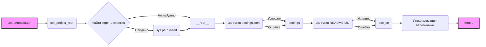

## Анализ кода `hypotez/src/suppliers/chat_gpt/header.py`

### 1. <алгоритм>

**1. Инициализация**:
   - Задается `MODE = 'dev'` (возможно, для указания режима разработки).
   - Импортируются необходимые модули: `sys`, `json`, `Version` из `packaging.version`, `Path` из `pathlib`.

**2. Функция `set_project_root`**:
   - **Входные данные**: `marker_files` - кортеж имен файлов или директорий, используемых для определения корня проекта. По умолчанию - `('pyproject.toml', 'requirements.txt', '.git')`.
   - **Логика**:
      - Получает путь к директории, содержащей текущий файл (`__file__`).
      - Начиная с текущей директории и поднимаясь вверх по дереву директорий, проверяет, существует ли в каждой директории хотя бы один из файлов или директорий, указанных в `marker_files`.
      - Если такой файл или директория найдены, путь к этой директории считается корнем проекта.
      - Добавляет путь к корню проекта в `sys.path`, чтобы Python мог находить модули в проекте.
   - **Выходные данные**: Путь к корню проекта (`Path`).

   *Пример*: 
     - Если `marker_files` = `('.git', 'requirements.txt')`, и в `hypotez/` есть папка `.git`, то `set_project_root()` вернет путь к `hypotez/`.

**3. Определение корня проекта**:
   - Вызывается `set_project_root()` для определения пути к корню проекта и сохраняется в `__root__`.

**4. Загрузка настроек**:
   - Пытается загрузить настройки из файла `settings.json`, расположенного в директории `src` относительно корня проекта.
   - Если файл не найден или не является валидным JSON, переменная `settings` остается `None`.

   *Пример*: 
      - Если в `hypotez/src/` есть файл `settings.json` со следующим содержанием:
       ```json
          {
            "project_name": "my_project",
            "version": "1.0.0",
            "author": "John Doe"
          }
       ```
       то после загрузки `settings` будет словарем с этими ключами и значениями.

**5. Загрузка документации**:
   - Пытается загрузить документацию из файла `README.MD`, расположенного в директории `src` относительно корня проекта.
   - Если файл не найден, переменная `doc_str` остается `None`.
   
   *Пример*: 
       -  Если в `hypotez/src/` есть файл `README.MD` с текстом `"My Project Documentation"`, то `doc_str` будет строкой с этим значением.

**6. Инициализация переменных**:
   - Инициализируются переменные, используя значения из `settings`, если они есть, или значения по умолчанию.
   - `__project_name__` - имя проекта (`'hypotez'`, если `settings` не загружены или в нем нет `project_name`).
   - `__version__` - версия проекта (`''`, если `settings` не загружены или в нем нет `version`).
   - `__doc__` - документация проекта (`''`, если `doc_str` не загружена).
   - `__details__` - детальная информация о проекте (`''`).
   - `__author__` - автор проекта (`''`, если `settings` не загружены или в нем нет `author`).
   - `__copyright__` - информация об авторском праве (`''`, если `settings` не загружены или в нем нет `copyright`).
    - `__cofee__` - сообщение про кофе (`"Treat the developer to a cup of coffee for boosting enthusiasm in development: https://boosty.to/hypo69"`, если `settings` не загружены или в нем нет `cofee`).

### 2. <mermaid>



**Объяснение диаграммы:**

- `A`: **Инициализация** - Начальная точка процесса, где устанавливается `MODE` и импортируются модули.
- `B`: **set_project_root** - Функция, которая пытается найти корень проекта.
- `C`: **Найти корень проекта** - Логический блок, где выполняется поиск корня проекта на основе заданных `marker_files`.
- `D`: **sys.path.insert** - Действие добавления корня проекта в `sys.path`.
- `E`: **`__root__`** - Переменная, которая хранит путь к корню проекта.
- `F`: **Загрузка `settings.json`** - Попытка загрузить настройки из файла `settings.json`.
- `G`: **`settings`** - Переменная для хранения загруженных настроек.
- `H`: **Загрузка `README.MD`** - Попытка загрузить документацию из файла `README.MD`.
- `I`: **`doc_str`** - Переменная для хранения загруженной документации.
- `J`: **Инициализация переменных** - Заполнение глобальных переменных значениями из `settings` или значениями по умолчанию.
- `K`: **Конец** - Конечная точка процесса.

Диаграмма показывает последовательность выполнения кода, начиная с инициализации и заканчивая инициализацией переменных проекта. Она демонстрирует поток данных между функциями, логическими блоками и переменными.

### 3. <объяснение>

**Импорты:**

- `sys`: Модуль `sys` используется для добавления пути к корню проекта в `sys.path`, что позволяет Python находить модули проекта.
- `json`: Модуль `json` используется для чтения и разбора файла `settings.json`, содержащего настройки проекта.
- `packaging.version`: Модуль `packaging.version` (используется конкретно `Version`) не используется в данном коде, что возможно является ошибкой. Возможно, планировалось использовать для сравнения версий, но фактически не используется.
- `pathlib.Path`: Класс `Path` из `pathlib` используется для представления путей к файлам и директориям, а также для манипуляций с ними.

**Классы:**
   - В данном коде используются только классы `Path` из модуля `pathlib` и `Version` из `packaging.version`.

     - `Path`: Используется для работы с файловой системой, определения корня проекта, загрузки файла настроек и документации.

     - `Version`: Импортируется, но не используется. Возможно, в будущем понадобится для работы с версиями.
   

**Функции:**

- **`set_project_root(marker_files)`**:
    - **Аргументы**: `marker_files` - кортеж имен файлов или каталогов для поиска корня проекта.
    - **Возвращает**: `Path` - путь к корневой директории проекта.
    - **Назначение**: Определяет корневую директорию проекта, путем последовательного перемещения по родительским каталогам пока не встретит маркерный файл или каталог.
    - **Пример**:
      ```python
        root_path = set_project_root(marker_files=('.git', 'setup.py'))
        print(root_path) # выведет путь к корневой директории проекта, где будет файл .git или setup.py
      ```

**Переменные:**

- `MODE`: Строковая переменная, устанавливающая режим работы (в данном случае `'dev'`).
- `__root__`: Переменная типа `Path`, хранящая путь к корневой директории проекта.
- `settings`: Словарь, содержащий настройки проекта, загруженные из `settings.json`. Может быть `None`, если загрузка не удалась.
- `doc_str`: Строка, содержащая документацию проекта, загруженную из `README.MD`. Может быть `None`, если загрузка не удалась.
- `__project_name__`: Строка, содержащая имя проекта. По умолчанию - `'hypotez'`.
- `__version__`: Строка, содержащая версию проекта. По умолчанию - `''`.
- `__doc__`: Строка, содержащая документацию проекта. По умолчанию - `''`.
- `__details__`: Строка, содержащая детали проекта. По умолчанию - `''`.
- `__author__`: Строка, содержащая автора проекта. По умолчанию - `''`.
- `__copyright__`: Строка, содержащая информацию об авторских правах. По умолчанию - `''`.
- `__cofee__`: Строка, содержащая сообщение про кофе. По умолчанию `"Treat the developer to a cup of coffee for boosting enthusiasm in development: https://boosty.to/hypo69"`.

**Потенциальные ошибки и области для улучшения:**

- **Неиспользуемый импорт**: `Version` импортируется, но нигде не используется. Это можно удалить.
- **Обработка ошибок**: Обработка ошибок загрузки `settings.json` и `README.MD` выполнена при помощи конструкции `try-except`, которая молча обрабатывает ошибки, а не выводит предупреждение или сообщение об ошибке. Это может затруднить отладку. Следует добавить логирование ошибок, если это потребуется.
- **Константы**: Строки `'project_name'`, `'version'`, `'author'`, `'copyrihgnt'`, `'cofee'` используемые при обращении к `settings` следует вынести в константы.
- **Использование `...`**: В блоках `except` используется `...`, что является python3-way для `pass`.  Возможно, лучше использовать явный `pass`.
- **Поиск файла:** Код ищет файл `settings.json` и `README.MD` в директории `src`. Желательно, вынести путь в константу или в переменную.

**Взаимосвязи с другими частями проекта:**

- Этот файл предназначен для настройки проекта, поиска корня проекта, загрузки настроек и документации. Он используется как общий заголовочный файл, который настраивает окружение для остальных модулей проекта.
- Переменные, заданные в этом файле (`__root__`, `__project_name__`, `__version__`, `__doc__`, и др.), могут быть использованы в других модулях проекта.
- `gs.path.root` - используется для доступа к переменной `__root__`.

**Цепочка взаимосвязей**:
   1. `header.py` определяет корень проекта и загружает базовые настройки.
   2.  Остальные модули проекта могут импортировать переменные из `header.py` для доступа к базовым настройкам, документации, и т.д.
   3. `header.py` использует модуль `src.gs` для определения пути к файлам.