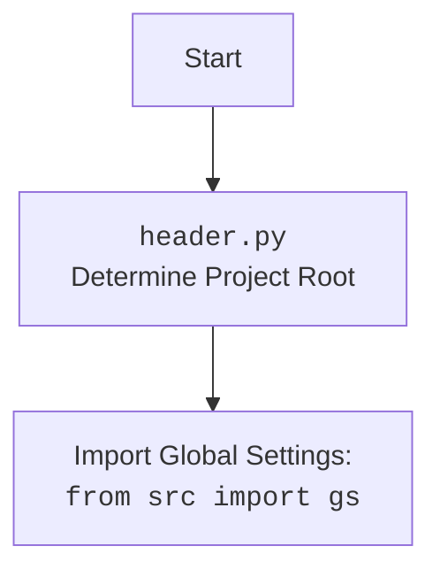

## Анализ кода `header.py`

### 1. <алгоритм>

**Функция `set_project_root`:**

1.  **Начало:** Функция принимает кортеж `marker_files` (по умолчанию `('__root__', '.git')`) в качестве аргумента. Это маркерные файлы/директории, которые используются для определения корня проекта.
2.  **Определение текущего пути:**  Получает абсолютный путь к текущему файлу (`__file__`) и его родительский каталог (`current_path`).
    *   _Пример:_ Если `header.py` находится в `/home/user/projects/hypotez/src/suppliers/chat_gpt/`, то `current_path` будет `/home/user/projects/hypotez/src/suppliers/chat_gpt`.
3.  **Инициализация корня:** Изначально устанавливает `__root__` равным `current_path`.
4.  **Поиск корня:** 
    *   Перебирает текущий путь и его родительские каталоги.
    *   Для каждого каталога проверяет, существует ли в нем какой-либо из файлов/директорий, указанных в `marker_files`.
        *   _Пример:_ Для `marker_files=('__root__', '.git')`, проверяется наличие `/home/user/projects/hypotez/src/suppliers/chat_gpt/__root__` или `/home/user/projects/hypotez/src/suppliers/chat_gpt/.git`, затем `/home/user/projects/hypotez/src/suppliers/__root__` или `/home/user/projects/hypotez/src/suppliers/.git` и так далее.
    *   Если маркерный файл/директория найден, `__root__` обновляется до родительского каталога, и цикл поиска прерывается.
5. **Добавление корня в `sys.path`:**
   *  Проверяется, есть ли путь к корню проекта (`__root__`) в `sys.path`. Если нет, путь вставляется в начало списка.
   *  Это позволяет импортировать модули из корня проекта, используя абсолютные импорты.
6.  **Возврат корня:** Возвращает `__root__` (путь к корню проекта).
    * _Пример_: Если `.git` найден в `/home/user/projects/hypotez/`, функция вернет `/home/user/projects/hypotez`.

**Чтение настроек и документации:**

1.  **Чтение `settings.json`:**
    *   Строит путь к `settings.json` используя корень проекта (`gs.path.root`) и `src/settings.json`.
    *   Пытается открыть и загрузить JSON из файла в переменную `settings`.
    *   Если файл не найден или JSON невалидный, исключение обрабатывается, и `settings` остается `None`.
2.  **Чтение `README.MD`:**
    *   Строит путь к `README.MD` используя корень проекта (`gs.path.root`) и `src/README.MD`.
    *   Пытается открыть и прочитать содержимое файла в переменную `doc_str`.
    *   Если файл не найден или не может быть прочитан, исключение обрабатывается, и `doc_str` остается `None`.
3.  **Инициализация переменных:** Инициализируются глобальные переменные:
    *   `__project_name__`: берется из `settings`, если есть, иначе - `hypotez`.
    *   `__version__`:  берется из `settings`, если есть, иначе - `''`.
    *   `__doc__`:  берется из `doc_str`, если есть, иначе - `''`.
    *   `__details__`:  всегда пустая строка.
    *   `__author__`: берется из `settings`, если есть, иначе - `''`.
    *   `__copyright__`: берется из `settings`, если есть, иначе - `''`.
    *   `__cofee__`:  берется из `settings`, если есть, иначе - `Treat the developer to a cup of coffee for boosting enthusiasm in development: https://boosty.to/hypo69`.

### 2. <mermaid>

```mermaid
flowchart TD
    Start[Начало] --> FindRoot[<code>set_project_root()</code><br>Определить корень проекта];
    FindRoot --> CheckMarker[Проверить маркерные файлы<br><code>("__root__", ".git")</code>];
    CheckMarker -- Маркер найден --> SetRoot[Установить корень проекта];
    CheckMarker -- Маркер не найден --> UseCurrentPath[Использовать текущий путь];
    SetRoot --> AddRootToPath[Добавить корень в <code>sys.path</code>];
    UseCurrentPath --> AddRootToPath;
    AddRootToPath --> ReturnRoot[Вернуть корень проекта];
    ReturnRoot --> LoadSettings[Загрузить <code>settings.json</code>];
    LoadSettings -- Успешно загружено --> ExtractSettings[Извлечь настройки];
    LoadSettings -- Ошибка --> SetDefaults[Установить значения по умолчанию];
    ExtractSettings --> LoadReadme[Загрузить <code>README.MD</code>];
    SetDefaults --> LoadReadme;
    LoadReadme -- Успешно загружено --> ExtractReadme[Извлечь документацию];
    LoadReadme -- Ошибка --> SetEmptyDoc[Установить пустую документацию];
    ExtractReadme --> DefineGlobalVars[Определить глобальные переменные];
    SetEmptyDoc --> DefineGlobalVars;
    DefineGlobalVars --> End[Конец];

    subgraph "header.py"
        Start
        FindRoot
        CheckMarker
        SetRoot
        UseCurrentPath
        AddRootToPath
        ReturnRoot
        LoadSettings
        ExtractSettings
        SetDefaults
        LoadReadme
        ExtractReadme
        SetEmptyDoc
        DefineGlobalVars
        End
    end

    
     style FindRoot fill:#f9f,stroke:#333,stroke-width:2px
    style LoadSettings fill:#ccf,stroke:#333,stroke-width:2px
    style LoadReadme fill:#ccf,stroke:#333,stroke-width:2px
```



**Объяснение зависимостей:**

*   Диаграмма `flowchart TD` показывает последовательность выполнения кода в `header.py`. Она визуализирует процесс поиска корня проекта, загрузки настроек и документации, а также инициализации глобальных переменных.
*   `header.py` импортирует `gs` из `src`,  `gs` - это глобальные настройки проекта, в том числе содержит информацию о путях, которая используется для определения местоположения `settings.json` и `README.MD`.

### 3. <объяснение>

**Импорты:**

*   `sys`: Используется для доступа к системным переменным и функциям, в частности для работы с `sys.path`.
*   `json`: Используется для работы с JSON-файлами (чтение `settings.json`).
*   `packaging.version`: Используется для работы с версиями, но в этом коде не применяется, это потенциальное место для удаления, поскольку не используется.
*   `pathlib.Path`: Используется для удобной работы с путями к файлам и каталогам.
*   `from src import gs`: Импортирует глобальные настройки (`gs`) из пакета `src`. `gs` предположительно содержит информацию о путях проекта, необходимых для загрузки файлов настроек и документации.

**Функция `set_project_root`:**

*   **Назначение:** Функция находит корень проекта, начиная с каталога, где находится файл `header.py`. Она поднимается вверх по иерархии каталогов до тех пор, пока не встретит маркерный файл или каталог (например, `__root__` или `.git`).
*   **Аргументы:** `marker_files` (кортеж строк) - список файлов или каталогов, обозначающих корень проекта. По умолчанию используется `('__root__', '.git')`.
*   **Возвращаемое значение:**  Объект `Path` , представляющий корень проекта.
*   **Примеры:**
    *   Если файл `.git` находится в `/home/user/projects/hypotez`, функция вернет `/home/user/projects/hypotez`.
    *   Если ни один из маркеров не найден, то вернётся директория, где расположен `header.py`.
*   **Потенциальные улучшения:** Можно добавить логирование, если корень не найден, чтобы упростить отладку.
*   **Взаимодействие:** Функция вызывается в начале файла для определения переменной `__root__`, которая используется для получения доступа к файлам проекта.

**Переменные:**

*   `__root__`: Объект `Path`  –  путь к корню проекта. Определяется с помощью `set_project_root`.
*   `settings`: Словарь, содержащий настройки, загруженные из `settings.json`. Может быть `None`, если файл не найден или недействителен.
*   `doc_str`:  Строка, содержащая содержимое файла `README.MD`. Может быть `None`, если файл не найден или недействителен.
*   `__project_name__`:  Строка, содержащая имя проекта. Берется из `settings`, по умолчанию - `hypotez`.
*    `__version__`:  Строка, содержащая версию проекта. Берется из `settings`, по умолчанию - `''`.
*   `__doc__`: Строка, содержащая описание проекта. Берется из `doc_str`, по умолчанию - `''`.
*   `__details__`: Строка, всегда пустая.
*   `__author__`: Строка, содержащая автора проекта. Берется из `settings`, по умолчанию - `''`.
*   `__copyright__`: Строка, содержащая информацию об авторских правах. Берется из `settings`, по умолчанию - `''`.
*   `__cofee__`: Строка, содержащая сообщение для поддержки разработчика. Берется из `settings`, по умолчанию - `Treat the developer to a cup of coffee for boosting enthusiasm in development: https://boosty.to/hypo69`.

**Объяснение:**

*   `header.py` выполняет важную роль - он устанавливает корень проекта, что необходимо для правильной работы с модулями проекта.
*   Затем  `header.py` пытается загрузить настройки и документацию из файлов JSON и MD, чтобы инициализировать глобальные переменные, содержащие информацию о проекте.
*   Эти глобальные переменные доступны для всех остальных модулей проекта, так как путь к корню добавляется в `sys.path`, и используется `from src import gs`.
*  **Потенциальные ошибки**:
   * Обработка ошибок при загрузке файлов (`settings.json`, `README.MD`) довольно проста и просто присваивает переменным значения `None`. Возможно, нужно улучшить обработку ошибок (например, добавить логирование).
   * Зависимость от `gs.path.root` делает код зависимым от структуры `gs`, что может создать проблемы, если структура `gs` изменится.
   *  Импорт `from packaging.version import Version` без использования.
*  **Возможные улучшения:**
    * Добавить кэширование для `settings` и `doc_str`, что бы избежать множественного считывания файлов.
    *  Добавить возможность указывать альтернативный путь для `settings.json` и `README.MD`.
    * Добавить валидацию настроек после загрузки из `settings.json`
    *  Использовать `os.path.join` вместо `/` для формирования путей, для обеспечения кроссплатформенности.

**Взаимосвязь с другими частями проекта:**

*   `header.py` является центральным файлом, поскольку он определяет корень проекта. Это позволяет всем другим модулям проекта корректно использовать абсолютные импорты.
*   Все остальные модули проекта могут импортировать глобальные переменные, определенные в `header.py`
*   Зависимость от `src.gs.path.root`  создает тесную связь с конфигурацией проекта.

Таким образом, `header.py` играет роль инициализирующего модуля, который устанавливает контекст выполнения и предоставляет общую информацию о проекте другим модулям.