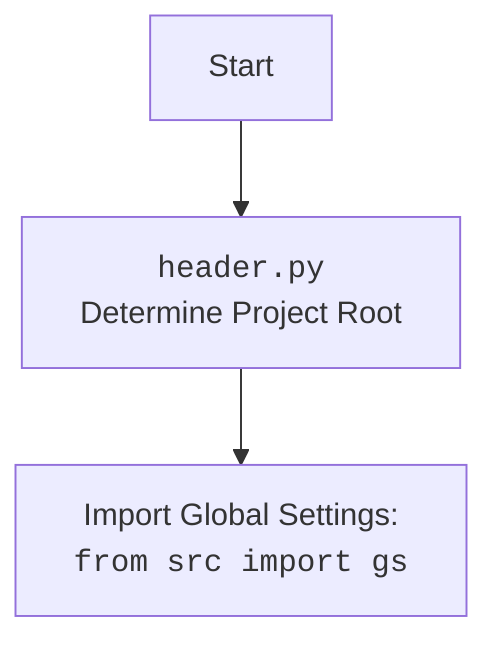

## <алгоритм>

1.  **`set_project_root(marker_files)` Function**:
    *   Начало: Функция принимает `marker_files` (tuple) как аргумент для поиска корневой директории. По умолчанию `marker_files` равен `('__root__')`.
    *   Определение текущей директории: Получает абсолютный путь к директории текущего файла.
    *   Инициализация `__root__`: Присваивает переменной `__root__` значение текущей директории.
    *   Поиск родительской директории:
        *   Итерируется по родительским директориям, включая текущую.
        *   Проверяется, существует ли в текущей родительской директории хотя бы один файл из `marker_files`.
        *   Если файл найден, `__root__` обновляется и цикл прерывается.
    *   Добавление `__root__` в `sys.path`: Если путь к корневой директории отсутствует в `sys.path`, он добавляется в начало, чтобы обеспечить импорт модулей из корневой директории.
    *   Возврат `__root__`: Возвращает путь к корневой директории.
    
    **Пример**:
        *   Пусть файл `header.py` находится в `/home/user/hypotez/src/suppliers/chat_gpt/`.
        *   `marker_files` = `('__root__', '.git')`
        *   Поиск начинается с `/home/user/hypotez/src/suppliers/chat_gpt/`
        *   Предположим, что файл `__root__` находится в `/home/user/hypotez/`. Тогда `__root__` станет `/home/user/hypotez/`.
        *   Этот путь добавляется в `sys.path`.

2.  **Инициализация `__root__`**:
    *   Вызывается функция `set_project_root()` для определения корневой директории проекта.
    *   Результат присваивается глобальной переменной `__root__`.

3.  **Импорт `src.gs`**:
    *   Импортируется модуль `gs` из пакета `src`.

4.  **Загрузка `settings.json`**:
    *   Пытается открыть файл `settings.json`, который находится в `<root>/src/settings.json`.
    *   Если файл существует и является корректным JSON, его содержимое загружается в переменную `settings` (dict).
    *   При ошибке `FileNotFoundError` или `json.JSONDecodeError` переменная `settings` остаётся `None`.

5.  **Загрузка `README.MD`**:
    *   Пытается открыть файл `README.MD`, который находится в `<root>/src/README.MD`.
    *   Если файл существует и его содержимое можно прочитать, оно загружается в переменную `doc_str` (str).
    *   При ошибке `FileNotFoundError` или `json.JSONDecodeError` переменная `doc_str` остаётся `None`.

6.  **Инициализация глобальных переменных**:
    *   Инициализируются глобальные переменные, такие как `__project_name__`, `__version__`, `__doc__`, `__details__`, `__author__`, `__copyright__`, и `__cofee__`. Значения берутся из `settings` (если они существуют), в противном случае используются значения по умолчанию.

## <mermaid>

```mermaid
flowchart TD
    Start[Начало] --> SetProjectRootCall[Вызов set_project_root()]
    SetProjectRootCall --> FindRootDir[Найти корневой каталог проекта]
    FindRootDir --> CheckMarkerFiles{Проверить наличие маркерных файлов}
    CheckMarkerFiles -- Да --> UpdateRoot[Обновить корневой каталог]
    UpdateRoot --> BreakLoop[Прервать цикл поиска]
    CheckMarkerFiles -- Нет --> CheckParents[Проверить следующую родительскую директорию]
    CheckParents -- Есть родительская директория --> FindRootDir
    CheckParents -- Нет родительской директории --> SetToCurrentDir[Установить корневой каталог как текущий]
    SetToCurrentDir --> AddRootToSysPath{Добавить корневой каталог в sys.path}
    AddRootToSysPath --> ReturnRoot[Возврат корневого каталога]
    ReturnRoot --> SetGlobalRoot[Установка глобальной переменной __root__]
    SetGlobalRoot --> ImportGS[Импорт src.gs]
    ImportGS --> LoadSettings{Загрузка settings.json}
    LoadSettings --> CheckSettings{Проверка загрузки settings.json}
    CheckSettings -- Успешно --> LoadREADME[Загрузка README.MD]
    CheckSettings -- Ошибка --> LoadREADME
    LoadREADME --> CheckREADME{Проверка загрузки README.MD}
    CheckREADME -- Успешно --> InitGlobalVars[Инициализация глобальных переменных]
    CheckREADME -- Ошибка --> InitGlobalVars
    InitGlobalVars --> End[Конец]

   
    subgraph set_project_root()
        FindRootDir
        CheckMarkerFiles
        UpdateRoot
        BreakLoop
        CheckParents
        SetToCurrentDir
        AddRootToSysPath
        ReturnRoot
    end
    
    
   style SetProjectRootCall fill:#f9f,stroke:#333,stroke-width:2px
   style FindRootDir fill:#ccf,stroke:#333,stroke-width:2px
```


**Объяснение `mermaid`:**

1.  **`Start`**: Начало выполнения скрипта.
2.  **`SetProjectRootCall`**: Вызов функции `set_project_root()`.
3.  **`FindRootDir`**: Блок поиска корневой директории.
4.  **`CheckMarkerFiles`**: Проверка наличия маркерных файлов.
5.  **`UpdateRoot`**: Обновление корневой директории, если маркерный файл найден.
6.  **`BreakLoop`**: Прерывание цикла поиска родительских директорий.
7.  **`CheckParents`**: Проверка наличия следующей родительской директории.
8.  **`SetToCurrentDir`**: Установка корневой директории как текущей, если не найдена родительская директория с маркерным файлом.
9.  **`AddRootToSysPath`**: Добавление пути к корневой директории в `sys.path`.
10. **`ReturnRoot`**: Возврат пути к корневой директории.
11. **`SetGlobalRoot`**: Установка глобальной переменной `__root__`.
12. **`ImportGS`**: Импорт модуля `gs` из пакета `src`.
13. **`LoadSettings`**: Загрузка содержимого файла `settings.json`.
14. **`CheckSettings`**: Проверка успешной загрузки `settings.json`.
15. **`LoadREADME`**: Загрузка содержимого файла `README.MD`.
16. **`CheckREADME`**: Проверка успешной загрузки `README.MD`.
17. **`InitGlobalVars`**: Инициализация глобальных переменных.
18. **`End`**: Конец выполнения скрипта.

## <объяснение>

**Импорты:**

*   **`sys`**: Используется для доступа к некоторым переменным и функциям, взаимодействующим с интерпретатором Python, в данном случае для модификации `sys.path`.
*   **`json`**: Используется для работы с данными в формате JSON. В коде используется для чтения файла `settings.json`.
*   **`packaging.version.Version`**: Используется для работы с версиями пакетов, но фактически не используется в данном коде. Возможно, это остаток от предыдущих версий или заготовка на будущее.
*   **`pathlib.Path`**: Используется для представления путей к файлам и директориям в объектно-ориентированном стиле. Это облегчает работу с файловой системой.
*   **`src.gs`**: Импортируется модуль `gs` из пакета `src`. Предположительно, `gs` содержит глобальные настройки или пути, используемые в проекте.

**Функции:**

*   **`set_project_root(marker_files)`**:
    *   **Аргументы**:
        *   `marker_files` (tuple): Кортеж, содержащий имена файлов или директорий, которые используются для идентификации корневой директории проекта. По умолчанию `('__root__')`.
    *   **Возвращаемое значение**:
        *   `pathlib.Path`: Возвращает путь к корневой директории проекта. Если корневая директория не найдена, возвращается путь к директории, где находится скрипт.
    *   **Назначение**:
        *   Ищет корневую директорию проекта, начиная с текущей директории и поднимаясь вверх по иерархии директорий, пока не найдет маркерный файл.
        *   Добавляет путь к корневой директории в `sys.path`, что позволяет импортировать модули из этого каталога.

**Переменные:**

*   `__root__` (pathlib.Path): Путь к корневой директории проекта. Определяется функцией `set_project_root()` и используется для определения путей к файлам внутри проекта.
*   `settings` (dict): Словарь, содержащий настройки проекта, загруженные из `settings.json`. Если файл не найден или имеет неверный формат, значение будет `None`.
*   `doc_str` (str): Строка, содержащая содержимое файла `README.MD`. Если файл не найден, значение будет `None`.
*   `__project_name__` (str): Название проекта, по умолчанию `'hypotez'`, если не найдено в `settings.json`.
*   `__version__` (str): Версия проекта, по умолчанию `''`, если не найдено в `settings.json`.
*   `__doc__` (str): Строка с описанием проекта, по умолчанию `''`, если не найдено в `README.MD`.
*    `__details__` (str): Строка с деталями проекта, по умолчанию `''` и не меняется.
*   `__author__` (str): Автор проекта, по умолчанию `''`, если не найдено в `settings.json`.
*   `__copyright__` (str): Авторские права на проект, по умолчанию `''`, если не найдено в `settings.json`.
*   `__cofee__` (str): Сообщение с ссылкой для доната, по умолчанию `'Treat the developer to a cup of coffee for boosting enthusiasm in development: https://boosty.to/hypo69'`, если не найдено в `settings.json`.

**Цепочка взаимосвязей:**

1.  Скрипт начинается с определения корневой директории проекта с помощью функции `set_project_root`.
2.  После определения корневой директории, скрипт импортирует модуль `gs` из пакета `src`.
3.  Используя пути из `gs`, скрипт пытается загрузить настройки из `settings.json` и описание из `README.MD`.
4.  На основе загруженных данных или значений по умолчанию инициализируются глобальные переменные, такие как `__project_name__`, `__version__` и другие.

**Потенциальные ошибки и области для улучшения:**

1.  **Обработка ошибок**: Хотя есть `try-except` блоки для загрузки `settings.json` и `README.MD`, ошибки просто игнорируются, что может затруднить отладку.
2.  **`packaging.version.Version`**: Импорт этого модуля не используется. Это может быть устаревший импорт или заготовка для будущей функциональности, которую можно удалить или реализовать.
3.  **Жёсткие пути:**  Пути к `settings.json` и `README.MD` жестко закодированы (`'src' / 'settings.json'` и `'src' / 'README.MD'`). Было бы лучше использовать переменные из `gs` для определения этих путей, чтобы сделать код более гибким.
4.  **Отсутствие явной проверки `gs`**:  Код предполагает, что `gs` существует и имеет структуру, необходимую для доступа к `gs.path.root`. Стоит добавить проверку на наличие `gs` и его атрибутов.
5. **`__details__`**: Переменная `__details__` всегда инициализируется пустой строкой. Стоит прояснить её назначение или убрать, если она не используется.
6.  **Логирование**:  Можно добавить логирование для отслеживания действий скрипта, особенно в случаях, когда `settings.json` или `README.MD` не удается загрузить.

Этот анализ предоставляет всесторонний обзор кода, его функциональности, зависимостей и потенциальных улучшений.