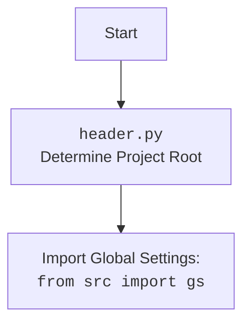

## АНАЛИЗ КОДА: `hypotez/src/suppliers/chat_gpt/scenarios/grab_lilnks_to_chats.py`

### 1. <алгоритм>

**Блок-схема:**

```mermaid
graph LR
    A[Start] --> B{Инициализация Драйвера (Firefox)};
    B --> C{Загрузка URL: 'https://chatgpt.com/'};
    C --> D{Вызов функции get_links()};
    D --> E{Извлечение локаторов из 'chats_list.json'};
    E --> F{Поиск элементов по локатору link};
    F --> G{Возврат списка ссылок};
    G --> H{Обработка полученных ссылок (опущено)};
    H --> I[End];
```

**Пояснение:**

1.  **Start**: Начало выполнения скрипта.
2.  **Инициализация Драйвера (Firefox)**: Создается экземпляр класса `Driver` с указанием использовать браузер Firefox.
    *   _Пример:_ `d = Driver(Firefox)`
3.  **Загрузка URL: 'https://chatgpt.com/'**: Драйвер браузера загружает веб-страницу по указанному URL.
    *   _Пример:_ `d.get_url('https://chatgpt.com/')`
4.  **Вызов функции `get_links()`**:  Вызывается функция, которая должна извлечь ссылки на чаты.
5.  **Извлечение локаторов из 'chats\_list.json'**: Функция использует `j_loads_ns` для загрузки JSON-структуры с локаторами элементов со страницы.
    *   _Пример_: `locator = j_loads_ns(gs.path.src / 'suppliers' / 'chat_gpt' / 'locators' / 'chats_list.json')`
    *    JSON может содержать  `{"link": "xpath_или_css_селектор"}`.
6.   **Поиск элементов по локатору `link`**: Метод `execute_locator` драйвера ищет на странице все элементы, соответствующие локатору `link`.
    *   _Пример:_ `links = d.execute_locator(locator.link)`
7.  **Возврат списка ссылок**: Функция `get_links()` возвращает список найденных элементов.
8. **Обработка полученных ссылок (опущено)**: В коде есть `...`,  вместо обработки списка.
9.  **End**: Конец выполнения скрипта.

### 2. <mermaid>

```mermaid
flowchart TD
    subgraph "grab_lilnks_to_chats.py"
        A[Start] --> B{Driver(Firefox)};
        B --> C{get_url('https://chatgpt.com/')};
        C --> D{get_links(d)};
        D --> E{j_loads_ns(locator_path)};
        E --> F{execute_locator(locator.link)};
        F --> G{return links};
        G --> H[End]
    end
    
    subgraph "src.webdriver.driver.py"
      I[Driver Class] --> J[execute_locator(locator)]
    end
    
    subgraph "src.utils.jjson.py"
      K[j_loads_ns(path)]
    end
    
    subgraph "src.webdriver.chrome.py"
        L[Chrome Class]
    end
    
    subgraph "src.webdriver.firefox.py"
        M[Firefox Class]
    end

   B --> I
   E --> K
   B --> L
   B --> M
   D --> I
    
    style A fill:#f9f,stroke:#333,stroke-width:2px
    style H fill:#ccf,stroke:#333,stroke-width:2px
    style I fill:#afa,stroke:#333,stroke-width:2px
    style K fill:#afa,stroke:#333,stroke-width:2px
    style L fill:#afa,stroke:#333,stroke-width:2px
    style M fill:#afa,stroke:#333,stroke-width:2px
```

**Зависимости:**

*   `grab_lilnks_to_chats.py` зависит от:
    *   `header.py` (непосредственно импортируется).
    *   `src.gs` (глобальные настройки, импортируется из `src/__init__.py`).
    *   `src.webdriver.driver.Driver` (абстрактный класс-драйвер для управления браузером).
    *   `src.webdriver.chrome.Chrome` (конкретная реализация драйвера для Chrome, не используется напрямую).
    *   `src.webdriver.firefox.Firefox` (конкретная реализация драйвера для Firefox).
    *   `src.utils.jjson.j_loads_ns` (загрузчик JSON с пространством имен).
* `src.webdriver.driver.py` - предоставляет базовый класс для работы с драйверами браузеров.
* `src.utils.jjson.py` -  предоставляет функцию загрузки JSON.
* `src.webdriver.chrome.py` - реализует драйвер для браузера Chrome.
* `src.webdriver.firefox.py` - реализует драйвер для браузера Firefox.

**Диаграмма для `header.py`:**



### 3. <объяснение>

**Импорты:**

*   `import header`: Импортирует модуль `header.py`, который, вероятно, определяет корень проекта и устанавливает пути. (см. дополнительный mermaid блок)
*   `from src import gs`: Импортирует глобальные настройки проекта (настройки пути, общие переменные). `gs` представляет собой объект с настройками проекта.
*   `from src.webdriver.driver import Driver`: Импортирует абстрактный класс `Driver`, определяющий интерфейс для управления браузерами. Используется для создания экземпляра конкретного драйвера.
*   `from src.webdriver.chrome import Chrome`: Импортирует класс `Chrome` для управления браузером Chrome.
*   `from src.webdriver.firefox import Firefox`: Импортирует класс `Firefox` для управления браузером Firefox.
*   `from src.utils.jjson import j_loads_ns`: Импортирует функцию `j_loads_ns` для загрузки JSON-файлов с поддержкой пространств имен. Она используется для загрузки локаторов элементов со страницы.

**Классы:**

*   **`Driver`**:  Абстрактный класс, определяющий интерфейс для работы с веб-драйверами (методы, такие как `get_url` и `execute_locator`). Является базовым классом для `Chrome` и `Firefox`.
*   **`Chrome`**: Класс, реализующий взаимодействие с браузером Chrome. Наследует от `Driver`.
*   **`Firefox`**: Класс, реализующий взаимодействие с браузером Firefox. Наследует от `Driver`.

**Функции:**

*   **`get_links(d: Driver)`**:
    *   **Аргументы**: Принимает объект `d` типа `Driver` (интерфейс).
    *   **Возвращаемое значение**: Должен возвращать список элементов (`links`) .
    *   **Назначение**: Извлекает ссылки на чаты, используя драйвер `d` и локаторы, загруженные из JSON.
    *   **Пример**: `links = get_links(d)`, где `d` - экземпляр драйвера (например, `Firefox`).

**Переменные:**

*   `locator`: Словарь, содержащий локаторы элементов, полученный с помощью `j_loads_ns`.
*   `d`: Экземпляр класса `Driver`, который управляет браузером.
*   `links`: Список найденных элементов, который, предположительно, является ссылками.

**Ошибки и области для улучшения:**

1.  **Отсутствие обработки ссылок**: В коде после извлечения ссылок стоит многоточие `...`, то есть отсутствует логика обработки полученных ссылок. Это требует доработки.
2. **Комментарии и многоточие**: Комментарии не информативны, многоточие не дает понимания работы кода.
3.  **Жесткое задание URL**:  URL  `'https://chatgpt.com/'` задан жестко и может быть вынесен в конфигурацию.
4.  **Не используется `Chrome`**: Импорт `Chrome` не используется в основном блоке `if __name__ == '__main__':`.
5.  **Не всегда валидные локаторы**:  Локаторы могут быть невалидными или меняться в зависимости от изменений на сайте. Желательно иметь механизм обработки подобных ситуаций (например, через `try-except`).
6. **Недостаточная типизация**: Недостаточная типизация переменных и функций, что уменьшает читаемость и возможность проверки на ошибки.

**Взаимосвязи с другими частями проекта:**

*   Файл использует общие настройки проекта из `src.gs`, что связывает его с общими конфигурациями проекта.
*   Использует абстрактный класс `Driver` из `src.webdriver.driver`, что позволяет использовать различные драйверы браузеров (через `Chrome` и `Firefox`).
*   Загружает JSON-данные с помощью `src.utils.jjson`, что обеспечивает поддержку работы с данными.

**Заключение**

Этот код предназначен для извлечения ссылок на чаты со страницы ChatGPT, используя веб-драйвер. Однако, требует доработки, поскольку отсутствует обработка полученных ссылок, необходимо добавления обработки ошибок и использования конфигурационных файлов.