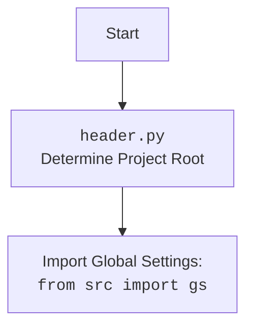

## Анализ кода `hypotez/src/suppliers/chat_gpt/scenarios/header.py`

### 1. <алгоритм>

**Блок-схема:**

1.  **`set_project_root` Function:**
    *   **Начало:** Функция `set_project_root` вызывается с `marker_files` (по умолчанию `('__root__', '.git')`).
    *   **Инициализация:** Определяется `current_path` как абсолютный путь к директории текущего файла, и `__root__` присваивается значение `current_path`.
        *   *Пример:* Если скрипт находится в `/home/user/hypotez/src/suppliers/chat_gpt/scenarios/header.py`, то `current_path` будет `/home/user/hypotez/src/suppliers/chat_gpt/scenarios`. `__root__` будет инициализирован  `/home/user/hypotez/src/suppliers/chat_gpt/scenarios`.
    *   **Поиск Родительской Директории:**
        *   Цикл перебирает текущую директорию и все её родительские директории.
        *   Для каждой родительской директории проверяется наличие хотя бы одного из `marker_files` (например, `'__root__'` или `'.git'`).
            *   *Пример:* Проверяется наличие файлов `__root__` или `.git` в директории `/home/user/hypotez/src/suppliers/chat_gpt/scenarios`, затем `/home/user/hypotez/src/suppliers/chat_gpt`, затем `/home/user/hypotez/src/suppliers`, и т.д.
        *   Если маркерный файл найден, то `__root__` присваивается значение родительской директории, и цикл прерывается.
            *   *Пример:* Если файл `.git` найден в `/home/user/hypotez`, `__root__` становится `/home/user/hypotez`.
    *   **Добавление в `sys.path`:** Если `__root__` не в `sys.path`, то он добавляется в начало списка путей для поиска модулей.
    *   **Возврат:** Функция возвращает `__root__` (тип `Path`).
        *   *Пример:* Возвращается `/home/user/hypotez`.

2.  **`__root__` Assignment:**
    *   Переменной `__root__` присваивается возвращенное значение из `set_project_root()`.

3.  **Импорт `gs`:**
    *   Из `src` импортируется `gs`.

4.  **Загрузка `settings.json`:**
    *   Файл `settings.json` открывается (путь строится с использованием `gs.path.root` и относительного пути `'src' / 'settings.json'`) и загружается в переменную `settings`, если файл существует и является валидным JSON.
    *   Если возникает ошибка `FileNotFoundError` или `json.JSONDecodeError`, переменной `settings` присваивается значение `None`.

5.  **Чтение `README.MD`:**
    *   Файл `README.MD` открывается (путь строится с использованием `gs.path.root` и относительного пути `'src' / 'README.MD'`) и его содержимое сохраняется в `doc_str`, если файл существует.
    *    Если возникает ошибка `FileNotFoundError` или `json.JSONDecodeError`, переменной `doc_str` присваивается значение `None`.

6.  **Инициализация Глобальных Переменных:**
    *   Глобальные переменные, такие как `__project_name__`, `__version__`, `__doc__`, `__details__`, `__author__`, `__copyright__`, `__cofee__` инициализируются.
    *   Значения берутся из словаря `settings`, если он есть, иначе используются значения по умолчанию.
    *   `__doc__` присваивается значение `doc_str`, если он есть, иначе пустая строка.

### 2. <mermaid>

```mermaid
flowchart TD
    Start[Start] --> FindRoot[<code>set_project_root</code><br>Find Project Root Directory];
    FindRoot --> CheckMarkers[Check for marker files in current and parent directories];
    CheckMarkers -- Marker Found --> SetRoot[Set project root to parent directory];
    CheckMarkers -- Marker Not Found --> MoveToParent[Move to parent directory];
    MoveToParent -- Exists Parent--> CheckMarkers
    MoveToParent -- Not Exists Parent --> SetDefaultRoot[Set project root to initial directory];
    SetRoot --> AddToSysPath[Add project root to <code>sys.path</code> if needed];
    SetDefaultRoot --> AddToSysPath
    AddToSysPath --> ReturnRoot[Return Project Root];
    ReturnRoot --> AssignRoot[Assign root path to <code>__root__</code>];
    AssignRoot --> ImportGS[Import Global Settings: <br><code>from src import gs</code>];
    ImportGS --> LoadSettingsJson[Load <code>settings.json</code>];
    LoadSettingsJson --> ReadReadme[Read <code>README.MD</code>];
    ReadReadme --> SetGlobalVariables[Set global project variables: <br> <code>__project_name__</code>, <code>__version__</code>, etc.];
    SetGlobalVariables --> End[End];

    classDef important fill:#f9f,stroke:#333,stroke-width:2px
    class FindRoot, CheckMarkers, SetRoot, SetDefaultRoot, AddToSysPath, ReturnRoot, AssignRoot, ImportGS, LoadSettingsJson, ReadReadme, SetGlobalVariables important
    
```
**Объяснение `mermaid`:**

*   **`flowchart TD`**: Объявляет начало блок-схемы с направлением сверху вниз.
*   **`Start`**: Начало процесса.
*   **`FindRoot`**: Вызов функции `set_project_root`.
*   **`CheckMarkers`**: Проверка наличия маркерных файлов (`__root__`, `.git`) в текущей и родительских директориях.
*   **`SetRoot`**: Устанавливает корневую директорию проекта на родительскую директорию, где найден маркерный файл.
*   **`MoveToParent`**: Переход к родительской директории для дальнейшего поиска маркерных файлов.
*   **`SetDefaultRoot`**: Если маркерные файлы не найдены, устанавливает корневую директорию на исходную директорию.
*   **`AddToSysPath`**: Добавляет корневую директорию в `sys.path` (если необходимо).
*   **`ReturnRoot`**: Возвращает корневую директорию.
*   **`AssignRoot`**: Присваивает корневой путь переменной `__root__`.
*   **`ImportGS`**: Импортирует глобальные настройки из `src.gs`.
*   **`LoadSettingsJson`**: Загружает настройки из файла `settings.json`.
*  **`ReadReadme`**: Читает содержимое файла `README.MD`.
*   **`SetGlobalVariables`**: Инициализирует глобальные переменные проекта (имя, версия, автор и т.д.) из загруженных настроек.
*   **`End`**: Конец процесса.
*   **`classDef important`**: определяет стиль для выделения ключевых блоков.
*    **`class`**: добавляет определенный стиль к блокам

**Импорты в диаграмме:**

*   `sys`: Используется для добавления корневой директории проекта в список путей поиска модулей (`sys.path`).
*   `json`: Используется для загрузки настроек из файла `settings.json` в формате JSON.
*    `pathlib.Path`: Используется для работы с путями к файлам и директориям.
*   `src.gs`: Импортируется для получения доступа к путям глобальных настроек проекта.



### 3. <объяснение>

**Импорты:**

*   `sys`: Модуль `sys` используется для работы с системными переменными и функциями, в данном случае для добавления корневой директории проекта в `sys.path`. Это позволяет импортировать модули из этого каталога как часть проекта.
*   `json`: Модуль `json` используется для работы с данными в формате JSON. В этом скрипте он применяется для загрузки настроек из файла `settings.json`.
*   `packaging.version.Version`: Этот импорт не используется в текущем коде. Возможно, он был добавлен для будущих потребностей, например, для сравнения версий.
*   `pathlib.Path`: Модуль `Path` из `pathlib` используется для создания и работы с путями к файлам и директориям. Он предоставляет удобный объектно-ориентированный интерфейс для работы с файловой системой.
*   `src.gs`:  Импорт `gs` из пакета `src` представляет собой глобальные настройки проекта (пути к файлам).

**Функции:**

*   `set_project_root(marker_files=('__root__', '.git')) -> Path`:
    *   **Назначение:** Эта функция находит корневую директорию проекта. Она ищет вверх по иерархии директорий от текущего файла, пока не найдет директорию, содержащую один из указанных `marker_files` (по умолчанию `'__root__'` или `'.git'`).
    *   **Аргументы:**
        *   `marker_files` (tuple, необязательный): кортеж с именами файлов или директорий, которые используются для определения корня проекта.
    *   **Возвращаемое значение:**
        *   `Path`: Объект `Path`, представляющий путь к корневой директории проекта. Если маркерные файлы не найдены, функция возвращает путь директории, в которой находится сам скрипт.
    *   **Примеры:**
        *   Если в `/home/user/project/` находится файл `.git`, то при запуске скрипта из `/home/user/project/src/suppliers/chat_gpt/scenarios/header.py`, функция вернет `Path("/home/user/project/")`.
        *  Если в `/home/user/project/src/` находится файл `__root__`, то при запуске скрипта из `/home/user/project/src/suppliers/chat_gpt/scenarios/header.py`, функция вернет `Path("/home/user/project/src/")`.

**Переменные:**

*   `__root__`:  Хранит путь к корневой директории проекта (тип `Path`). Используется для построения путей к другим файлам проекта.
*   `settings`:  Словарь, содержащий настройки проекта, загруженные из файла `settings.json` (тип `dict` или `None`, если файл не найден или ошибка).
*   `doc_str`: Строка, содержащая содержимое файла `README.MD`, используется в дальнейшем для `__doc__`(тип `str` или `None`, если файл не найден).
*   `__project_name__`: Название проекта (тип `str`, по умолчанию `'hypotez'`).
*   `__version__`: Версия проекта (тип `str`, по умолчанию `''`).
*   `__doc__`: Документация проекта, взятая из README.MD (тип `str`, по умолчанию `''`).
*   `__details__`: Детали проекта (тип `str`, по умолчанию `''`).
*   `__author__`: Автор проекта (тип `str`, по умолчанию `''`).
*   `__copyright__`: Копирайт проекта (тип `str`, по умолчанию `''`).
*  `__cofee__`: Сообщение для поддержки разработчика (тип `str`).

**Цепочка взаимосвязей:**
1. Функция `set_project_root` определяет корневую директорию проекта, что позволяет корректно строить пути к файлам конфигурации, таким как `settings.json` и `README.MD` и добавлять корень проекта в `sys.path`.
2.  Файл `settings.json` используется для инициализации таких глобальных переменных, как `__project_name__` и `__version__`.
3. `README.MD` используется для инициализации глобальной переменной `__doc__`, которая является документацией проекта.
4.  Глобальные переменные используются другими модулями и скриптами проекта для получения доступа к метаданным и настройкам проекта.

**Потенциальные ошибки и области для улучшения:**

*   **Обработка ошибок:**  Обработка ошибок при загрузке `settings.json` и `README.MD` заключается в игнорировании ошибок и присваивании `settings` или `doc_str` значения `None`. Можно было бы добавить логгирование ошибок или выброс исключений для более надежной работы.
*   **`packaging.version`**: Импорт `Version` из `packaging.version` не используется в коде. Его можно убрать, если он не планируется к использованию в будущем.
*   **`__details__`**:  Переменная `__details__` инициализируется пустой строкой и нигде не используется. Если она не нужна, её следует удалить. Если нужно наполнять, следует добавить логику.
*   **`__copyright__`**: Переменная инициализируется на основе ключа  `copyrihgnt` (орфографическая ошибка), нужно исправить.
*   **`__cofee__`**: Переменная инициализируется на основе ключа  `cofee` (орфографическая ошибка), нужно исправить.
*   **Использование `try`-`except`:** Код использует `try`-`except` блоки без указания конкретных типов ошибок (кроме `FileNotFoundError`, `json.JSONDecodeError`), что может скрыть другие потенциальные проблемы. Желательно указывать конкретные типы исключений.
*   **Зависимость от `gs`**: Код зависит от наличия модуля `gs` в пакете `src`. Можно было бы сделать более явную проверку на импорт `gs`.
*  **Общая структура**: Все переменные и функции находятся на глобальном уровне, возможно следует создать отдельный класс `ProjectHeader` для капсулирования.

**В заключение**: Скрипт `header.py` выполняет важную функцию определения корня проекта и загрузки основных настроек из `settings.json` и  `README.MD`. Он обеспечивает доступ к метаданным проекта, таким как имя и версия, через глобальные переменные. Присутствуют области для улучшения, такие как обработка ошибок и логирование, а также устранение неиспользуемых переменных.