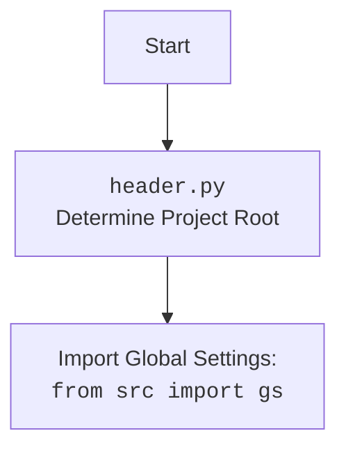

## АНАЛИЗ КОДА `hypotez/src/suppliers/chat_gpt/scenarios/header.py`

### <алгоритм>
1. **`set_project_root(marker_files)`**:
   - **Начало**: Определяется текущий каталог скрипта `current_path`.
   - **Инициализация**: Переменная `__root__` инициализируется значением `current_path`.
   - **Поиск**:
     - Перебираются текущий каталог и все его родительские каталоги.
     - Для каждого каталога проверяется, существует ли в нем хотя бы один файл или каталог из `marker_files`.
     - Если такой файл/каталог найден, текущий каталог становится корнем проекта `__root__` и поиск прекращается.
   - **Добавление в `sys.path`**:
     - Если `__root__` еще не содержится в `sys.path`, он добавляется в начало, что позволяет импортировать модули из корневого каталога.
   - **Возврат**: Возвращается `__root__` (путь к корню проекта).

   *Пример*:
     - Если `marker_files` = `('__root__', '.git')` и структура каталогов такая: `/parent/child/script.py`, `/parent/child/__root__`, то `__root__` будет `/parent/child`.
     - Если  `marker_files` = `('__root__', '.git')` и структура каталогов такая: `/parent/child/script.py`, `/parent/.git`, то `__root__` будет `/parent`.
     - Если ни одного `marker_files` не будет найдено, `__root__` будет каталогом, где находится скрипт, в нашем примере: `/parent/child`.

2. **Инициализация `__root__`**:
   - Вызывается функция `set_project_root()` и полученный результат присваивается переменной `__root__`.

3. **Загрузка `settings.json`**:
   - Пытается открыть файл `settings.json` в каталоге `src` относительно корня проекта `__root__`.
   - Если файл успешно открыт, содержимое загружается в переменную `settings` как словарь `dict`.
   - Если файл не найден или возникает ошибка декодирования JSON, блок `try...except` обрабатывает исключение, и `settings` остается `None`.
    *Пример*:
        - Если `__root__` равен `/home/user/project`, то будет прочитан файл `/home/user/project/src/settings.json`.
4. **Загрузка `README.MD`**:
    - Пытается открыть файл `README.MD` в каталоге `src` относительно корня проекта `__root__`.
    - Если файл успешно открыт, содержимое загружается в переменную `doc_str` как строка `str`.
    - Если файл не найден или возникает ошибка декодирования JSON, блок `try...except` обрабатывает исключение, и `doc_str` остается `None`.
     *Пример*:
        - Если `__root__` равен `/home/user/project`, то будет прочитан файл `/home/user/project/src/README.MD`.
5. **Инициализация глобальных переменных**:
    - Если `settings` содержит данные, извлекаются значения `project_name`, `version`, `author`, `copyrihgnt` и `cofee` из словаря `settings` и присваиваются соответствующим переменным. Если в `settings` отсутствуют ключи, то переменным присваиваются значения по умолчанию.
    - Если `settings` равен `None`, всем переменным присваиваются значения по умолчанию
    - Если `doc_str` содержит данные, то `__doc__` присваивается `doc_str`, иначе - пустая строка.
    - Переменная `__details__` инициализируется пустой строкой `''`.

### <mermaid>

```mermaid
flowchart TD
    Start --> SetProjectRoot[<code>set_project_root()</code><br> Determine Project Root];
    SetProjectRoot --> FindRoot[Find Project Root Directory:<br>Iterate through parent directories<br>Check for marker files];
    FindRoot -- Marker Found --> SetRoot[Set <code>__root__</code> Variable<br> Add to <code>sys.path</code>];
    FindRoot -- No Marker --> SetCurrentDir[Set <code>__root__</code> to Current Directory<br> Add to <code>sys.path</code>];
     SetRoot --> LoadSettings[Load <code>settings.json</code><br>from <code>src/</code>];
    SetCurrentDir --> LoadSettings
    LoadSettings --> HandleSettings[Handle Loaded Settings or Default Values];
    HandleSettings --> LoadReadme[Load <code>README.MD</code><br>from <code>src/</code>];
    LoadReadme --> HandleReadme[Handle Loaded Doc String or Default Values];
    HandleReadme --> SetGlobalVars[Set Project Global Variables<br> (<code>__project_name__</code>, <code>__version__</code>,<code>__doc__</code>, etc.)];
    SetGlobalVars --> End;
    
     
    style SetProjectRoot fill:#f9f,stroke:#333,stroke-width:2px
    style LoadSettings fill:#ccf,stroke:#333,stroke-width:2px
    style HandleSettings fill:#ccf,stroke:#333,stroke-width:2px
    style LoadReadme fill:#ccf,stroke:#333,stroke-width:2px
     style HandleReadme fill:#ccf,stroke:#333,stroke-width:2px
    style SetGlobalVars fill:#ccf,stroke:#333,stroke-width:2px
```

### <объяснение>

#### Импорты:
- **`import sys`**: Предоставляет доступ к некоторым переменным и функциям, взаимодействующим с интерпретатором Python. Используется для добавления пути к корню проекта в `sys.path`, что позволяет импортировать модули из этого каталога.
- **`import json`**: Используется для работы с JSON-форматом, в данном случае для чтения данных из `settings.json`.
- **`from packaging.version import Version`**: Используется для работы с версиями, но в коде не используется явно, возможно для расширения функциональности в будущем.
- **`from pathlib import Path`**: Позволяет работать с путями к файлам и каталогам в операционной системе. Используется для поиска корня проекта и построения путей к файлам.
-   **`from src import gs`**: импорт глобальных настроек из пакета `src`, используется для доступа к переменным, например, `gs.path.root`, где хранится корневой путь проекта.

#### Функции:
- **`set_project_root(marker_files: tuple = ('__root__', '.git')) -> Path`**:
    -   **Аргументы**:
        -   `marker_files`: `tuple` - кортеж с именами файлов или папок, которые идентифицируют корень проекта. По умолчанию `('__root__', '.git')`.
    -   **Возвращаемое значение**:
        -   `Path`: путь к корневой директории проекта.
    -   **Назначение**:
        -   Определяет путь к корневому каталогу проекта, начиная с каталога, где расположен текущий файл. Функция ищет вверх по дереву каталогов, пока не найдет каталог, содержащий один из `marker_files`. Если такие файлы не найдены, то возвращается каталог, где расположен скрипт. После чего добавляет корень проекта в `sys.path`, чтобы можно было импортировать модули из корня проекта.
    -   **Примеры**:
        -   `set_project_root()`: найдет корень проекта, если в одном из родительских каталогов есть файл `__root__` или каталог `.git`.
        -   `set_project_root(marker_files=('.project'))`: найдет корень проекта, если в одном из родительских каталогов есть файл `.project`.
#### Переменные:
-   `__root__`: `Path` - путь к корневому каталогу проекта.
-   `settings`: `dict | None` - словарь, содержащий настройки проекта из `settings.json`. Если файл не найден или не может быть прочитан, принимает значение `None`.
-   `doc_str`: `str | None` - строка, содержащая текст из файла `README.MD`. Если файл не найден или не может быть прочитан, принимает значение `None`.
-   `__project_name__`: `str` - имя проекта, берется из настроек или `hypotez` по умолчанию.
-   `__version__`: `str` - версия проекта, берется из настроек или пустая строка по умолчанию.
-   `__doc__`: `str` - документация проекта, берется из файла `README.MD` или пустая строка по умолчанию.
-    `__details__`: `str` - дополнительная информация о проекте, по умолчанию пустая строка.
-   `__author__`: `str` - автор проекта, берется из настроек или пустая строка по умолчанию.
-   `__copyright__`: `str` - копирайт проекта, берется из настроек или пустая строка по умолчанию.
-   `__cofee__`: `str` - сообщение с предложением "угостить разработчика кофе", берется из настроек или стандартное сообщение по умолчанию.

#### Цепочка взаимосвязей:

-   `set_project_root()` определяет корень проекта и добавляет его в `sys.path`.
-   `__root__` используется для построения путей к файлам `settings.json` и `README.MD`.
-   Содержимое `settings.json` влияет на значения глобальных переменных, таких как `__project_name__`, `__version__`, `__author__` и `__copyright__`.
-  `doc_str`  влияет на значение глобальной переменной `__doc__`.
-  `gs.path.root` используется для определения корневой директории в контексте глобальных настроек.

#### Потенциальные ошибки и области для улучшения:

- **Обработка ошибок**: Код обрабатывает `FileNotFoundError` и `json.JSONDecodeError` при чтении `settings.json` и `README.MD` используя пустой `except` блок (`...`), что скрывает ошибку. Лучше логировать ошибку.
- **Избыточное дублирование кода**: Повторяющийся код для обработки загрузки `settings.json` и `README.MD`. Можно вынести этот код в отдельную функцию для уменьшения дублирования.
-  **Неопределенность с `packaging.version`**: Импорт `Version` из `packaging.version` есть, но не используется в этом файле. Если он не нужен, его следует удалить. Если планируется использовать его в будущем, следует убедиться в корректном его использовании.
- **Неопределенность с переменными**: Переменная `__details__` не используется и никак не инициализируется, стоит рассмотреть вариант удаления или проработать ее назначение.
- **Жестко закодированные пути**: Путь к `settings.json` и `README.MD` жестко прописан (`'src' / 'settings.json'`, `'src' / 'README.MD'`). Возможно, имеет смысл использовать `gs` для определения пути до директории `src`.
- **Использование `__` для глобальных переменных**: Использование двойного подчеркивания (`__`) в начале и конце имен переменных, таких как `__project_name__`, обычно предназначено для name mangling в классах, в данном контексте оно не несет дополнительной пользы и может быть удалено для большей читаемости.