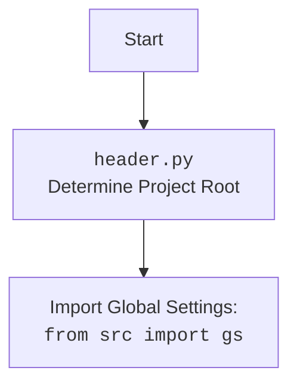

## Анализ кода `hypotez/src/suppliers/chat_gpt/scenarios/header.py`

### 1. <алгоритм>

**Функция `set_project_root`:**

1.  **Начало:** Функция принимает кортеж `marker_files` (по умолчанию `('__root__', '.git')`) в качестве аргумента.
2.  **Получение текущего пути:** Определяет путь к директории, в которой находится текущий файл (`__file__`), и сохраняет его в переменной `current_path`.
    *   Пример: Если файл расположен в `/home/user/project/src/suppliers/chat_gpt/scenarios/header.py`, то `current_path` будет `/home/user/project/src/suppliers/chat_gpt/scenarios`.
3.  **Инициализация корня проекта:** Инициализирует переменную `__root__` текущим путем.
4.  **Поиск корня проекта:**
    *   Перебирает текущую директорию и все её родительские директории.
        *   Пример: Перебирает `/home/user/project/src/suppliers/chat_gpt/scenarios`, `/home/user/project/src/suppliers/chat_gpt`, `/home/user/project/src/suppliers`, `/home/user/project/src`, `/home/user/project`, `/home/user`, `/home`, `/`.
    *   Проверяет, существует ли в текущей директории какой-либо из маркеров (файлов или папок) из `marker_files`.
        *   Пример: Для каждого родительского каталога проверяет существование `/home/user/project/src/suppliers/chat_gpt/scenarios/__root__`, `/home/user/project/src/suppliers/chat_gpt/scenarios/.git`, `/home/user/project/src/suppliers/chat_gpt/__root__`, `/home/user/project/src/suppliers/chat_gpt/.git` и т.д.
    *   Если маркер найден, обновляет `__root__` на путь к этой директории и выходит из цикла.
5.  **Добавление корня проекта в `sys.path`:** Проверяет, присутствует ли путь к корню проекта в `sys.path`. Если нет, добавляет его в начало `sys.path`
6.  **Возврат:** Возвращает путь к корню проекта (`__root__`).

**Основной блок кода:**

1.  **Вызов `set_project_root()`:**  Вызывает функцию `set_project_root()` для определения корня проекта и сохраняет результат в переменной `__root__`.
2.  **Импорт `gs`:** Импортирует модуль `gs` из `src`, который предполагает собой модуль `global settings`.
3.  **Загрузка настроек из `settings.json`:**
    *   Пытается открыть файл `settings.json` (предположительно расположенный в `<project_root>/src/settings.json`).
    *   Если файл существует и JSON-данные валидны, загружает настройки в словарь `settings`.
    *   В случае ошибок (файл не найден или JSON невалиден) перехватывает исключения,  ничего не делая.
4. **Загрузка документации из `README.md`:**
     * Пытается открыть файл `README.md` (предположительно расположенный в `<project_root>/src/README.MD`).
     * Если файл существует, то считывает его и сохраняет в строку `doc_str`.
     * В случае ошибок (файл не найден или чтение не удалось) перехватывает исключения,  ничего не делая.
5.  **Инициализация глобальных переменных:**
    *   Инициализирует глобальные переменные (`__project_name__`, `__version__`, `__doc__`, `__details__`, `__author__`, `__copyright__`, `__cofee__`) значениями из словаря `settings`, если он был успешно загружен, иначе устанавливает значения по умолчанию.

### 2. <mermaid>

```mermaid
flowchart TD
    subgraph set_project_root
        A[Start: set_project_root<br>marker_files=('__root__', '.git')] --> B{Get Current Path: <br>Path(__file__).resolve().parent}
        B --> C[Initialize: __root__ = Current Path]
        C --> D{Iterate through Parents: <br> current_path, current_path.parents}
        D -- For each parent --> E{Check Marker Exists: <br> (parent / marker).exists()}
        E -- Yes --> F[Update __root__: __root__ = parent]
        F --> G[Break]
        E -- No --> D
        D -- End iteration --> H{Is __root__ in sys.path?}
        H -- No --> I[Insert __root__ into sys.path]
        I --> J[Return __root__]
        H -- Yes --> J
     end
     
     K[Call: __root__ = set_project_root()] --> L[Import: from src import gs]
     L --> M{Try: Open settings.json}
     M -- Success --> N[Load settings: settings = json.load(settings_file)]
     M -- Fail --> O[Exception: FileNotFoundError, JSONDecodeError]
     N --> P{Try: Open README.MD}
     O --> P
     P -- Success --> Q[Load doc_str: doc_str = settings_file.read()]
     P -- Fail --> R[Exception: FileNotFoundError, JSONDecodeError]
    Q --> S[Init Project Info: __project_name__ = settings.get("project_name", 'hypotez'), etc.]
    R --> S
    S --> T[End]
        
    style A fill:#f9f,stroke:#333,stroke-width:2px
    style J fill:#ccf,stroke:#333,stroke-width:2px    
    style T fill:#ccf,stroke:#333,stroke-width:2px
```



**Анализ зависимостей `mermaid`:**

*   `flowchart TD`:  Объявляет тип диаграммы как блок-схему (flowchart) с направлением сверху вниз (TD).
*   `Start`: Начало процесса.
*   `subgraph set_project_root` -  определяет блок кода отвечающий за поиск корня проекта.
    * `A` - `J` - пошаговое описание алгоритма функции `set_project_root`.
    * `style A fill:#f9f,stroke:#333,stroke-width:2px` и `style J fill:#ccf,stroke:#333,stroke-width:2px` -  определяют цвет и стиль выделения блоков начала и конца функции.
*  `K` - вызов функции `set_project_root()` и получение пути к корню проекта.
* `L` -  импорт глобальных настроек из модуля `src.gs`.
*   `M` - `R`: Блоки отвечают за обработку исключений при загрузке файлов `settings.json` и `README.md`.
*  `S` - инициализация глобальных переменных из загруженных данных или значений по умолчанию.
*  `T` - конец процесса.

### 3. <объяснение>

**Импорты:**

*   `import sys`: Модуль `sys` предоставляет доступ к некоторым переменным и функциям, взаимодействующим с интерпретатором Python. Здесь используется `sys.path` для добавления пути к корню проекта в список путей поиска модулей. Это позволяет импортировать модули из других частей проекта.
*   `import json`: Модуль `json` используется для работы с данными в формате JSON. В данном коде используется для загрузки настроек из файла `settings.json`.
*   `from packaging.version import Version`: Импортирует класс `Version` для сравнения версий пакетов. В этом коде не используется, но возможно используется в других частях проекта.
*   `from pathlib import Path`: Класс `Path` из модуля `pathlib` предоставляет объектно-ориентированный способ работы с путями к файлам и директориям. Используется для определения путей к корню проекта, файлу настроек и документации.
*   `from src import gs`: Импортирует модуль `gs` (глобальные настройки) из пакета `src`. Этот импорт предполагает, что в проекте есть модуль с глобальными настройками. `gs` используется для доступа к пути корня проекта, полученного ранее.
**Взаимосвязь с пакетом `src`:**
    - Код напрямую зависит от модуля `src.gs` для получения пути к корню проекта, так как предполагается, что  `gs.path.root` уже определен и содержит верный путь к корню проекта.
    - Код подразумевает наличие файлов `settings.json` и `README.MD`  в поддиректории `src` от корня проекта.

**Функция `set_project_root`:**

*   **Назначение:** Определяет корень проекта, начиная с текущего файла, поднимаясь вверх по директориям, пока не найдет один из "маркерных" файлов или директорий (по умолчанию это `__root__` или `.git`).
*   **Аргументы:**
    *   `marker_files` (tuple, по умолчанию `('__root__', '.git')`): Кортеж имен файлов или папок, которые используются для определения корня проекта.
*   **Возвращаемое значение:**
    *   `Path`: Объект `Path`, представляющий путь к корню проекта. Если маркер не найден, возвращает путь к директории, где находится текущий файл.
*   **Логика:**
    *   Ищет маркерные файлы в текущем каталоге и его родительских каталогах.
    *   Добавляет путь к корню проекта в `sys.path`, чтобы можно было импортировать другие модули из этого проекта.
    *   Это обеспечивает корректную работу импортов внутри проекта.

**Переменные:**

*   `__root__`:
    *   Тип: `Path`.
    *   Назначение: Содержит путь к корневой директории проекта.
*   `settings`:
    *   Тип: `dict` или `None`.
    *   Назначение: Словарь, содержащий настройки, загруженные из `settings.json`.
*   `doc_str`:
    *   Тип: `str` или `None`.
    *   Назначение: Строка, содержащая текст из файла `README.MD`.
*   `__project_name__`, `__version__`, `__doc__`, `__details__`, `__author__`, `__copyright__`, `__cofee__`:
    *   Тип: `str`.
    *   Назначение: Глобальные переменные, содержащие информацию о проекте. Значения берутся из словаря `settings`, если он доступен, иначе используются значения по умолчанию.
    
**Потенциальные ошибки и улучшения:**

1.  **Обработка ошибок:** Код обрабатывает ошибки при открытии и чтении файлов `settings.json` и `README.MD`, но не предоставляет никакой обратной связи в случае ошибки. Следует добавить запись в лог или вывести сообщение об ошибке.
2.  **Обработка отсутствия файла `settings.json`:** В случае отсутствия файла `settings.json` все переменные (`__project_name__`, `__version__` и т.д.) получают значения по умолчанию. Возможно, стоит добавить проверку на наличие файла, чтобы дать пользователю знать об отсутствии файла настроек.
3.  **Не используется импортированный `Version`:** В коде присутствует импорт `from packaging.version import Version`, но он не используется. Следует удалить неиспользуемый импорт.
4.  **`__details__`: Глобальная переменная `__details__` инициализируется пустой строкой.
5.  **Ошибки в `settings.json`:** Если в файле `settings.json` отсутствуют какие-либо из ожидаемых ключей, например "project_name" или "version", то будет использоваться значение по умолчанию, что может быть неожиданно для пользователя. Следует предусмотреть более явную проверку на наличие необходимых ключей.
6.  **Нестандартное имя `copyrihgnt`:** Возможно опечатка в `copyrihgnt`, должно быть `copyright`.
7.  **Жесткая привязка к путям**: Код жестко привязан к путям `src/settings.json` и `src/README.MD`. Необходимо предусмотреть возможность переопределения этих путей.

**Взаимосвязь с другими частями проекта:**

*   Модуль является частью инфраструктуры проекта и служит для настройки среды и загрузки основной информации о проекте.
*   Полученные настройки (например, `__project_name__`, `__version__`) могут быть использованы в других модулях проекта.
*   Функция `set_project_root()` обеспечивает правильную работу импортов в проекте.
*   Модуль `src.gs` используется как глобальный источник настроек.