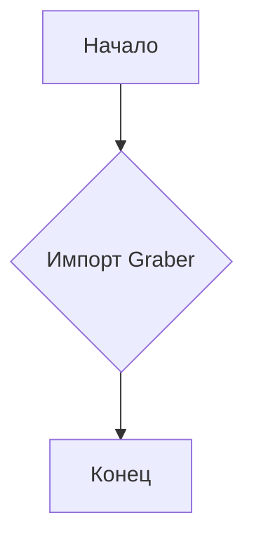
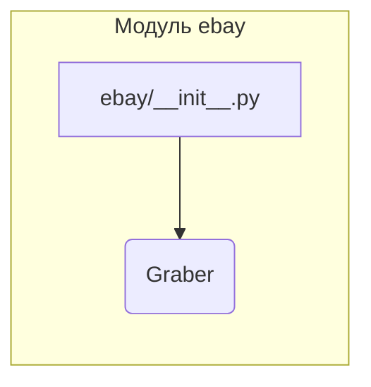

```MD
# Анализ кода hypotez/src/suppliers/ebay/__init__.py

1. **<input code>**

```python
## \file hypotez/src/suppliers/ebay/__init__.py
# -*- coding: utf-8 -*-
#! venv/Scripts/python.exe
#! venv/bin/python/python3.12

"""
.. module: src.suppliers.ebay 
	:platform: Windows, Unix
	:synopsis:

"""
MODE = 'dev'

from .graber import Graber
```

2. **<algorithm>**

Код представляет собой инициализационный файл для модуля `ebay` в пакете `suppliers`.  Алгоритм прост: он импортирует класс `Graber` из подпапки `graber`.  Блок-схема:



Пример:  Код выполняется, и переменная `MODE` получает значение 'dev'. Затем выполняется импорт класса `Graber`, делая его доступным для использования в других частях модуля `ebay` или в коде, который импортирует этот модуль.


3. **<mermaid>**



Эта диаграмма показывает, что модуль `ebay/__init__.py` импортирует класс `Graber` из подпапки `graber`.  Подключаемые зависимости - это `graber.py` внутри пакета `ebay`.


4. **<explanation>**

* **Импорты:**
    `from .graber import Graber`:  Импортирует класс `Graber` из файла `graber.py` в текущей папке (`./graber`).  Это типичный способ импорта модулей или классов внутри одного пакета.  `./` указывает на текущую папку, что жизненно важно для правильной работы импорта.


* **Классы:**
    Класс `Graber` (определенный в файле `graber.py`) не показан в текущем файле, но, судя по имени, он, вероятно, отвечает за извлечение данных с eBay.


* **Функции:**
    В данном файле нет функций.


* **Переменные:**
    `MODE = 'dev'`:  Переменная, вероятно, используется для определения режима работы (например, 'dev' для разработки, 'prod' для производства).  Может влиять на поведение других частей приложения (например, на выбор источника данных или уровень логирования).


* **Возможные ошибки и улучшения:**
    - Неясно, как именно используется значение переменной `MODE`.  Было бы полезно увидеть, как она используется в других частях проекта.
    -  Отсутствует документация о классе `Graber`.  Необходимо дополнить файл `graber.py` документацией, описывающей назначение, аргументы, и возвращаемые значения методов класса.
    -  Необъявленные переменные или импорты, используемые в `graber.py` могут вызывать ошибки.


* **Взаимосвязи с другими частями проекта:**
    Этот файл является частью пакета `suppliers`, что предполагает, что он содержит функции или классы для получения данных с разных поставщиков. Вероятно, существует главный модуль, который использует классы из этого файла для получения данных с eBay и дальнейшей обработки.  Например, модуль `main.py` или подобный.  Связь устанавливается через импорт этого модуля в основной логике.


**Заключение:**

Файл `__init__.py` выполняет необходимую инициализацию для модуля `ebay`. Он подключает класс `Graber`, который, вероятно, отвечает за взаимодействие с API eBay.  Для более подробного анализа необходим код файла `graber.py`.