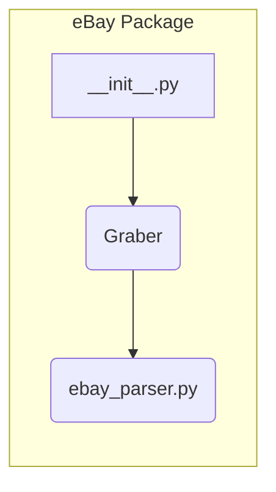

```MD
# Анализ файла hypotez/src/suppliers/ebay/__init__.py

1. **<input code>**

```python
## \file hypotez/src/suppliers/ebay/__init__.py
# -*- coding: utf-8 -*-
#! venv/Scripts/python.exe
#! venv/bin/python/python3.12

"""
.. module: src.suppliers.ebay 
	:platform: Windows, Unix
	:synopsis:

"""
MODE = 'dev'

from .graber import Graber
```

2. **<algorithm>**

Файл `__init__.py` в пакете `ebay` является инициализатором этого пакета.  В данном случае он выполняет лишь одну функцию - импорт класса `Graber` из подпакета `graber`.  Алгоритм работы сводится к следующему:

* **Импорт:** Модуль `__init__.py` импортирует класс `Graber` из модуля `graber.py`.  Этот импорт делает класс `Graber` доступным для использования в других модулях внутри пакета `ebay`.

**Пример:**

Если другой модуль в `ebay` (например, `ebay_parser.py`) нуждается в использовании `Graber`, он сможет сделать это через импорт из `ebay/__init__.py`.

```python
# ebay_parser.py
from ebay import Graber
```

3. **<mermaid>**



**Объяснение диаграммы:**

* `__init__.py` – инициализатор пакета `ebay`.
* `Graber` – класс, определённый в файле `graber.py` внутри пакета `ebay`.
* `ebay_parser.py` – пример модуля, который использует класс `Graber` из `ebay`.  

4. **<explanation>**

* **Импорты:**
    * `from .graber import Graber`: Этот импорт вносит в текущий модуль (`__init__.py`) доступ к классу `Graber`, который, скорее всего, определён в файле `hypotez/src/suppliers/ebay/graber.py`.  `.` указывает на подпапку `graber` внутри текущего пакета `ebay`. Эта конструкция позволяет организовать модули в иерархию, что улучшает структуру проекта.

* **Классы:**
    * `Graber`:  Этот класс (судя по имени) отвечает за сбор данных с eBay.  Подробности реализации (атрибуты и методы) находятся в `hypotez/src/suppliers/ebay/graber.py`.  Данный файл `__init__.py` просто экспортирует доступ к этому классу для других частей проекта.

* **Функции:**  Нет функций, так как это файл инициализации пакета.


* **Переменные:**
    * `MODE = 'dev'`:  Эта переменная, вероятно, используется для определения режима работы (например, `dev` для разработки, `prod` для производства).  Значение может влиять на настройки, поведение или логику работы других частей кода.

* **Возможные ошибки/улучшения:**
    * Отсутствие docstrings для переменной `MODE` и других потенциально важных элементов.  Добавление docstrings улучшило бы читаемость и понимание кода.
    * Необходимость в `hypotez/src/suppliers/ebay/graber.py` для дальнейшего анализа.  Необходимо знать реализацию `Graber` для полного понимания.

**Цепочка взаимосвязей:**

Файл `__init__.py` является частью пакета `ebay`.  Он предоставляет доступ к классу `Graber`, который, вероятно, используется другими модулями (например, в `hypotez/src/suppliers/ebay/ebay_parser.py`) для работы с данными eBay.  Далее эти данные, скорее всего, обрабатываются и используются в других частях проекта (в зависимостях от `MODE`).  Для полного понимания потребуется изучить `graber.py` и связанные файлы.