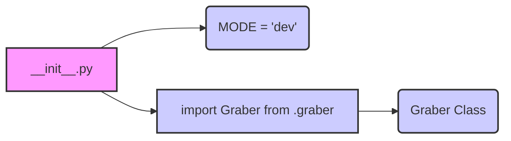

## Анализ кода `hypotez/src/suppliers/ebay/__init__.py`

### 1. <алгоритм>

1. **Инициализация режима:**
   - Устанавливается глобальная переменная `MODE` в значение `'dev'`. Это может использоваться для определения режима работы приложения (например, разработка или продакшн).
   - *Пример*: `MODE = 'dev'` означает, что приложение находится в режиме разработки.

2. **Импорт класса `Graber`:**
   - Из модуля `.graber` (который, как подразумевается, находится в той же директории) импортируется класс `Graber`.
   - *Пример*: `from .graber import Graber` делает класс `Graber` доступным для использования в текущем модуле (`__init__.py`).

### 2. <mermaid>

**Разбор диаграммы:**

- `A[__init__.py]` – представляет текущий файл `__init__.py`, который является начальной точкой модуля `src.suppliers.ebay`.
- `B(MODE = 'dev')` – переменная `MODE`, устанавливающая режим работы модуля.
- `C[import Graber from .graber]` –  операция импорта класса `Graber` из файла `graber.py` в той же директории.
- `D(Graber Class)` –  класс `Graber`, который был импортирован и доступен для использования.

**Зависимости:**

Диаграмма показывает, что `__init__.py` зависит от:
1.  **Переменной `MODE`**:  Инициализирует переменную для определения режима работы приложения.
2. **Класса `Graber`**: `__init__.py`  импортирует `Graber`, что указывает на зависимость текущего модуля от модуля `graber.py`.

### 3. <объяснение>

**Импорты:**

-   `from .graber import Graber`:
    -   **Назначение**: Импортирует класс `Graber` из файла `graber.py`, находящегося в той же директории, что и `__init__.py`.
    -   **Взаимосвязь**: Это устанавливает зависимость текущего модуля от класса `Graber`, который вероятно содержит логику для сбора данных с eBay.

**Классы:**

-   `Graber`:
    -   **Роль**: Судя по названию, класс `Graber` предназначен для сбора (граббинга) данных с веб-сайта eBay.
    -   **Атрибуты и методы**: (Неизвестны, так как код `graber.py` не предоставлен) Предположительно, класс содержит методы для отправки запросов к API eBay, парсинга HTML или JSON ответов, и извлечения необходимых данных.
    -   **Взаимодействие**: Класс может взаимодействовать с сетевыми библиотеками (например `requests`), библиотеками для парсинга (например `Beautiful Soup` или `lxml`), а так же может использовать другие классы внутри проекта.

**Функции:**

-   В данном коде нет функций, но присутсвует переменная `MODE`

**Переменные:**

-   `MODE = 'dev'`:
    -   **Тип**: Строка (`str`).
    -   **Использование**: Определяет текущий режим работы приложения. `'dev'` указывает на режим разработки.  Это позволяет, например, включать или отключать отладочные сообщения, использовать тестовые учетные данные API, или изменить поведение приложения в зависимости от среды.

**Потенциальные ошибки и области для улучшения:**

-   **Отсутствует документация**: Отсутствие docstring у модуля затрудняет понимание его назначения и использования.
-   **Жестко заданный режим**: Переменная `MODE` жестко задана в коде. Было бы лучше задавать ее через переменные окружения или аргументы командной строки.
-   **Отсутствует обработка ошибок**: В коде нет явной обработки исключений, что может привести к проблемам при работе с внешними ресурсами.
-   **Отсутствует описание `Graber`**:  Без кода модуля `graber.py` невозможно оценить функциональность класса `Graber` и потенциальные проблемы.

**Цепочка взаимосвязей:**

`hypotez/src/suppliers/ebay/__init__.py`
  - Зависит от `hypotez/src/suppliers/ebay/graber.py`.
  - Используется как модуль, предоставляющий функциональность для сбора данных с eBay.

**Общее заключение:**

Файл `__init__.py` служит точкой входа в пакет `src.suppliers.ebay`. Он инициализирует переменную `MODE` для определения режима работы приложения и импортирует класс `Graber`, который, вероятно, отвечает за сбор данных с eBay. Для более детального анализа необходим доступ к коду модуля `graber.py`.