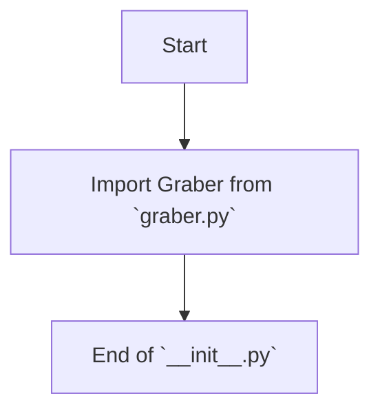

## АНАЛИЗ КОДА: `hypotez/src/suppliers/ebay/__init__.py`

### 1. <алгоритм>

1.  **Начало**: Программа начинается с импорта модуля `Graber` из текущей директории.

    *Пример:* `from .graber import Graber` - импортирует класс `Graber` из файла `graber.py`, находящегося в той же директории `ebay`.

2.  **Завершение**: Модуль `__init__.py` импортирует класс, делая его доступным для использования в других модулях проекта.

    *Пример:*  Другие модули в проекте могут теперь использовать `from src.suppliers.ebay import Graber` для создания объектов класса `Graber`.

### 2. <mermaid>

*   `Start`: Начало выполнения модуля `__init__.py`.
*   `ImportGraber`: Импорт класса `Graber` из файла `graber.py` в текущей директории. Это устанавливает зависимость от модуля `graber`.
*   `End`: Конец выполнения модуля, класс `Graber` теперь доступен для импорта в других частях проекта.

### 3. <объяснение>

**Импорты:**

*   `from .graber import Graber`: Этот импорт указывает, что из файла `graber.py`, расположенного в той же директории (`ebay`), импортируется класс `Graber`. Это делается для того, чтобы класс `Graber` был доступен при импорте пакета `src.suppliers.ebay`.

**Классы:**

*   `Graber`: Данный класс, предположительно, отвечает за сбор данных с платформы eBay. Он, вероятно, содержит методы для запросов к API eBay или парсинга HTML страниц. Детальная информация о его функциональности находится в файле `graber.py`. Класс будет доступен для создания экземпляров в других частях проекта.

**Функции:**
    *В данном файле нет функций.*

**Переменные:**
    *В данном файле нет переменных.*

**Объяснение:**

Файл `__init__.py` в пакете `src.suppliers.ebay` служит для инициализации пакета и делает его модули (в данном случае `graber.py`) доступными при импорте пакета. Импортируя класс `Graber` в `__init__.py`, мы позволяем другим частям проекта импортировать класс `Graber` напрямую из пакета `src.suppliers.ebay` через конструкцию `from src.suppliers.ebay import Graber`.

**Возможные улучшения:**

*   Добавить docstring к модулю `__init__.py` для более полного описания назначения пакета.
*   Если в будущем будут добавляться другие модули в пакет `ebay`, их также нужно будет импортировать в `__init__.py`, чтобы они были доступны для импорта извне.

**Взаимосвязи с другими частями проекта:**
Другие части проекта, которые зависят от сбора данных с eBay, будут импортировать класс `Graber` из `src.suppliers.ebay` и использовать его методы для получения необходимых данных. В целом, модуль `src.suppliers.ebay` будет предоставлять функциональность для работы с данными eBay другим модулям проекта.