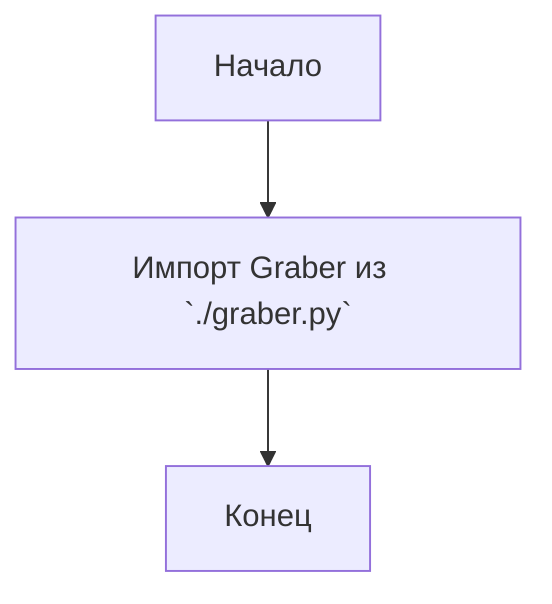

## АНАЛИЗ КОДА: `src/suppliers/ebay/__init__.py`

### 1. <алгоритм>

**Начало:**

1.  Импортируется модуль `graber` из текущего пакета (`.`).
2.  Создаётся объект `Graber` для работы со сбором данных.

**Пример:**

```python
from .graber import Graber

# Далее в коде (не в этом файле) можно будет создать экземпляр класса Graber
# grabber_instance = Graber(...)  
# И использовать его методы для сбора данных с eBay.
```

### 2. <mermaid>



**Объяснение `mermaid`:**

-   `Start`: Начальная точка выполнения скрипта.
-   `ImportGraber`: Импортирование класса `Graber` из модуля `graber.py`, находящегося в той же директории (`.`).
-  `End`: Конечная точка скрипта.

**Зависимости:**

Импортируется только один модуль - `graber`. Это предполагает, что класс `Graber` определен в файле `graber.py`, находящемся в той же директории, что и файл `__init__.py`.

### 3. <объяснение>

**Импорты:**

-   `from .graber import Graber`:
    -   Импортирует класс `Graber` из модуля `graber.py`, находящегося в текущем пакете (`.`).
    -   Это означает, что в файле `src/suppliers/ebay/graber.py` должен быть класс с именем `Graber`.
    -   Это позволяет использовать класс `Graber` в других частях проекта, импортировав пакет `src.suppliers.ebay`.
    -   Этот импорт устанавливает зависимость текущего модуля от модуля `graber`.

**Классы:**

-   Класс `Graber`:
    -   В файле `__init__.py` напрямую класс не используется, а только импортируется.
    -   Предполагается, что класс `Graber` находится в файле `src/suppliers/ebay/graber.py` и имеет функциональность, связанную со сбором данных с eBay.
    -   Его атрибуты, методы и взаимодействие с другими компонентами проекта описаны в файле `graber.py`.

**Функции:**

-   В данном файле нет функций.

**Переменные:**

-   В данном файле нет переменных.

**Дополнительно:**

-   Цепочка взаимосвязей:
    -   `src.suppliers.ebay.__init__.py` зависит от `src.suppliers.ebay.graber.py`.
    -   Другие модули в проекте могут зависеть от `src.suppliers.ebay`, импортируя этот пакет и используя класс `Graber`.
-   Потенциальные ошибки или области для улучшения:
    -   Недостаточно информации, если файла `src/suppliers/ebay/graber.py` нет или класс `Graber` в нем отсутствует.
    -   В `__init__.py` обычно размещают импорты для удобства и часто используют как точку входа для работы с пакетом.

В данном контексте, `__init__.py` служит для того, чтобы сделать пакет `src.suppliers.ebay` доступным для импорта и предоставить класс `Graber` как часть этого пакета. Это упрощает использование сборщика данных eBay в других частях проекта.