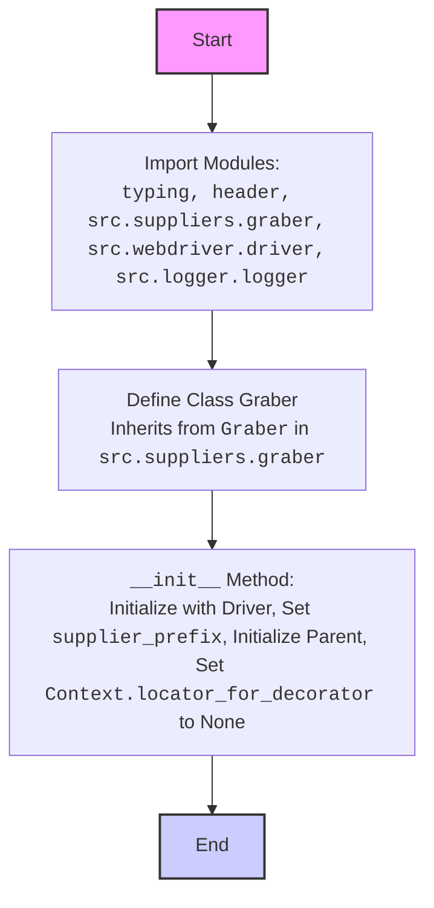

## ИНСТРУКЦИЯ:

Анализируй предоставленный код подробно и объясни его функциональность. Ответ должен включать три раздела:  

1. **<алгоритм>**: Опиши рабочий процесс в виде пошаговой блок-схемы, включая примеры для каждого логического блока, и проиллюстрируй поток данных между функциями, классами или методами.  
2. **<mermaid>**: Напиши код для диаграммы в формате `mermaid`, проанализируй и объясни все зависимости, 
    которые импортируются при создании диаграммы. 
    **ВАЖНО!** Убедитесь, что все имена переменных, используемые в диаграмме `mermaid`, 
    имеют осмысленные и описательные имена. Имена переменных вроде `A`, `B`, `C`, и т.д., не допускаются!  
    
    **Дополнительно**: Если в коде есть импорт `import header`, добавьте блок `mermaid` flowchart, объясняющий `header.py`:\
    ```mermaid
    flowchart TD
        Start --> Header[<code>header.py</code><br> Determine Project Root]
    
        Header --> import[Import Global Settings: <br><code>from src import gs</code>] 
    ```

3. **<объяснение>**: Предоставьте подробные объяснения:  
   - **Импорты**: Их назначение и взаимосвязь с другими пакетами `src.`.  
   - **Классы**: Их роль, атрибуты, методы и взаимодействие с другими компонентами проекта.  
   - **Функции**: Их аргументы, возвращаемые значения, назначение и примеры.  
   - **Переменные**: Их типы и использование.  
   - Выделите потенциальные ошибки или области для улучшения.  

Дополнительно, постройте цепочку взаимосвязей с другими частями проекта (если применимо).  

Это обеспечивает всесторонний и структурированный анализ кода.
## Формат ответа: `.md` (markdown)
**КОНЕЦ ИНСТРУКЦИИ**
```markdown
## <алгоритм>

1.  **Импорт модулей**:
    *   Импортируются необходимые модули и классы из других частей проекта `src`, а также стандартные библиотеки (`typing`).
    *   Пример: `from src.suppliers.graber import Graber as Grbr, Context` импортирует класс `Graber` как `Grbr` и класс `Context`.
2.  **Определение класса `Graber`**:
    *   Создается класс `Graber`, наследующий от `Grbr` из `src.suppliers.graber`.
    *   Устанавливается атрибут класса `supplier_prefix = 'ebay'`.
    *   Пример: `class Graber(Grbr): supplier_prefix: str`.
3.  **Инициализация `__init__`**:
    *   Метод инициализации принимает объект `Driver` (веб-драйвер).
    *   Устанавливает `self.supplier_prefix` в `'ebay'`.
    *   Вызывает конструктор родительского класса `Grbr` с `supplier_prefix` и `driver`.
    *   Устанавливает `Context.locator_for_decorator` в `None`.
    *   Пример: `def __init__(self, driver: Driver): ... Context.locator_for_decorator = None`.

**Поток данных:**

*   **Импорт**: Код импортирует модули, предоставляющие функциональность для сбора данных с веб-страниц, работы с веб-драйвером, логирования и т. д.
*   **Создание экземпляра `Graber`**: При создании объекта `Graber` передается объект `Driver`, предоставляющий доступ к веб-драйверу.
*   **Инициализация**: В методе `__init__` устанавливается `supplier_prefix` и вызывается конструктор родительского класса `Grbr`, настраивая сборщик для работы с eBay.
*   **Декоратор**:  Установка `Context.locator_for_decorator = None` означает что  декоратор `@close_pop_up`  не будет использован при  вызове  методов  класса `Graber`.

## <mermaid>

```mermaid
    flowchart TD
        Start --> Header[<code>header.py</code><br> Determine Project Root]
    
        Header --> import[Import Global Settings: <br><code>from src import gs</code>] 
    ```

**Анализ зависимостей `mermaid`:**

*   `Start`: Начало блок-схемы.
*  `ImportModules`:  Импортирует  необходимые  модули и классы, в том числе `typing`  для  типизации, `header` для работы с настройками, `src.suppliers.graber` для базовой логики сбора данных,  `src.webdriver.driver` для  управления веб-драйвером и `src.logger.logger` для логирования.
*   `DefineGraberClass`: Определяет класс `Graber`, который является наследником от класса `Graber`  из  модуля  `src.suppliers.graber`.
*   `InitGraber`:  Метод `__init__`, который инициализирует экземпляр класса `Graber`, принимая объект `Driver`. Устанавливает `supplier_prefix` на 'ebay', вызывает конструктор родительского класса и устанавливает `Context.locator_for_decorator` на `None`.
*   `End`: Конец блок-схемы.

**Анализ зависимостей `header.py`:**

*   `Start`: Начало блок-схемы `header.py`.
*   `Header`: Модуль `header.py` определяет корень проекта.
*   `import`: Импортируются глобальные настройки из `src.gs`.

## <объяснение>

**Импорты:**

*   `from typing import Any`: Импортируется `Any` для аннотации типов, когда тип данных может быть любым.
*   `import header`: Импортируется модуль `header`, который, вероятно, используется для определения корня проекта и загрузки глобальных настроек.
*   `from src.suppliers.graber import Graber as Grbr, Context, close_pop_up`: Импортируются класс `Graber` (переименованный как `Grbr`), класс `Context` и функция `close_pop_up` из модуля `src.suppliers.graber`. Этот модуль, вероятно, предоставляет базовую функциональность для сбора данных с веб-страниц.
*   `from src.webdriver.driver import Driver`: Импортируется класс `Driver` из модуля `src.webdriver.driver`, который, вероятно, отвечает за управление веб-драйвером.
*   `from src.logger.logger import logger`: Импортируется объект `logger` из модуля `src.logger.logger` для логирования событий.

**Классы:**

*   `class Graber(Grbr)`:
    *   **Роль**: Класс `Graber` предназначен для сбора данных с веб-страниц eBay.
    *   **Атрибуты**:
        *   `supplier_prefix`: Строковый атрибут класса, который хранит префикс поставщика (`'ebay'`).
    *   **Методы**:
        *   `__init__(self, driver: Driver)`:
            *   **Аргументы**: Принимает объект `Driver`.
            *   **Назначение**: Инициализирует объект `Graber`, устанавливает `supplier_prefix` и вызывает конструктор родительского класса `Grbr`. Устанавливает `Context.locator_for_decorator` в `None`.
            *   **Взаимодействие**: Использует объект `Driver` для инициализации базового класса и устанавливает атрибуты для eBay.
        
**Функции:**

*   В коде представлен шаблон декоратора  `close_pop_up`, но он закомментирован,  поэтому  он не  используется.

**Переменные:**

*   `supplier_prefix`: Строковая переменная, используемая для идентификации поставщика ('ebay').
*   `Context.locator_for_decorator`: Переменная, используемая для передачи локатора в декоратор. Устанавливается в `None`, отключая декоратор по умолчанию.

**Объяснения:**

*   Класс `Graber` специализируется на сборе данных с eBay, наследуя базовую функциональность от `Grbr`.
*   Использование `supplier_prefix` помогает идентифицировать поставщика данных.
*   `Context.locator_for_decorator = None` отключает применение декоратора по умолчанию для данного класса `Graber`. Если бы это значение было установлено, то декоратор `@close_pop_up` был бы использован перед каждым методом класса, и `Context.locator` был бы бы использован для закрытия всплывающих окон
*   Класс работает в связке с другими модулями проекта (`driver`, `logger`, `graber`).

**Потенциальные ошибки и области для улучшения:**

*   **Обработка ошибок**: В коде не предусмотрена детальная обработка исключений, связанных с веб-драйвером или сбором данных. Рекомендуется добавить более подробные блоки try-except для обработки возможных ошибок.
*   **Использование декораторов**: Закомментированный шаблон декоратора  не используется. Раскомментирование и настройка декоратора может  обеспечить более гибкий контроль над работой класса.
*   **Логирование**: Стоит добавить логирование важных действий и ошибок в методе `__init__`, чтобы облегчить отладку и мониторинг работы класса.

**Взаимосвязи с другими частями проекта:**

*   **src.suppliers.graber**: Класс `Graber` наследует от базового класса `Graber` в этом модуле, предполагая, что базовый класс предоставляет общий интерфейс для сбора данных с веб-страниц.
*   **src.webdriver.driver**: Класс `Driver` из этого модуля используется для управления веб-драйвером и доступа к веб-странице.
*   **src.logger.logger**: Объект `logger` из этого модуля используется для записи событий и ошибок в процессе работы класса.
*   **header.py**: модуль используется для загрузки настроек проекта, что может  влиять на поведение класса `Graber`.
```