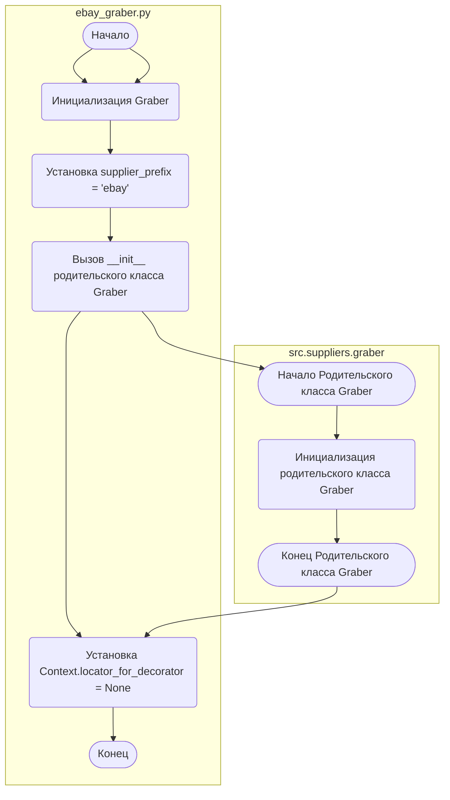
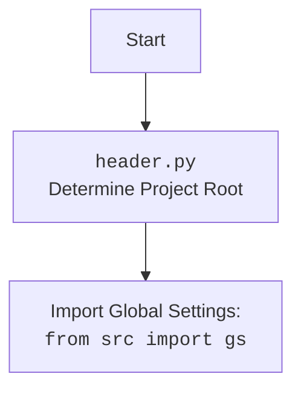

## АНАЛИЗ КОДА `hypotez/src/suppliers/ebay/graber.py`

### <алгоритм>

1.  **Инициализация:**
    *   При создании объекта `Graber` вызывается конструктор `__init__`.
    *   Устанавливается префикс поставщика (`supplier_prefix`) в значение `'ebay'`.
    *   Вызывается конструктор родительского класса `Graber` (из `src.suppliers.graber`), передавая `supplier_prefix` и объект `Driver`.
    *   Устанавливается `Context.locator_for_decorator` в `None`.

2.  **Декоратор (неактивен):**
    *   Определена, но закомментирована функция `close_pop_up`, предназначенная для создания декоратора, который закрывает всплывающие окна.
    *   Внутри `close_pop_up` находится функция `decorator`, которая принимает функцию `func` в качестве аргумента.
    *   Внутри `decorator` находится функция `wrapper`, которая:
        *   Пытается выполнить локатор для закрытия всплывающего окна (закомментировано).
        *   Обрабатывает исключение `ExecuteLocatorException`, если таковое возникает.
        *   Вызывает декорируемую функцию `func` и возвращает ее результат.
        *  Декоратор `close_pop_up` не используется, так как вызов не раскоментирован и `Context.locator_for_decorator` установлено значение `None`.
3.  **Класс `Graber`:**
    *   Наследуется от класса `Graber` из модуля `src.suppliers.graber`.
    *   Имеет атрибут класса `supplier_prefix`.
    *   Имеет метод `__init__`, который инициализирует экземпляр класса.

**Пример:**
```
# Создание объекта Graber
driver_instance = Driver()  
graber_instance = Graber(driver=driver_instance)
# supplier_prefix = 'ebay'
# вызывается конструктор родительского класса Graber
# Context.locator_for_decorator = None
```

**Поток данных:**
1.  Объект `Driver` передается в конструктор класса `Graber`.
2.  Префикс поставщика `'ebay'` сохраняется в атрибуте `supplier_prefix`.
3.  Конструктор родительского класса `Graber` использует переданные данные и устанавливает  `Context.locator_for_decorator = None`.

### <mermaid>



**Разбор зависимостей `mermaid`:**

*   `ebay_graber.py`: Основной модуль, содержащий класс `Graber` для eBay.
*   `src.suppliers.graber`: Родительский класс `Graber`, от которого наследуется класс `Graber` в `ebay_graber.py`.
*   `Driver`: Класс, представляющий веб-драйвер (не показан на диаграмме, но используется в инициализации).
*   `Context`: Глобальный контекст, используемый для хранения настроек и данных (не показан на диаграмме, но используется для установки `locator_for_decorator`).

### <объяснение>

1.  **Импорты:**

    *   `from typing import Any`: Импортирует тип `Any`, используемый для аннотации типов переменных, которые могут принимать любое значение.
    *   `import header`: Импортирует модуль `header`. Предположительно, этот модуль используется для определения корневой директории проекта и загрузки глобальных настроек, но в представленном коде явно не используется.
     *   `from src.suppliers.graber import Graber as Grbr, Context, close_pop_up`: Импортирует класс `Graber`, `Context` и функцию `close_pop_up` из модуля `src.suppliers.graber`. `Graber` переименовывается в `Grbr`.
    *   `from src.webdriver.driver import Driver`: Импортирует класс `Driver` из модуля `src.webdriver.driver`, который, вероятно, используется для управления веб-драйвером.
    *   `from src.logger.logger import logger`: Импортирует объект `logger` для ведения журнала.

2.  **Классы:**

    *   `class Graber(Grbr):`:
        *   Это основной класс для сбора данных с eBay, который наследуется от `src.suppliers.graber.Graber` (импортируется как `Grbr`).
        *   `supplier_prefix`: Атрибут класса, который устанавливает префикс поставщика (в данном случае `'ebay'`).
        *   `__init__(self, driver: Driver)`: Конструктор класса. Принимает объект `Driver` в качестве аргумента. Инициализирует экземпляр класса, устанавливая префикс поставщика и вызывая конструктор родительского класса. Также устанавливает `Context.locator_for_decorator` в `None`.

3.  **Функции:**

    *   `close_pop_up(value: Any = None) -> Callable`:
        *   Функция, предназначенная для создания декоратора для закрытия всплывающих окон.
        *   Принимает необязательный аргумент `value` типа `Any`.
        *   Возвращает декоратор.
        *   **Примечание:** Этот декоратор закомментирован и в данном коде не используется.
        *   Декоратор обертывает функцию, и при вызове оборачиваемой функции перед ее выполнением пытается закрыть всплывающее окно.

4.  **Переменные:**

    *   `supplier_prefix: str`: Атрибут класса `Graber`, содержащий префикс поставщика.
    *   `driver: Driver`:  В экземпляре класса `Graber` хранит объект типа `Driver`, который используется для управления веб-драйвером.
    *   `Context.locator_for_decorator`:  Глобальная переменная, которая хранит локатор для выполнения в декораторе, в этом случае установлено в `None`.

**Взаимосвязь с другими частями проекта:**

*   **`src.suppliers.graber`**: Класс `Graber` наследуется от класса `Graber` в этом модуле, что предполагает наличие общей логики для сбора данных с разных поставщиков.
*   **`src.webdriver.driver`**: Класс `Driver` используется для взаимодействия с веб-драйвером, вероятно, для управления браузером.
*   **`src.logger.logger`**:  Объект `logger` используется для логирования событий и ошибок.
*   **`header.py`**:  Предположительно используется для определения корневой директории проекта и загрузки глобальных настроек.

**Потенциальные ошибки и области для улучшения:**

*   Декоратор `close_pop_up` закомментирован, и не используется. Если он необходим, то следует его раскомментировать.
*   Отсутствует реализация основной логики сбора данных. Необходимо добавить функции сбора полей товара.
*   Необходимо добавить обработку возможных исключений во время сбора данных.
*   Необходимо подробнее изучить модуль `header.py` для понимания его роли в проекте.

**Дополнительно:**
**`header.py` блок `mermaid` flowchart:**


Этот flowchart показывает, что `header.py` используется для определения корневой директории проекта и импорта глобальных настроек из `src.gs`. Это важный модуль, который помогает в настройке проекта и обеспечивает доступ к общим переменным.