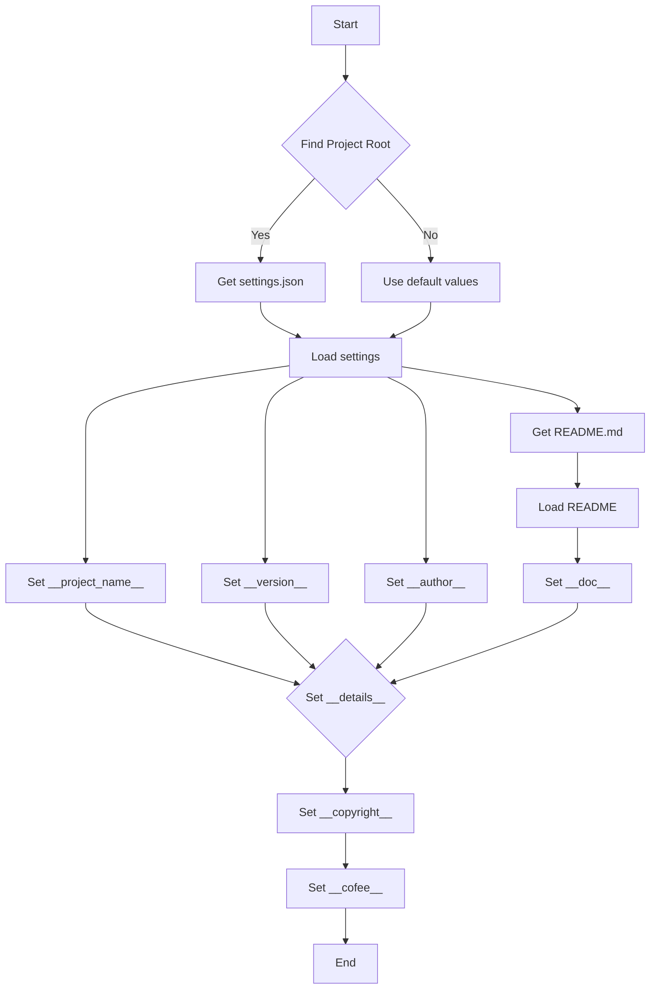
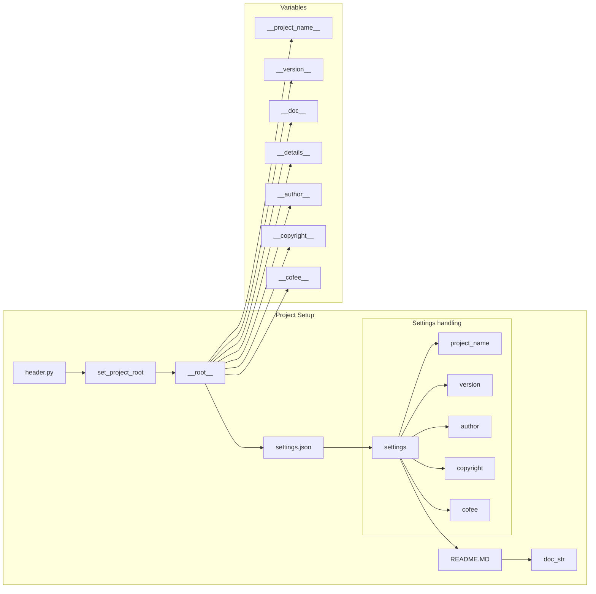

# <input code>

```python
## \file hypotez/src/suppliers/ebay/header.py
# -*- coding: utf-8 -*-
#! venv/Scripts/python.exe
#! venv/bin/python/python3.12

"""
.. module: src.suppliers.ebay 
	:platform: Windows, Unix
	:synopsis:

"""
MODE = 'dev'

import sys
import json
from packaging.version import Version

from pathlib import Path
def set_project_root(marker_files=('pyproject.toml', 'requirements.txt', '.git')) -> Path:
    """
    Finds the root directory of the project starting from the current file's directory,
    searching upwards and stopping at the first directory containing any of the marker files.

    Args:
        marker_files (tuple): Filenames or directory names to identify the project root.
    
    Returns:
        Path: Path to the root directory if found, otherwise the directory where the script is located.
    """
    __root__:Path
    current_path:Path = Path(__file__).resolve().parent
    __root__ = current_path
    for parent in [current_path] + list(current_path.parents):
        if any((parent / marker).exists() for marker in marker_files):
            __root__ = parent
            break
    if __root__ not in sys.path:
        sys.path.insert(0, str(__root__))
    return __root__


# Get the root directory of the project
__root__ = set_project_root()
"""__root__ (Path): Path to the root directory of the project"""

from src import gs

settings:dict = None
try:
    with open(gs.path.root / 'src' /  'settings.json', 'r') as settings_file:
        settings = json.load(settings_file)
except (FileNotFoundError, json.JSONDecodeError):
    ...

doc_str:str = None
try:
    with open(gs.path.root / 'src' /  'README.MD', 'r') as settings_file:
        doc_str = settings_file.read()
except (FileNotFoundError, json.JSONDecodeError):
    ...


__project_name__ = settings.get("project_name", 'hypotez') if settings  else 'hypotez'
__version__: str = settings.get("version", '')  if settings  else ''
__doc__: str = doc_str if doc_str else ''
__details__: str = ''
__author__: str = settings.get("author", '')  if settings else ''
__copyright__: str = settings.get("copyrihgnt", '')  if settings else ''
__cofee__: str = settings.get("cofee", "Treat the developer to a cup of coffee for boosting enthusiasm in development: https://boosty.to/hypo69")  if settings else "Treat the developer to a cup of coffee for boosting enthusiasm in development: https://boosty.to/hypo69"
```

# <algorithm>



**Пошаговое объяснение:**

1. **Найти корень проекта (B):** Функция `set_project_root` ищет родительские директории, начиная с текущей, пока не найдет директорию, содержащую указанные файлы (pyproject.toml, requirements.txt, .git). Результат сохраняется в переменной `__root__` (тип `Path`).
2. **Получить settings.json (C):** Проверяется, существует ли файл settings.json в корне проекта.
3. **Загрузить настройки (E):** Если файл существует, он загружается в переменную `settings` с помощью `json.load()`.  Если файл не найден или невалиден, выполняется блок except.
4. **Получить README.md (F):** Проверяется, существует ли README.MD в корне проекта.
5. **Загрузить README (G):** Если файл существует, он считывается в переменную `doc_str`. Если файл не найден или невалиден, выполняется блок except.
6. **Установить значения для переменных (H-N):** Программа получает значения из настроек, если они существуют. Если нет, используются значения по умолчанию. Эти значения сохраняются в переменных `__project_name__`, `__version__`, `__doc__`, `__details__`, `__author__`, `__copyright__`, `__cofee__`.


# <mermaid>



# <explanation>

**Импорты:**

- `sys`:  Используется для добавления директории проекта в `sys.path`, чтобы импортировать модули из `src`.
- `json`: Используется для работы с файлом `settings.json`.
- `packaging.version`: Используется для работы с версиями пакетов. Необязателен в данном контексте.
- `pathlib`: Используется для работы с путями к файлам.
- `src.gs`:  Необходимый модуль для доступа к пути к корневой директории проекта. Предполагается, что `gs` определён в другом модуле.

**Классы:**

Нет определённых классов.

**Функции:**

- `set_project_root(marker_files)`:  Находит корневую директорию проекта, начиная с текущего файла. Принимает кортеж `marker_files` для поиска файлов-маркеров (pyproject.toml, requirements.txt, .git).  Возвращает путь (`Path`) к корневой директории проекта, добавляя его в `sys.path`, если его там нет.

**Переменные:**

- `MODE`: Строковая переменная, вероятно, для обозначения режима работы.
- `__root__`: Путь (`Path`) к корневой директории проекта.
- `settings`: Словарь (`dict`) с настройками проекта.
- `doc_str`: Строка (`str`) содержимого файла `README.md`.
-  `__project_name__`, `__version__`, `__doc__`, `__details__`, `__author__`, `__copyright__`, `__cofee__`: Строковые переменные, содержащие информацию о проекте.

**Возможные ошибки и улучшения:**

- **Обработка ошибок:** Блоки `try...except` для открытия `settings.json` и `README.MD` важны для предотвращения аварийных ситуаций. Однако можно добавить более детальные проверки, например, для `JSONDecodeError`.
- **Обработка валидности данных:**  Проверка корректности загруженных данных из `settings.json` (например, наличие необходимых ключей) могла бы сделать код более устойчивым.
- **Документация:** Документация к коду (документальные строки) должна быть более подробной и информативной.
- **Взаимосвязи:** Необходимо прояснить взаимосвязи с модулем `src.gs` (определение `gs.path.root`). Без понимания этой связи невозможно оценить все зависимости.  Как `gs` обрабатывает пути и как он интегрируется в систему?

**Цепочка взаимосвязей:**

`header.py` зависит от `src.gs` (для доступа к корневой директории).  `header.py` извлекает информацию о проекте (имя, версия, описание), которая хранится в `settings.json` и `README.MD`.  Эта информация, вероятно, будет использоваться другими модулями в проекте.