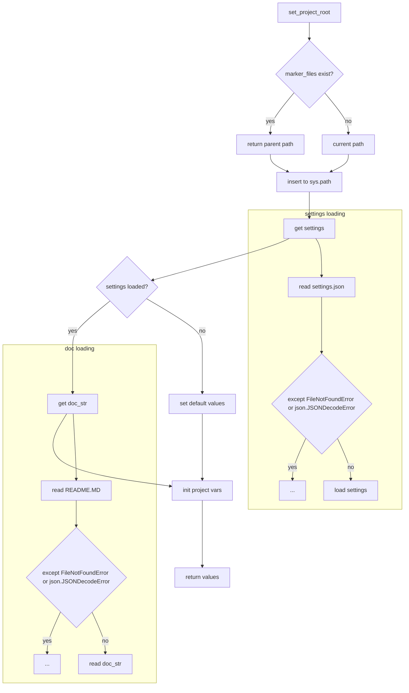

# <input code>

```python
## \file hypotez/src/suppliers/ebay/header.py
# -*- coding: utf-8 -*-\
#! venv/Scripts/python.exe
#! venv/bin/python/python3.12

"""
.. module: src.suppliers.ebay 
	:platform: Windows, Unix
	:synopsis:

"""
MODE = 'dev'

import sys
import json
from packaging.version import Version

from pathlib import Path
def set_project_root(marker_files=('pyproject.toml', 'requirements.txt', '.git')) -> Path:
    """
    Finds the root directory of the project starting from the current file's directory,
    searching upwards and stopping at the first directory containing any of the marker files.

    Args:
        marker_files (tuple): Filenames or directory names to identify the project root.
    
    Returns:
        Path: Path to the root directory if found, otherwise the directory where the script is located.
    """
    __root__:Path
    current_path:Path = Path(__file__).resolve().parent
    __root__ = current_path
    for parent in [current_path] + list(current_path.parents):
        if any((parent / marker).exists() for marker in marker_files):
            __root__ = parent
            break
    if __root__ not in sys.path:
        sys.path.insert(0, str(__root__))
    return __root__


# Get the root directory of the project
__root__ = set_project_root()
"""__root__ (Path): Path to the root directory of the project"""

from src import gs

settings:dict = None
try:
    with open(gs.path.root / 'src' /  'settings.json', 'r') as settings_file:
        settings = json.load(settings_file)
except (FileNotFoundError, json.JSONDecodeError):
    ...

doc_str:str = None
try:
    with open(gs.path.root / 'src' /  'README.MD', 'r') as settings_file:
        doc_str = settings_file.read()
except (FileNotFoundError, json.JSONDecodeError):
    ...


__project_name__ = settings.get("project_name", 'hypotez') if settings  else 'hypotez'
__version__: str = settings.get("version", '')  if settings  else ''
__doc__: str = doc_str if doc_str else ''
__details__: str = ''
__author__: str = settings.get("author", '')  if settings else ''
__copyright__: str = settings.get("copyrihgnt", '')  if settings else ''
__cofee__: str = settings.get("cofee", "Treat the developer to a cup of coffee for boosting enthusiasm in development: https://boosty.to/hypo69")  if settings else "Treat the developer to a cup of coffee for boosting enthusiasm in development: https://boosty.to/hypo69"
```

# <algorithm>

1. **`set_project_root()`:**
    * Принимает кортеж `marker_files` (файлы для поиска корня проекта).
    * Начинает поиск с текущего каталога (`Path(__file__).resolve().parent`).
    * Итерируется по родительским каталогам.
    * Для каждого родительского каталога проверяет наличие файлов из `marker_files` внутри него.
    * Если файл найден, то возвращает путь к этому родителю.
    * Если ни один файл не найден, возвращает путь к текущему каталогу.
    * Добавляет найденный путь к `sys.path`, если он еще не присутствует.

2. **Получение настроек (`settings`):**
    * Используется модуль `gs` для получения пути к файлу `settings.json`.
    * Файл открывается и загружается с помощью `json.load()`.
    * Обрабатываются возможные исключения `FileNotFoundError` и `json.JSONDecodeError`, если файл не найден или содержит некорректные данные.

3. **Получение документации (`doc_str`):**
    * Аналогично, загружает `README.MD` в переменную `doc_str`
    * Обрабатываются возможные исключения `FileNotFoundError` и `json.JSONDecodeError`.

4. **Инициализация переменных:**
    * Используются значения из `settings` для инициализации переменных проекта: `__project_name__`, `__version__`, `__author__`, `__copyright__`, `__cofee__`.
    * Если значение не найдено в `settings`, используется значение по умолчанию.
    * `__doc__` заполняется из загруженной документации.
    * `__details__` остается пустой.


Пример:
Если `__file__` находится в `hypotez/src/suppliers/ebay/header.py`, поиск пойдет по `hypotez/src/suppliers/ebay`, `hypotez/src/suppliers`, `hypotez/src`, `hypotez`. Если в `hypotez` найдется `pyproject.toml`, то это и будет корнем проекта.


# <mermaid>



# <explanation>

**Импорты:**

* `sys`:  Предоставляет доступ к системным переменным, включая `sys.path`, что используется для добавления пути к проекту в среду выполнения.
* `json`: Используется для работы с файлами JSON (чтения настроек).
* `packaging.version`:  Вероятно, используется для работы с версиями пакетов, но в этом коде не используется явно.
* `pathlib`: Предоставляет удобный способ работы с путями к файлам и каталогам. Это позволяет создавать и работать с путями, используя понятный синтаксис.


**Классы:**

Нет классов в этом коде.


**Функции:**

* `set_project_root(marker_files)`:  Находит корневую директорию проекта, начиная с текущего файла. Она ищет директории, содержащие файлы, указанные в `marker_files` (в данном случае `pyproject.toml`, `requirements.txt`, `.git`).  Если корень не найден, возвращает путь текущей директории.  Это критично для корректной работы импорта модулей, поскольку изменяет `sys.path`.

**Переменные:**

* `MODE`:  Строковая переменная, вероятно, хранящая режим работы приложения ('dev' в данном случае).
* `__root__`:  Путь к корневой директории проекта.
* `settings`: Словарь, хранящий настройки проекта, загруженные из `settings.json`.
* `doc_str`:  Строка, хранящая содержимое файла `README.MD`.
* `__project_name__`, `__version__`, `__author__`, `__copyright__`, `__cofee__`, `__doc__`: Переменные, содержащие информацию о проекте. Значения берутся из `settings.json` или устанавливаются по умолчанию, если соответствующие ключи отсутствуют.


**Возможные ошибки и улучшения:**

* **Обработка ошибок:** Блоки `try...except` для `settings.json` и `README.MD` хорошо обрабатывают возможные ошибки при чтении файлов, но могут быть улучшены, добавлением более информативных сообщений или logging.


**Взаимосвязи с другими частями проекта:**

Функция `set_project_root` и `settings` обеспечивают фундаментальное понимание проекта и пути к файлам.
Модуль `gs` отвечает за более продвинутые операции с путями, что делает этот код более универсальным для различных частей проекта.  Без `gs`, этот код был бы намного менее гибким.