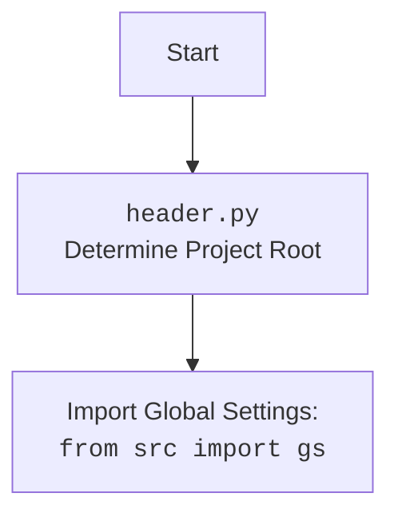

## <алгоритм>

1.  **`set_project_root(marker_files)` Function:**
    *   **Начало:** Функция вызывается с `marker_files` (кортеж имен файлов/директорий, например, `('__root__', '.git')`).
    *   **Инициализация:**
        *   `__root__` -  переменная типа `Path` для хранения пути к корневой директории, изначально устанавливается в None
        *   `current_path` получает абсолютный путь к директории, где находится текущий файл `header.py`.
        *   `__root__` изначально устанавливается в `current_path`.
    *   **Поиск корня проекта:**
        *   Функция перебирает директории, начиная с текущей и поднимаясь вверх по дереву (`current_path` и все его родительские директории).
        *   Для каждой директории `parent` проверяет, существует ли в ней какой-либо из `marker` файлов/директорий, указанных в `marker_files`.
        *   Если хотя бы один из `marker` файлов/директорий найден в `parent`, то  `__root__` устанавливается в `parent` и цикл прерывается.
    *   **Добавление в `sys.path`:**
        *   Проверяется, не находится ли `__root__` уже в списке путей поиска модулей Python (`sys.path`).
        *   Если `__root__` нет в `sys.path`, то  `__root__` добавляется в начало списка `sys.path`, чтобы модули в корневой директории можно было импортировать.
    *   **Возврат:** Функция возвращает `__root__`, путь к корневой директории проекта.

2.  **Вызов `set_project_root()` и получение `__root__`:**
    *   Функция `set_project_root()` вызывается, и ее результат присваивается глобальной переменной `__root__`.

3.  **Импорт `gs`:**
    *   Выполняется `from src import gs`, импортируя модуль `gs` из пакета `src`. Этот модуль, как предполагается, содержит глобальные настройки проекта.

4.  **Чтение `settings.json`:**
    *   Инициализируется переменная `settings` как `None`.
    *   Блок `try-except` пытается открыть файл `settings.json` (предположительно, расположенный в `src/settings.json` относительно корня проекта).
    *   Если файл успешно открыт и содержимое JSON корректно, `settings` присваивается словарь, полученный из JSON файла.
    *   Если происходит ошибка `FileNotFoundError` или `json.JSONDecodeError`, переменная settings остаётся `None`.

5.   **Чтение `README.MD`:**
    *   Инициализируется переменная `doc_str` как `None`.
    *   Блок `try-except` пытается открыть файл `README.MD` (предположительно, расположенный в `src/README.MD` относительно корня проекта).
    *   Если файл успешно открыт, `doc_str` присваивается строковое содержимое файла.
    *   Если происходит ошибка `FileNotFoundError` или `json.JSONDecodeError`, переменная `doc_str` остаётся `None`.

6.  **Инициализация глобальных переменных:**
    *   Из словаря `settings` (если он был успешно загружен) или значения по умолчанию инициализируются глобальные переменные:
        *   `__project_name__` : имя проекта. По умолчанию: `'hypotez'`.
        *   `__version__` : версия проекта. По умолчанию: `''`.
        *   `__doc__` : описание проекта. Значение берется из файла `README.MD`, если он был успешно загружен. По умолчанию `''`.
        *   `__details__` :  по умолчанию: `''`.
        *   `__author__` : автор проекта. По умолчанию: `''`.
        *   `__copyright__` : копирайт проекта. По умолчанию: `''`.
        *   `__cofee__` : строка с призывом угостить разработчика кофе. По умолчанию: `'Treat the developer to a cup of coffee for boosting enthusiasm in development: https://boosty.to/hypo69'`.

## <mermaid>

```mermaid
flowchart TD
    Start[Start] --> FindRoot[<code>set_project_root()</code><br>Find Project Root Directory];
    FindRoot -- Root Path -->  SetRoot[<code>__root__</code> = root_path <br> Set Project Root Path];
    SetRoot --> CheckSysPath[Check if <br> <code>__root__</code> in sys.path ];
    CheckSysPath -- No --> InsertSysPath[<code>sys.path.insert(0, str(__root__))</code> <br> Add root to sys.path];
     CheckSysPath -- Yes --> ImportGS[<code>from src import gs</code> <br> Import Global Settings];
    InsertSysPath --> ImportGS
    ImportGS --> LoadSettingsJson[Load settings.json <br> from <code>gs.path.root</code>/src/settings.json]
    LoadSettingsJson -- Success --> LoadReadme[Load README.MD <br> from <code>gs.path.root</code>/src/README.MD]
    LoadSettingsJson -- Failure --> LoadReadme
    LoadReadme  -- Success --> SetGlobals[Set global variables <br> <code>__project_name__</code>, <br><code>__version__</code>, etc.]
    LoadReadme -- Failure --> SetGlobals
    SetGlobals --> End[End]
     
```



**Объяснение зависимостей:**

*   `sys`: Используется для доступа к системным переменным и функциям, в частности для модификации `sys.path` (пути поиска модулей Python).
*   `json`: Используется для работы с JSON-файлами (чтение настроек из `settings.json`).
*   `packaging.version`: Импортируется `Version` класс, но не используется непосредственно в представленном коде, что может свидетельствовать о его возможном использовании в других частях проекта
*   `pathlib`: Модуль `Path` используется для работы с путями к файлам и директориям, делает код более кросс-платформенным и удобочитаемым.
*   `src.gs`: Предполагается, что `gs` - это модуль, содержащий глобальные настройки и константы проекта. Импортируется после определения корня проекта, так как путь к `settings.json`  зависит от этого корня.

## <объяснение>

### Импорты:

*   **`sys`**: Используется для доступа к переменной `sys.path`, которая содержит список путей, где Python ищет модули для импорта. Модификация `sys.path` позволяет импортировать модули из корневой директории проекта.
*   **`json`**: Используется для работы с файлами JSON. В этом коде используется для чтения файла `settings.json`, который содержит настройки проекта.
*   **`packaging.version.Version`**:  Используется для управления версиями пакета, но в текущем файле не используется, что может свидетельствовать о его использовании в других частях проекта.
*   **`pathlib.Path`**:  Предоставляет объектно-ориентированный способ работы с путями файлов и директорий. Делает код более читабельным и кросс-платформенным.
*   **`src.gs`**:  Модуль `gs` (предположительно, от "global settings") является частью пакета `src` и содержит глобальные настройки, такие как путь к корню проекта.

### Классы:
*   В данном коде нет классов.

### Функции:

*   **`set_project_root(marker_files)`**:
    *   **Аргументы**:
        *   `marker_files` (tuple): Кортеж имен файлов или директорий, которые используются для определения корневой директории проекта. По умолчанию `('__root__', '.git')`.
    *   **Возвращаемое значение**:
        *   `Path`: Объект `Path`, представляющий абсолютный путь к корневой директории проекта.
    *   **Назначение**:
        *   Определяет корневую директорию проекта, начиная с директории текущего файла и двигаясь вверх по дереву каталогов, пока не найдет директорию, содержащую один из файлов или директорий, указанных в `marker_files`.
        *   Добавляет корневую директорию проекта в `sys.path` для корректного импорта модулей.
    *   **Пример:**
        Если файл `header.py` находится в директории `/path/to/project/src/suppliers/ebay/` и  в `/path/to/project/`  есть файл с именем `__root__`, то функция вернет `Path('/path/to/project/')`.

### Переменные:

*   **`__root__`**:
    *   **Тип**: `pathlib.Path`
    *   **Использование**: Содержит путь к корневой директории проекта, определенный функцией `set_project_root()`. Используется для построения путей к другим файлам в проекте.
*   **`settings`**:
    *   **Тип**: `dict` или `None`
    *   **Использование**: Содержит словарь с настройками проекта, полученный из файла `settings.json`. Если файл не найден или не может быть прочитан, то равен `None`.
*   **`doc_str`**:
    *    **Тип**: `str` или `None`
    *   **Использование**: Содержит строку документации проекта, прочитанную из файла `README.MD`. Если файл не найден или не может быть прочитан, то равен `None`.
*   **`__project_name__`**:
    *   **Тип**: `str`
    *   **Использование**: Содержит имя проекта, полученное из `settings` или значение по умолчанию `'hypotez'`.
*   **`__version__`**:
    *   **Тип**: `str`
    *   **Использование**: Содержит версию проекта, полученную из `settings` или значение по умолчанию `''`.
*   **`__doc__`**:
     *   **Тип**: `str`
     *   **Использование**: Содержит описание проекта.
*   **`__details__`**:
    *   **Тип**: `str`
    *   **Использование**:  Не используется, инициализируется пустой строкой.
*  **`__author__`**:
    *   **Тип**: `str`
    *   **Использование**: Содержит автора проекта, полученного из `settings` или значение по умолчанию `''`.
*   **`__copyright__`**:
     *   **Тип**: `str`
     *   **Использование**: Содержит копирайт проекта, полученный из `settings` или значение по умолчанию `''`.
*   **`__cofee__`**:
     *   **Тип**: `str`
     *   **Использование**: Содержит сообщение с призывом поддержать разработчика, полученное из `settings` или значение по умолчанию.

### Потенциальные ошибки и области для улучшения:

*   **Отсутствие обработки исключений для `sys.path.insert()`**:  Добавление пути в `sys.path` может вызвать исключение, если путь не является строкой. В текущем коде нет обработки этих исключений.
*   **Жестко заданные пути:** Путь `src/settings.json` и `src/README.MD` заданы в коде. Это может стать проблемой, если структура каталогов изменится. Возможно, стоит использовать относительные пути.
*   **Отсутствие проверок на типы и значения в JSON**: Код не проверяет, что значения в `settings.json` имеют правильные типы и значения. Это может привести к ошибкам во время работы программы.
*   **Неиспользуемый импорт**: Импорт `packaging.version.Version`, который не используется, стоит убрать, если он не требуется.
*   **Отсутствие подробной обработки ошибок:** Обработка исключений `FileNotFoundError` и `json.JSONDecodeError`  заканчивается просто многоточием. Стоит добавить более информативное логирование ошибок.

### Взаимосвязи с другими частями проекта:

*   **Зависимость от `src.gs`**: Данный модуль зависит от модуля `gs` для получения пути к корню проекта и файлам настроек.
*   **Настройки проекта**: Файл `settings.json` является центральным местом для хранения настроек, что влияет на поведение всего проекта.
*   **Использование глобальных переменных**: Глобальные переменные (`__project_name__`, `__version__`, `__doc__` и т.д.) используются в других частях проекта для получения информации о проекте.
*   **Импорт**:  Модуль `header.py` импортируется другими частями проекта для доступа к глобальным переменным и константам.

**Цепочка взаимосвязей:**

1.  `header.py` определяет корень проекта.
2.  `header.py` импортирует `gs` из `src`, полагаясь на то, что корневая директория уже установлена.
3.  `header.py` читает `settings.json` из пути, полученного от `gs` (основанного на корне проекта).
4.  `header.py` устанавливает глобальные переменные на основе прочитанных настроек.
5.  Другие модули в проекте импортируют переменные из `header.py` , чтобы получить доступ к настройкам проекта.