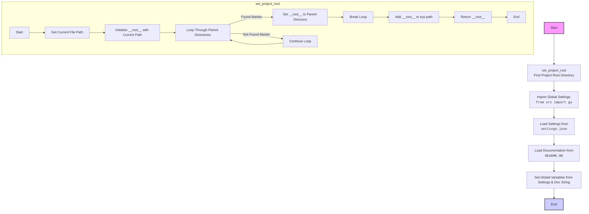

## <алгоритм>

1. **`set_project_root(marker_files)`**:
   - **Начало**: Функция принимает кортеж `marker_files` (по умолчанию `('__root__',)`) для поиска корневой директории проекта.
   - **Определение текущего пути**: Получает абсолютный путь к директории, где находится текущий файл (`__file__`), и сохраняет его в `current_path`.
     *Пример: Если файл `header.py` находится в `/home/user/hypotez/src/suppliers/ebay/`, то `current_path` будет `/home/user/hypotez/src/suppliers/ebay/`.*
   - **Инициализация `__root__`**:  Переменной `__root__` присваивается значение `current_path`.
   - **Поиск родительских директорий**: Перебираются текущая директория и все её родительские директории.
     *Пример: для `current_path` `/home/user/hypotez/src/suppliers/ebay/` будут перебираться `/home/user/hypotez/src/suppliers/ebay/`, `/home/user/hypotez/src/suppliers/`, `/home/user/hypotez/src/`, `/home/user/hypotez/`, `/home/user/` и `/home/`.*
   - **Проверка на наличие маркеров**: Для каждой родительской директории проверяется наличие файлов или директорий с именами из `marker_files`.
     *Пример: Если `marker_files` = `('__root__',)` и в `/home/user/hypotez/` есть файл с именем `__root__`, то цикл остановится на этой директории.*
   - **Обновление `__root__`**: Если маркер найден, `__root__` присваивается путь к родительской директории, где найден маркер, и цикл прерывается.
   - **Добавление в `sys.path`**: Если `__root__` нет в `sys.path`, то `__root__` добавляется в начало списка путей поиска модулей.
   - **Возврат `__root__`**: Функция возвращает путь к корневой директории проекта.
2. **Инициализация `__root__`**:  Вызывает `set_project_root()` и сохраняет результат в `__root__`.
3. **Импорт `gs`**: Импортирует модуль `gs` из `src`.
4. **Загрузка настроек из `settings.json`**:
   - Пытается открыть файл `settings.json`, расположенный по пути `gs.path.root / 'src' / 'settings.json'`.
     *Пример: Если `gs.path.root` равен `/home/user/hypotez`, то файл будет искаться по пути `/home/user/hypotez/src/settings.json`.*
   - Если файл открывается успешно, то считывает JSON данные и сохраняет их в `settings`.
   - В случае `FileNotFoundError` или `json.JSONDecodeError` пропускает ошибку.
5. **Чтение документации из `README.MD`**:
   - Пытается открыть файл `README.MD`, расположенный по пути `gs.path.root / 'src' / 'README.MD'`.
      *Пример: Если `gs.path.root` равен `/home/user/hypotez`, то файл будет искаться по пути `/home/user/hypotez/src/README.MD`.*
   - Если файл открывается успешно, то считывает его содержимое и сохраняет в `doc_str`.
   - В случае `FileNotFoundError` или `json.JSONDecodeError` пропускает ошибку.
6. **Инициализация глобальных переменных**:
   - `__project_name__`:  Берется из `settings['project_name']`, если `settings` существует, иначе `'hypotez'`.
   - `__version__`: Берется из `settings['version']`, если `settings` существует, иначе `''`.
   - `__doc__`: Присваивается `doc_str`, если `doc_str` определен, иначе `''`.
   - `__details__`: Инициализируется пустой строкой `''`.
   - `__author__`: Берется из `settings['author']`, если `settings` существует, иначе `''`.
   - `__copyright__`: Берется из `settings['copyrihgnt']`, если `settings` существует, иначе `''`.
    - `__cofee__`: Берется из `settings['cofee']`, если `settings` существует, иначе "Treat the developer to a cup of coffee for boosting enthusiasm in development: https://boosty.to/hypo69".

## <mermaid>



**Анализ зависимостей:**

-   `Start` -> `FindRoot`: Начало выполнения скрипта, вызывается функция `set_project_root` для определения корневой директории.
-   `FindRoot` -> `ImportGS`: После определения корневой директории, импортируются глобальные настройки из модуля `src.gs`.
-   `ImportGS` -> `LoadSettings`: Загрузка настроек из файла `settings.json` с использованием `gs.path.root`.
-   `LoadSettings` -> `LoadDocString`:  Загрузка строки документации из файла `README.MD` с использованием `gs.path.root`.
-   `LoadDocString` -> `SetGlobals`: Инициализация глобальных переменных на основе загруженных настроек и документации.
-   `SetGlobals` -> `End`: Конец выполнения скрипта.

**Диаграмма `set_project_root`:**
-  `StartRoot` -> `GetCurrentPath`: Начало выполнения `set_project_root`, получение пути к текущему файлу.
-  `GetCurrentPath` -> `InitRoot`: Инициализация переменной `__root__` текущим путем.
- `InitRoot` -> `LoopParents`: Начинается цикл перебора родительских директорий.
-  `LoopParents` -> `SetRoot`: Если маркер найден в одной из родительских директорий,  `__root__` обновляется и цикл прерывается
-  `LoopParents` -> `ContinueLoop`: Если маркер не найден в текущей родительской директории, цикл продолжается.
-  `SetRoot` -> `BreakLoop`: Выход из цикла.
- `BreakLoop` -> `AddSysPath`: Добавление  `__root__` в `sys.path`, если его там нет.
-   `AddSysPath` -> `ReturnRoot`: Возврат значения `__root__`.
- `ReturnRoot` -> `EndRoot`: Завершение функции.

```mermaid
    flowchart TD
        Start --> Header[<code>header.py</code><br> Determine Project Root]
    
        Header --> import[Import Global Settings: <br><code>from src import gs</code>] 
    ```
## <объяснение>

**Импорты:**

-   `sys`: Модуль `sys` используется для работы с системными параметрами и функциями. В данном коде он используется для добавления корневой директории проекта в список путей поиска модулей (`sys.path`).
-   `json`: Модуль `json` используется для работы с JSON-данными. В данном коде он используется для загрузки настроек из файла `settings.json`.
-    `packaging.version.Version`:  Используется для работы с версиями, но в текущем коде не применяется.
-   `pathlib.Path`:  Модуль `pathlib` используется для работы с путями к файлам и директориям. В данном коде `Path` используется для представления путей, их разрешения и проверки существования файлов и директорий.
-   `from src import gs`: Импортирует модуль `gs`, который, вероятно, содержит глобальные настройки и пути, общие для всего проекта. Этот модуль играет ключевую роль, предоставляя доступ к переменным, таким как `gs.path.root`, который используется для поиска файлов `settings.json` и `README.MD`. Модуль  `gs` обеспечивает централизованное хранение настроек и путей, что облегчает управление ими и обеспечивает согласованность в рамках проекта.

**Функции:**

-   `set_project_root(marker_files: tuple = ('__root__',)) -> Path`:
    -   **Аргументы**:
        -   `marker_files` (tuple): Кортеж с именами файлов или директорий, которые используются для определения корневой директории проекта. По умолчанию `('__root__',)`.
    -   **Возвращает**:
        -   `Path`: Объект `Path`, представляющий корневую директорию проекта.
    -   **Назначение**: Функция определяет корневую директорию проекта, начиная с текущей директории файла и двигаясь вверх по родительским директориям, пока не найдет один из файлов или директорий, указанных в `marker_files`.
    -   **Пример**: Если скрипт находится в `/home/user/hypotez/src/suppliers/ebay/` и маркерный файл `__root__` находится в `/home/user/hypotez/`, то функция вернет `/home/user/hypotez/`.

**Переменные:**

-   `__root__` (Path): Глобальная переменная, хранящая путь к корневой директории проекта.
-   `settings` (dict): Словарь, содержащий настройки проекта, загруженные из `settings.json`. Может быть `None`, если файл не найден или поврежден.
-   `doc_str` (str): Строка, содержащая текст из файла `README.MD`. Может быть `None`, если файл не найден или не читается.
-   `__project_name__` (str): Название проекта, берется из `settings`, иначе `hypotez`.
-   `__version__` (str): Версия проекта, берется из `settings`, иначе пустая строка.
-   `__doc__` (str): Документация проекта, берется из `doc_str`, иначе пустая строка.
-   `__details__` (str): Дополнительные детали проекта, инициализируется пустой строкой.
-   `__author__` (str): Автор проекта, берется из `settings`, иначе пустая строка.
-   `__copyright__` (str): Информация об авторских правах, берется из `settings`, иначе пустая строка.
-   `__cofee__` (str): Сообщение с предложением угостить разработчика кофе, берется из `settings`, иначе стандартное сообщение.

**Взаимосвязь с другими частями проекта:**

-   Этот файл является точкой входа для определения базовой конфигурации проекта. Он определяет корень проекта, загружает настройки и основную информацию (версия, автор и тд) из `settings.json` и документацию из `README.MD`, делая их доступными как глобальные переменные.
-   Использование `gs.path.root` устанавливает зависимость от модуля `gs`, который, вероятно, определен в другом месте проекта (`src.gs`). Это централизованное решение помогает поддерживать общую структуру проекта.
-  Все эти данные  используется в других частях проекта, например, для создания справки, логирования или настройки поведения.

**Потенциальные ошибки и области для улучшения:**

-   **Обработка ошибок**: Обработка ошибок при загрузке `settings.json` и `README.MD` очень простая (пропуск ошибок). Было бы неплохо добавить логирование ошибок для отладки или использовать более продвинутую обработку, например, выдачу предупреждений или использование настроек по умолчанию.
-   **Зависимость от `gs`**:  Сильная зависимость от `gs.path.root` может привести к проблемам, если `gs` не инициализируется должным образом или отсутствует.  Возможно стоит добавить проверку наличия `gs.path.root` перед использованием.
-   **Использование `try/except` с пустым блоком**: Использование `try/except` с пустым блоком `...` может скрыть ошибки и затруднить их отладку. Желательно добавить хотя бы запись в лог или использовать более конкретное исключение.
-   **Неявные предположения**: Код предполагает, что  `settings.json` и `README.MD` всегда находятся в директории `/src/`. Было бы хорошо сделать этот путь более гибким.

**Дополнительно:**
Код выполняет важную задачу, устанавливая корневую директорию проекта и загружая общие настройки, что обеспечивает согласованность и управляемость во всем проекте. Улучшения в обработке ошибок и зависимостей сделают его более надежным и простым в поддержке.