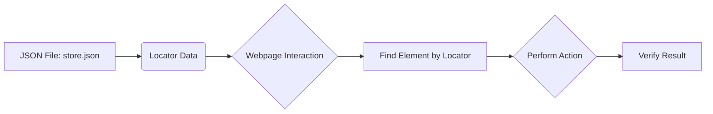

## Анализ кода `hypotez/src/suppliers/ebay/locators/store.json`

### <алгоритм>

1. **Чтение JSON-файла:** Файл `store.json` содержит JSON-объект, представляющий структуру локаторов для веб-страницы магазина eBay. Этот файл не содержит кода Python, а является статическим JSON-файлом.
2. **Использование локаторов:** При выполнении тестов или сбора данных, данные из этого файла используются для поиска элементов на веб-странице eBay. К примеру, при тестировании страницы магазина, локаторы из этого файла помогут найти кнопки, поля ввода и другие интерактивные элементы.
    - Пример:
       - `{ "button_add_to_cart": "#add-to-cart-button" }` - поиск кнопки "Добавить в корзину" по ID.
       - `{ "input_search": "#gh-ac" }` - поиск поля поиска по ID.
3. **Обновление локаторов:** При изменении HTML-структуры страницы eBay, потребуется обновление данных в файле `store.json`, чтобы они соответствовали новым локаторам.

### <mermaid>


**Объяснение:**
*   `A`: Представляет файл `store.json`, который содержит локаторы.
*   `B`: Обозначает данные локаторов, которые считываются из файла JSON.
*   `C`: Показывает процесс взаимодействия с веб-страницей.
*  `D`: Означает этап поиска элементов на странице с использованием данных локаторов.
*  `E`: Представляет выполнение действия над найденным элементом, например, клик.
*   `F`: Обозначает проверку результата после выполнения действия.

### <объяснение>

#### **Импорты**:
   - В данном файле `store.json` нет импортов, так как это статический JSON-файл.

#### **Классы**:
   - В файле `store.json` нет классов, так как это статический JSON-файл.

#### **Функции**:
   - В файле `store.json` нет функций, так как это статический JSON-файл.

#### **Переменные**:
   - Переменные в файле `store.json` представляют собой ключи и значения в JSON-объекте. Ключи являются именами локаторов (например, `button_add_to_cart`), а значениями являются CSS-селекторы (например, `#add-to-cart-button`).
    - Типы:
        - Ключи: `String`
        - Значения: `String` (CSS-селекторы)
    - Использование:
       - Используются для динамического поиска элементов на веб-страницах, позволяя коду быть устойчивым к изменениям в HTML-структуре.
       - Пример:
            ```json
            {
              "button_add_to_cart": "#add-to-cart-button",
              "input_search": "#gh-ac",
               "title": ".product-title"
            }
            ```

#### Потенциальные ошибки и области для улучшения:

- **Устаревшие локаторы:** Если структура HTML-страницы eBay изменится, локаторы в `store.json` могут стать недействительными, что приведет к ошибкам в тестах или при сборе данных. Требуется регулярная проверка и обновление локаторов.
- **Сложность CSS-селекторов:** Использование слишком специфичных CSS-селекторов может привести к нестабильности, поскольку небольшие изменения в HTML могут сломать их. Рекомендуется использовать более общие и надежные селекторы.
- **Отсутствие комментариев:** В самом файле `store.json` нет возможности оставлять комментарии, что может затруднить понимание назначения конкретного локатора. Рекомендуется хранить документацию к файлу отдельно.

#### Взаимосвязь с другими частями проекта:

- Данные из `store.json` используются в модулях, отвечающих за тестирование или сбор данных с сайта eBay. Например, в файлах `src/suppliers/ebay/page.py` или `src/suppliers/ebay/test.py`.
-  Этот файл обеспечивает гибкость при работе с сайтом eBay, позволяя легко адаптироваться к изменениям HTML-структуры.

**Цепочка взаимосвязей:**
1.  `store.json`: Хранит статические локаторы для элементов веб-страницы.
2.  `src/suppliers/ebay/page.py`: Использует данные из `store.json` для поиска элементов на веб-странице и выполнения действий.
3.  `src/suppliers/ebay/test.py`:  Использует `page.py` для автоматизированного тестирования, которое опирается на локаторы из `store.json`.

```