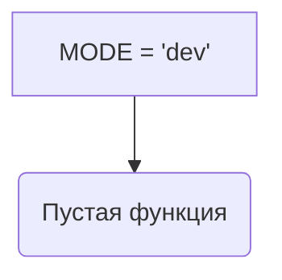

```MD
# Анализ кода файла `hypotez/src/suppliers/ebay/login.py`

## <input code>

```python
## \file hypotez/src/suppliers/ebay/login.py
# -*- coding: utf-8 -*-\
#! venv/Scripts/python.exe
#! venv/bin/python/python3.12

"""
.. module: src.suppliers.ebay 
	:platform: Windows, Unix
	:synopsis:

"""
MODE = 'dev'

"""
	:platform: Windows, Unix
	:synopsis:

"""


"""
	:platform: Windows, Unix
	:synopsis:

"""


"""
  :platform: Windows, Unix

"""
"""
  :platform: Windows, Unix
  :platform: Windows, Unix
  :synopsis:
"""MODE = 'dev'
  
""" module: src.suppliers.ebay """


"""   Интерфейс авторизации. Реализация для вебдрайвера

@image html login.png
"""
```

## <algorithm>

В представленном коде отсутствует алгоритм в виде функций или классов. Код содержит лишь комментарии и константу `MODE`.  Пошаговая блок-схема невозможна.

## <mermaid>



## <explanation>

**Импорты**:  Отсутствуют. Файл `login.py` не импортирует никаких модулей.

**Классы**: Нет определений классов.

**Функции**: Нет определений функций.

**Переменные**: Единственная переменная - `MODE` со строковым значением `'dev'`. Она глобальная.  Переменная определена несколько раз, но это не имеет смысла в данном контексте, так как все определения дублируют друг друга.

**Возможные ошибки или области для улучшений**:

* **Отсутствие функциональности**: Файл содержит только комментарии и константу. Ему необходимо добавить код, реализующий логику авторизации на eBay.
* **Избыточность**: Многократное определение переменной `MODE` является избыточным и не соответствует принципам DRY (Don't Repeat Yourself).

**Взаимосвязи с другими частями проекта**:

Файл `login.py`, скорее всего, будет частью модуля `ebay`, который находится в папке `suppliers` внутри проекта `hypotez`.   В дальнейшем он должен взаимодействовать с библиотеками, отвечающими за работу с веб-драйверами (например, Selenium) и, вероятно, с другими модулями для обработки данных, полученных в результате авторизации.  Без определения функций и классов, точные связи с другими модулями определить сложно.

**Заключение**:

Данный код представляет собой пустой файл, который требует реализации. Комментарии описывают предполагаемую функциональность, но не содержат реального кода.  Необходимо добавить функциональность авторизации на eBay, используя веб-драйвер. Для этого следует импортировать нужные библиотеки, определить классы и методы, которые будут обрабатывать взаимодействие с веб-сайтом eBay.  Вместо многократного определения `MODE` лучше использовать одно единственное определение.